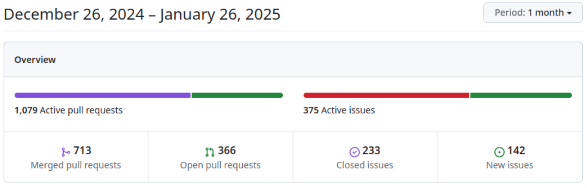
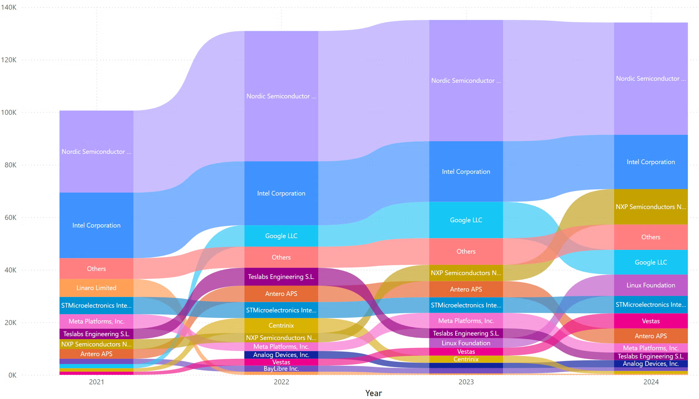

# Zephyr 爱好者月刊（第 1 期 202501）

这里记录Zephyr最新的消息和值得分享的内容，每月最后一周发布。

本杂志开源（GitHub: [lgl88911/Zephyr_Fans_Monthly](https://github.com/lgl88911/Zephyr_Fans_Monthly)），欢迎提交 issue，投稿或推荐Zephyr内容。

## 项目数据


不包括合并，300位作者向主分支推送了1,251次提交，向所有分支推送了1,341次提交。
在主分支上，共有3,813个文件发生了变化，新增了91,583行，删除了65,920行。


## 新闻&活动

1、[Zephyr 2024回顾](https://www.zephyrproject.org/zephyr-rtos-2024-wrap-up-a-year-of-growth-innovation-and-community-impact/)

全面回顾了 Zephyr 项目在 2024 年的发展历程，涵盖社区成长、技术成果、安全保障以及社区活动等多个方面，展现出项目的蓬勃发展态势与影响力。

贡献者的变化图颇有意思，Nordic和Intel一直稳坐老大和老二，NXP 2024年异军突起，之前从 2024ZDS 的内容推测 NXP 会使用 Zephyr 作为 SDK 又多一个支持点。


2、[Zephyr 项目在 FOSDEM 2025 的展示](https://www.zephyrproject.org/zephyr-project-at-fosdem-2025-tracks-you-cant-miss/)

Zephyr 项目在 2025 年 FOSDEM（自由和开源软件开发者欧洲会议）上的相关活动安排，包括展示内容、开发者演讲等信息。

3、[Zephyr 项目参与Embedded World 2025](https://www.zephyrproject.org/join-the-zephyr-project-at-embedded-world-2025/)

2025 年 3 月 11 - 13 日在德国纽伦堡举办的 Embedded World 2025 展会，Zephyr 项目将参展并带来产品展示、成员创新案例、项目路线图分享等活动，开发者还将发表演讲，同时设有周边赠送、互动演示等展位活动，鼓励相关人士注册参会并通过 Zephyr Discord 频道交流 。

4、[Zephyr 项目实战聚会](https://zephyrproject.org/event/zephyr-project-hands-on-meetup/)

2025 年 2 月 26 - 27 日每晚 17:00 - 23:00（中欧时间）德国阿伦 AAccelerator 举办的 Zephyr Project Hands-On Meetup 活动，以德语开展，面向嵌入式软件新手和技术爱好者，参与者将在 Bridle 项目维护者指导下实操 Zephyr 项目相关技术，需自带笔记本电脑（可自选携带微控制器板），可通过指定链接报名。

5、[2024 中国开源年度报告](https://docs.daocloud.io/blogs/2025/open-source-report.html#732-2024)

2024 中国开源年度报告，从总体宏观、OpenRank 排行榜、企业、基金会、技术领域、开源项目、开发者、商业开源、高校开源九个维度，通过基础事件、活跃仓库、活跃度等指标，分析中国开源生态在 2024 年的发展状况，涵盖全球和中国开源项目、企业、开发者等多方面数据及趋势。

该报告提及 Zephyr 的开发者角色分析，从不同角色数量分布、新增情况以及角色转化等方面，展现了 Zephyr 项目开发者生态的特征与发展态势。

## 文摘&观点

1、[When to Scrap Bare Metal and Use an RTOS](https://www.eetimes.eu/when-to-scrap-bare-metal-and-use-an-rtos/)

《电子时报欧洲》采访了 Segger、Zephyr 项目和 Nordic 半导体的高管，以了解更多关于开发者必须做出的关键决策。

“如果约束条件简单，那么你可以使用循环，然而，如果你在与你的设计周围更复杂的环境工作，想要利用安全、安全和通信协议，并注意时序约束，那么实时操作系统（RTOS）就变得必要了。”  -- Kate Stewart，Linux 基金会可靠嵌入式系统副总裁/Zephyr 项目总监

“RTOS并不是黑盒。你需要有透明度和理解出错的能力，这正是开源 RTOS 所能提供的。”  -- Akemann, Segger

"如果你站在一个来自嵌入式大学课程的开发者的角度，你控制硬件的方法是写入寄存器。与将硬件设备参数放在头文件中不同，使用 RTOS，硬件从源代码中被抽象出来。在 Zephyr 的情况下，所有内容都被抽象成一个设备树，所以当你选择你的目标时，它会选择该硬件的设备树"  -- Ali Aljaani, Nordic 开发者市场营销经理

## 技术

1、[ESP32 系列芯片上为 Zephyr 应用启用外部 PSRAM](https://developer.espressif.com/blog/2024/12/zephyr-how-to-use-psram/)

介绍在 ESP32 SoCs 上为 Zephyr 应用启用外部 PSRAM 的方法。涵盖 PSRAM 概念、ESP32 模块与 PSRAM 关系、Zephyr 中 PSRAM 设置，以及动态内存分配、添加到内存映射、从 PSRAM 运行代码、让 Wi-Fi 使用 PSRAM 等使用策略。

## 课程&教程

1、Nordic 作为Zephyr的头部贡献者，自己的nrf SDK也全部采用Zephyr，有非常深厚的Zephyr经验， [nRF Connect SDK Intermediate 在线课程](https://academy.nordicsemi.com/courses/nrf-connect-sdk-intermediate/)面向有 nRF Connect SDK/Zephyr RTOS 基础者，预计 10 - 12 小时完成，涵盖 Zephyr RTOS 进阶、调试、自定义开发板设置、外设交互、设备驱动开发和安全固件更新等内容。该课程有助于你全面了Zephyr。

## Zephyr 每月小知识

1、通过`--trace`得到Zephyr CMake处理流程，可以分析Zephyr构建过程
```
cmake --trace -Bbuild  -DBOARD=mm_feather zephyr/samples/hello_world/ 2>&1 | tee log1.txt
```
