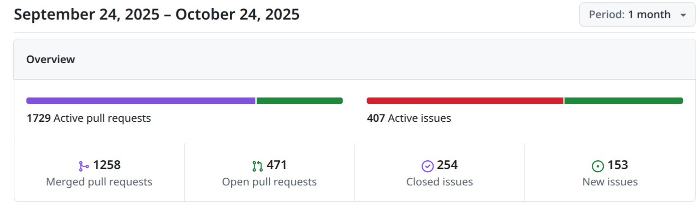
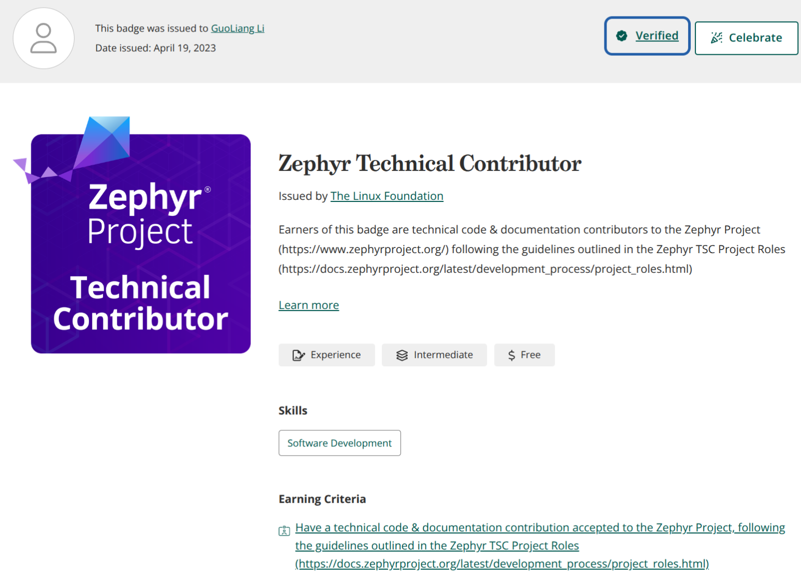
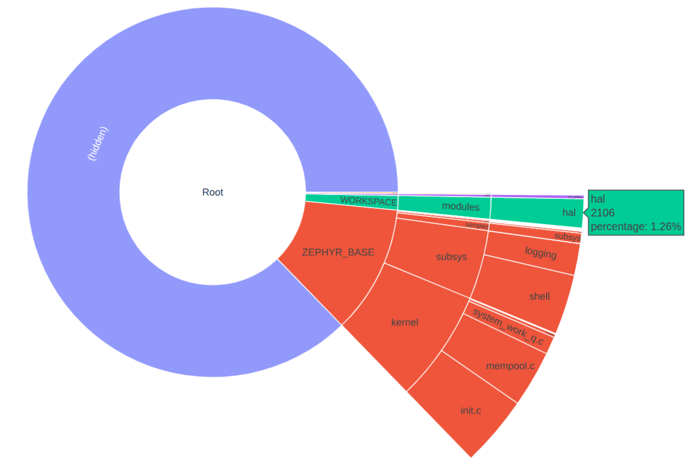
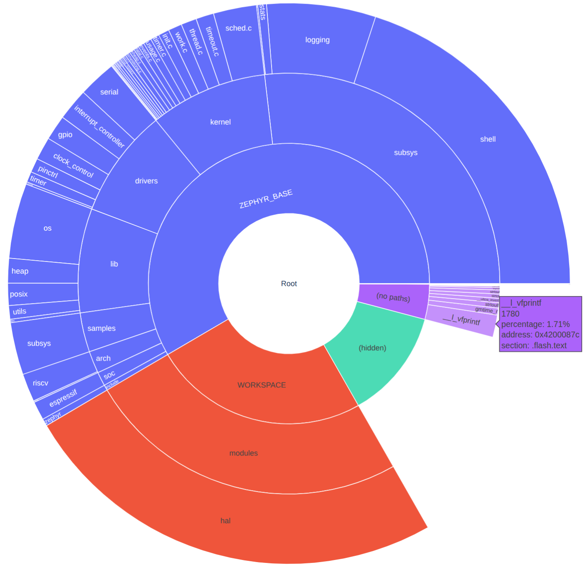

# Zephyr 爱好者月刊（第 10 期 202510）

这里记录 Zephyr 最新的消息和值得分享的内容，每月最后一周发布。

本杂志开源（GitHub: [lgl88911/Zephyr_Fans_Monthly](https://github.com/lgl88911/Zephyr_Fans_Monthly)），欢迎提交 issue，投稿或推荐 Zephyr 内容。

## 项目数据

不包括合并，433 位作者向主分支推送了 2756 次提交，向所有分支推送了 2798 次提交。
在主分支上，共有 6948 个文件发生了变化，新增了 249220 行，删除了 56491 行。

近期动向：
- [为 Nordic MVDMA 外设添加驱动程序](https://github.com/zephyrproject-rtos/zephyr/pull/95912)
- [通过附加属性进行设备树绑定增强](https://github.com/zephyrproject-rtos/zephyr/pull/96083)
- [MSPI CE 控制重做和 CE 时序支持](https://github.com/zephyrproject-rtos/zephyr/pull/96138)
- [添加 NVMEM 支持](https://github.com/zephyrproject-rtos/zephyr/pull/96379)
- [导入时钟管理子系统](https://github.com/zephyrproject-rtos/zephyr/pull/72102)
- [最低C版本从C99向C11过度](https://github.com/zephyrproject-rtos/zephyr/issues/97061)
- [添加对 USB 绑定 MCTP 的支持](https://github.com/zephyrproject-rtos/zephyr/pull/95347)
- [Zephyr 中的 MISRA 规则](https://github.com/zephyrproject-rtos/zephyr/pull/96300#discussion_r2414319726)
- [4.2.1 发布](https://github.com/zephyrproject-rtos/zephyr/releases/tag/v4.2.1)
- [10.24为4.3.0发布做功能冻结]()
- [SDK 1.0.0 Beta发布正式支持LLVM](https://github.com/zephyrproject-rtos/sdk-ng/releases/tag/v1.0.0-beta1)

## 新闻&活动

1、[Zephyr的贡献者徽章领取](https://docs.google.com/forms/d/e/1FAIpQLScWRn7CJnh3bPBeqI6eoLzx0xdJ-G_5g4PryBw9IYTFCCtBRw/viewform)

最近Zephyr又在推送邮件通知领取贡献徽章，在代码和文档上面有贡献的只要提供PR链接都可以申请，我曾经在2023年领取的徽章大概长这样

2、[Zephyr 10年调查](https://www.research.net/survey-taken/?sm=BiU7R1ALGvsp5Jf_2BPYvvhvflnxZlBTuUgh75TMI1pBdPgQ3rPFl_2FMCFogFLNub3GTFmElD6axVDH6TFUKSuDphqzmyb2qDULbKn1Naao0pBi7RFHoFMC_2BEr_2BT4dtQZCKYN_2Bs7ou11_2FePQmBk6SctB5sapp58KDQya2gd0w7Si1aZJylP0zImUOjkMbf6tjjh)

Zephyr 即将迎来十周年，通过调查希望了解其在过去十年中的影响。收集并听取 Zephyr 用户和贡献者的意见，了解Zephyr如何改变其用户的产品和工作，以及用户如何看待社区的发展。调查结果报告将在 Linux Foundation 网站上发布。完成调查问卷的用户可享受 Linux Foundation 在线学习培训课程或认证考试的 35% 折扣。

3、10月线下见面会

2025年10月27日在西班牙塞维利亚举办线下聚会
- https://www.zephyrproject.org/what-to-expect-at-the-zephyr-project-meetup-october-27-2025-seville-spain/

4、Zephyr 播客持续发布

本月Zephyr发布3期播客
- https://www.zephyrproject.org/zephyr-remotely-calling-zephyr-podcast-005/
- https://www.zephyrproject.org/the-new-arduino-uno-q-gets-a-zephyr-brain-zephyr-podcast-006/
- https://www.zephyrproject.org/three-blind-zephyr-mice-zephyr-podcast-007/

5、菁蓉联创成为Zephyr的白银会员(白银会员)

菁蓉联创是国内首家成为Zephyr会员的商业公司。国内还有另外北邮和湖大两家准会员（Associate Members）

https://www.zephyrproject.org/project-members/

## 文摘&观点

1、[Zephyr RTOS 如何成长为物联网开源实时操作系统领导者](https://www.nordicsemi.com/Resources/Training/Webinars/2025/How-Zephyr-became-the-leading-open-source-RTOS-for-IoT)

一次 Nordic 网络研讨会。回顾 Zephyr 项目自 2016 年至今的演进历程，强调Zephyr已超越传统 RTOS 内核，成为集驱动、协议栈、中间件、安全与开发工具于一体的统一嵌入式平台。作为最早拥抱 Zephyr 的厂商，Nordic 将其做为 nRF Connect SDK 基础，持续贡献约 25% 代码，涵盖蓝牙 LE 控制器、USB 协议栈、west 构建工具、DFU 框架等关键模块，使开发者无需从零维护硬件适配与连接协议。议程展示 Nordic 围绕 Zephyr 打造的完整开发生态：VS Code 插件、Developer Academy、云调试与量产级例程，显著缩短产品上市周期。与会者可通过研讨会回放、官方文档及社区渠道快速上手，借助 Zephyr 的可扩展、可配置架构，在 nRF52/nRF53/nRF91 系列 SoC 上构建低功耗、高安全的无线 IoT 设备。

2、[nRF Connect SDK 和 Zephyr RTOS 推动创新的物联网开发](https://blog.nordicsemi.com/getconnected/nrf-connect-sdk-and-zephyr-rtos-power-innovative-iot-development)

文章详细介绍了 Nordic 如何通过与 Zephyr RTOS 的合作，推动其 nRF Connect SDK 的发展，从而为物联网开发提供强大支持。Zephyr 作为一个开源的实时操作系统，因其开放治理、跨架构支持、小尺寸和低功耗等特点，成为 Nordic 的理想选择。Nordic 不仅积极参与 Zephyr 的开发，还通过 DevAcademy 等教育资源帮助开发者快速上手。nRF Connect SDK 以 Zephyr 为基础，结合了 Nordic 的专有技术，提供了丰富的功能和灵活的开发选项。这种结合使得复杂的物联网开发变得简单，帮助开发者更快地将产品推向市场。

3、[Zephyr RTOS的隐藏优势与未来愿景](https://www.eet-china.com/mp/a434634.html)

本文是对Zephyr项目开发者倡导者Benjamin Cabé的采访记录，主题围绕Zephyr实时操作系统（RTOS）的隐藏优势和未来愿景展开。Cabé指出，许多人仍将Zephyr仅视为RTOS，但实际上它是一个功能强大的开发平台，涵盖了连接性、安全性和开发体验等多个方面。他特别提到了Zephyr的两个“隐藏宝藏”：West工具和Twister测试框架，这些工具极大地简化了开发流程。此外，Zephyr的生态系统和社区活跃，得到了商业公司的大力支持，这为其可持续发展奠定了基础。展望未来，Zephyr在云集成、安全认证和边缘AI方面的进展将使其在市场中更具竞争力。

4、[Zephyr RTOS：安全性、可扩展性与未来趋势](https://www.eenewseurope.com/en/security-scalability-and-future-trends-pierre-lecomte-on-zephyr-rtos/)

本文是对Witekio公司软件解决方案负责人Pierre Lecomte的采访记录，探讨Zephyr实时操作系统（RTOS）在嵌入式和物联网开发中的安全性、可扩展性及未来趋势。Pierre指出，随着微控制器连接需求的增加和网络攻击的威胁上升，硬件和软件都需要不断进步以应对挑战。Zephyr作为RTOS生态系统，提供了简化网络安全机制集成、配置和维护的工具，支持硬件安全特性，并通过多种机制隔离任务和内存区域。他还提到，Zephyr通过与多种更新解决方案的集成，支持设备更新和漏洞跟踪，是未来嵌入式开发的理想选择。

5、Zephyr 招聘

Renesas 在班加罗尔招聘 5–7 年经验的“首席开源软件工程师”，聚焦 Linux/Zephyr 与功能安全。候选人需有公开代码贡献、社区 Maintainer/Reviewer 或会议演讲经历，能带团队并主导 Zephyr/Xen FUSA 方案。
- https://www.foundit.in/job/principal-software-engineer-open-source-software-linux-zephyr-renesas-electronics-bengaluru-bangalore-36611580

## 课程&教程

1、[NXP关于Zephyr的知识库](https://community.nxp.com/t5/Zephyr-Project-Knowledge-Base/Zephyr-Knowledge-Hub/ta-p/2008548)

知识库汇总了官方文档、应用笔记、培训、示例代码及论坛入口，涵盖环境搭建、设备支持、设备树/Kconfig、外设驱动、自定义板级等主题，形成一站式参考。开发者按图索骥可快速找到从安装、例程到深度配置的全部资料。

2、[如何在 ESP32-H2 上使用 Zephyr RTOS 设置 Matter 和 Thread ](https://myembeddedsystems.com/how-to-tutorials/how-to-set-up-matter-and-thread-on-esp32-h2-with-zephyr-rtos-for-iot/)

本文详细介绍了如何在 ESP32-H2 开发板上设置 Matter 和 Thread 协议，以实现物联网设备的安全通信。内容包括设置的前提条件，开发环境的准备和工具材料的清单。接通过详细的步骤说明了如何安装 Zephyr SDK、克隆 Matter 和 Zephyr 代码库、为 ESP32-H2 设置项目、构建项目、烧录固件以及测试通信。此外文章还提供了故障排除的建议，帮助开发者解决可能遇到的问题。

3、[DTS、DTSI和Overlay的区别与应用](https://www.embeddedrelated.com/showarticle/1762.php)

本文旨在帮助嵌入式开发者理解Zephyr操作系统中Devicetree的概念及其文件类型（DTS、DTSI和Overlay）的区别与应用场景。文章详细介绍了Devicetree文件的分层结构，以及如何根据硬件变更的范围选择使用Devicetree或Overlay。作者强调，。此外，作者还分享了在实际项目中如何灵活运用Devicetree和Overlay的经验，并鼓励开发者参加相关的实战训练营以深入学习。

## 技术&工具

1、[STM32、Zephyr和Lua打造无障碍嵌入式游戏平台](https://yairgadelov.me/accessible-embedded-games-with-stm32-zephyr-and-lua/)

本文介绍一个为特殊需求儿童设计的嵌入式游戏平台。项目基于STM32微控制器、Zephyr RTOS、Lua脚本和32×32 RGB LED矩阵，旨在提供灵活的游戏规则、实时响应和动态视觉反馈。作者选择Zephyr RTOS是因为其Linux风格的开发模型，包括设备树和Kconfig构建系统，能够简化硬件抽象和代码移植。Lua脚本的引入则允许非嵌入式开发人员在不修改固件的情况下扩展游戏逻辑。整个系统架构清晰，将RTOS、脚本语言和实时显示相结合，展示了嵌入式开发中技术与用户体验的完美融合。

2、[探索 Zephyr RTOS 中的动态加载](https://ignitarium.com/exploring-dynamic-loading-in-zephyr-rtos-for-modular-embedded-systems/)

本文深入探讨了 Zephyr RTOS 的动态加载功能。动态加载技术允许在运行时加载和执行预编译的模块，从而避免了传统静态链接的局限性，如需要重新构建和刷新固件。LLEXT 支持位置无关代码，能够按需加载功能，减少内存占用，并支持模块化设计。LLEXT 也存在一些限制，例如缺乏内置的安全性检查和对某些内存架构的支持不足。

3、 [在Zephyr RTOS基础上构建兼容AUTOSAR CP的智能车控操作系统](https://www.eet-china.com/mp/a447172.html)

这是zephyr-sig 成员任博的一篇文章，探讨了在Zephyr RTOS基础上构建兼容AUTOSAR CP的智能车控操作系统的可能性。Zephyr作为Linux基金会主导的开源RTOS，具有社区活跃、功能丰富、开发工具现代化等优势，尤其在信息安全和功能安全方面表现出色。尽管Zephyr在汽车领域的标准化功能较少，但其与AUTOSAR CP的结合可以弥补这一不足。通过整合开源汽车操作系统中的相关软件模块，有望打造一个开放、高效、安全的智能车控操作系统，解决传统AUTOSAR软件成本高、效率低、生态封闭的问题。

4、 [实时系统与并发：开发人员指南](https://www.emtechsa.com/post/real-time-systems-and-concurrency-a-developers-guide)

本文深入探讨了实时系统和并发在嵌入式开发中的重要性，强调了实时系统通过严格的时序要求确保任务按时完成的能力，以及并发通过任务切换实现多任务处理的机制。文章以 Zephyr RTOS 为例，详细介绍了其轻量级、模块化和多平台支持的特点，并通过生产者-消费者问题展示了其在任务同步中的应用。作者还提出了并发系统开发的最佳实践，包括任务分解、避免长时间阻塞、减少全局变量共享和合理使用中断。通过这些方法，开发人员可以构建出高效、可靠且易于维护的嵌入式系统，满足工业控制、医疗设备等领域的严格需求。

4、[利用 Zephyr 构建更环保的基于 MCU 的系统](https://www.hackster.io/Witekio_Software_Services/how-zephyr-can-help-you-build-greener-mcu-based-systems-3f4f08)

 本文介绍如何利用 Zephyr 实时操作系统优化基于微控制器的系统功耗，从而延长电池寿命并减少环境影响。通过一系列逐步优化措施，包括禁用未使用的外设、调整 BLE 通信频率、智能使用传感器、缩小广播数据包大小以及实现“系统关闭”模式，电池寿命从几天延长至数年。通过合理的软件优化和 Zephyr 的强大功能，无需依赖特殊硬件即可显著提升系统的能效。这种优化不仅有助于降低维护成本，还能减少电子垃圾，推动可持续发展。

5、[AkiraOS：复古赛博朋克游戏与现代嵌入式技术的融合](https://pen.engineering/akira)

AkiraOS 是一个开源的嵌入式游戏机和黑客工具包，结合了复古赛博朋克游戏的怀旧感和现代嵌入式系统技术。通过 WebAssembly 运行时在资源受限的硬件上实现网络规模的可移植性，同时保持实时游戏和安全应用所需的性能。AkiraOS 采用定制化的 Zephyr RTOS 架构，支持多种编程语言，并提供全面的学习资源和开发工具。

## Zephyr 每月小知识

1、通过`west build -t ram_plot`和`west build -t rom_plot` 会​​先生成命令行界面报告​​，然后​​自动打开一个浏览器窗口​​显示旭日图。可以通过​​点击各个区段​​来浏览目录结构及其对应大小，​​鼠标悬停在区段上​​以获取更多详细信息。

