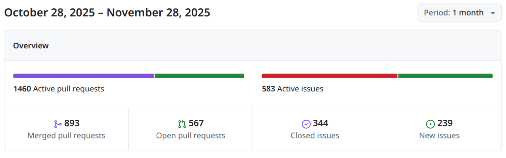
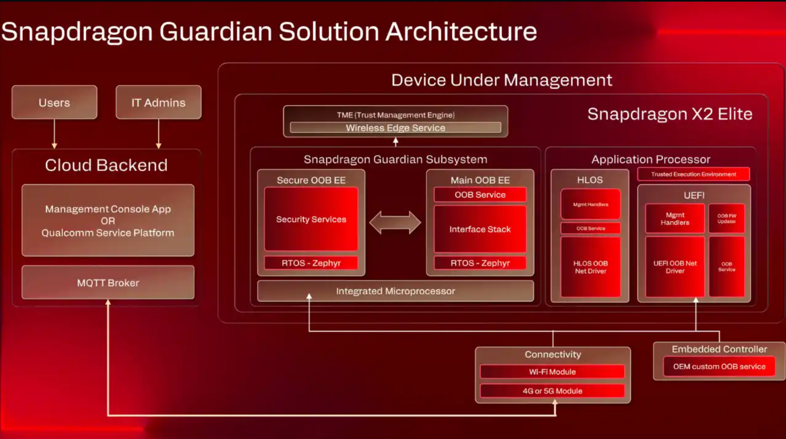

# Zephyr 爱好者月刊（第 11 期 202511）

这里记录 Zephyr 最新的消息和值得分享的内容，每月最后一周发布。

本杂志开源（GitHub: [lgl88911/Zephyr_Fans_Monthly](https://github.com/lgl88911/Zephyr_Fans_Monthly)），欢迎提交 issue，投稿或推荐 Zephyr 内容。

## 项目数据

不包括合并，333 位作者向主分支推送了 1657 次提交，向所有分支推送了 1733 次提交。
在主分支上，共有 5298 个文件发生了变化，新增了 124567 行，删除了 42810 行。

近期动向：
- [增加对 OpenRISC 的支持](https://github.com/zephyrproject-rtos/zephyr/pull/98160)
- [网络栈运行时配置](https://github.com/zephyrproject-rtos/zephyr/pull/97266)
- [counter 驱动增加 64bit 支持](https://github.com/zephyrproject-rtos/zephyr/pull/94189)
- [NVMEM 子系统支持 efuse/OTP 设备](https://github.com/zephyrproject-rtos/zephyr/issues/98184)
- [导入执行器（电机）驱动](https://github.com/zephyrproject-rtos/zephyr/pull/98741)
- [导入 libMP](https://github.com/zephyrproject-rtos/zephyr/pull/98514)
- [hwmv2 引入 series 和 families 应用目录](https://github.com/zephyrproject-rtos/zephyr/issues/81458)
- [导入“Forward Tree ” 协议](https://github.com/zephyrproject-rtos/zephyr/pull/95945)
- [引入新的 CMake 配置变量以支持应用可覆盖配置](https://github.com/zephyrproject-rtos/zephyr/issues/98679)
- [提议支持运行时选择 Devicetree 配置变体](https://github.com/zephyrproject-rtos/zephyr/issues/98879)
- [支持原生模拟器的交叉编译](https://github.com/zephyrproject-rtos/zephyr/issues/99436)
- [驱动、库和子系统边界的定义](https://github.com/zephyrproject-rtos/zephyr/issues/99250)
- [Zephyr 中 Vendor 特定 API 的设计与管理](https://github.com/zephyrproject-rtos/zephyr/issues/91373)
- [引入 additional-property 支持 Devicetree 绑定机制](https://github.com/zephyrproject-rtos/zephyr/pull/96083)
- [新增数字电位器通用驱动接口](https://github.com/zephyrproject-rtos/zephyr/pull/99077)
- [Zephyr 主线中 LVGL 升级到 9.4.0](https://github.com/zephyrproject-rtos/zephyr/pull/97599#event-21121051300)

## 新闻&活动

1、[Zephyr 4.3.0 发布](https://www.zephyrproject.org/zephyr-4-3-is-here-whats-new/)

Zephyr 4.3 版本有多项重大改进，包括对 USB 设备支持的全面更新、CPU 动态频率调整、新的仪器子系统以及对电动汽车充电协议 OCPP 1.6 的支持。此外，Zephyr 还引入了 Twister 显示捕获功能，用于自动化图形界面测试。增加 DT Doctor 和 traceconfig 工具提升开发者的开发体验。这些更新使 Zephyr 在嵌入式开发中的功能更加强大，同时也为开发者提供了更高效的开发工具和更广泛的硬件支持。

https://mp.weixin.qq.com/s/vKPQ3igPArgpG62W9I5lAA?poc_token=HOt8KmmjO_Uxfsbz3YJj6twUsDe96yJg1qalE2la

2、11 月线下见面会

- 2025 年 10 月 28 日，Zephyr 项目在哥本哈根的微软
  - https://www.zephyrproject.org/recap-of-the-zephyr-project-meetup-mjolner-informatics-october-28-2025/
- 2025 年 11 月 5 日 嵌入式世界北美展 美国加利福尼亚州安纳海姆会议中心
  - https://www.zephyrproject.org/what-to-expect-at-the-zephyr-project-meetup-november-5-2025-anaheim-california/
- 2025 年 11 月 20 日 德国慕尼黑加兴西门子技术中心 
  - https://www.zephyrproject.org/what-to-expect-at-the-zephyr-project-meetup-november-20-2025-garching-munich-germany/

3、Zephyr 播客持续发布

本月 Zephyr 发布 4 期播客
- https://www.zephyrproject.org/openbmc-ported-to-zephyr-and-lots-of-other-news-zephyr-podcast-009/
- https://www.zephyrproject.org/watch-your-language-zephyr-podcast-010/
- https://www.zephyrproject.org/zephyr-4-3-is-out-zephyr-podcast-011/
- https://www.zephyrproject.org/can-it-run-doom-yes-and-with-bluetooth-zephyr-podcast-012/

## 文摘&观点

1、[Zephyr RTOS 概述：技术规格、固件开发与专业建议](https://developex.com/blog/zephyr-rtos-overview/)

Zephyr RTOS 是一个为现代嵌入式设备设计的开源实时操作系统，特别适用于资源受限的连接设备。通过提供安全优先的设计、支持多种架构和广泛的生态系统，解决了传统固件开发中的复杂性和风险。Zephyr 的模块化和可配置性使其能够从简单原型扩展到复杂生产系统，同时其开源性质和社区支持降低了开发成本和风险。尽管其学习曲线可能对某些团队构成挑战，但对于需要长期维护、安全性和无线连接的项目，Zephyr 是一个理想的选择。文章从下面几个方面进行说明：
- **现代嵌入式系统面临的挑战**
- **Zephyr 平台简介**
- **Zephyr 的技术规格**
- **Zephyr 的独特之处**
	- **安全优先设计**：从底层构建安全性和安全性，利用硬件级安全措施（如 MPU）。
	- **供应商和架构灵活性**：支持多种架构（包括 ARM 和 RISC-V），提供统一的、供应商中立的 API。
	- **社区和企业协同作为信任信号**：由 Linux 基金会支持，拥有活跃的社区和企业贡献者。
- **使用 Zephyr 进行固件开发**
- **Zephyr 的商业价值**
	- **缩短上市时间**：模块化和供应商中立的工具链加速开发周期。
	- **降低固件开发成本**：开源和免版税，减少对专有工具链的依赖。
	- **提高可靠性**：安全设计和 OTA 更新确保产品质量和客户满意度。
	- **竞争优势**：支持 AI 集成和安全连接设备，实现产品差异化。
- **何时选择 Zephyr**
	- 长期项目、无线物联网应用、有 Linux 背景的团队、安全关键型应用。
	- 对于简单消费产品或快速原型，Zephyr 的学习曲线和架构开销可能超过其优势。

2、[NXP 的 Zephyr 无线连接支持](https://www.nxp.com/company/about-nxp/smarter-world-blog/BL-ZEPHYR-ENABLEMENT)

NXP  作为 Zephyr 项目的创始成员和白金董事会成员，持续推动 Zephyr 生态系统的发展，特别是在无线连接领域。NXP 为 Zephyr 上游贡献了多种设备，包括 Wi-Fi 6 和蓝牙解决方案，如 RW612、IW612 和 IW610。这些设备为开发者提供了灵活的无线解决方案，支持多种协议，包括 Wi-Fi、蓝牙双模、Thread 和 Matter。NXP 还在 Zephyr 社区中发挥了关键作用，包括集成 Hostapd 以支持移动接入点、提供企业级安全功能和高级无线功能。此外，NXP 提供了丰富的开发资源，包括文档、示例应用程序和入门指南，帮助开发者快速上手。

3、[为什么 Zephyr 成为 MCU 开发的首选](https://www.eet-china.com/mp/a434634.html)

Zephyr 是一个功能强大且灵活的开源实时操作系统，专为微控制器开发而设计。它通过硬件抽象层提供广泛的硬件支持，简化了从开发板到定制硬件的迁移过程。Zephyr 的内置安全功能、丰富的生态系统和统一的开发环境使其成为现代 MCU 开发的理想选择。尽管学习曲线较陡，但其强大的社区支持和持续改进确保了开发者能够充分利用其功能。

4、[TI 嵌入式研讨会](https://www.digitimes.com.tw/tech/dt/n/shwnws.asp?id=0000739178_KSI25ZS865RFN59C8TB9G)

TI 在其举办的嵌入式研讨会中提到** Zephyr 生态系统**：TI 支持 Zephyr RTOS，提供跨 MCU 平台的无缝迁移，确保开发人员能够快速适应不同硬件架构。

5、[从系统设计到源代码：Tobias Kästner 谈 Zephyr](https://www.eenewseurope.com/en/from-system-design-to-source-code-tobias-kaestner-on-zephyr/)

本文采访了咨询公司 inovex 的医疗物联网解决方案架构师 Tobias Kästner，探讨了 Zephyr 框架在嵌入式系统开发中的应用。Kästner 强调功能架构在系统设计中的重要性，并提到 Zephyr 提供的强大工具（如 KConfig 和 Devicetree）能够帮助开发者将系统需求转化为清晰的软件设计。此外，Zephyr 的现成服务（如 shell 和日志框架）以及对仿真工具的支持，能够加速开发周期并实现测试驱动开发。Kästner 认为，理解 Zephyr 中 KConfig、Devicetree 和 CMake 构建系统的交互是关键，这有助于开发者实现可维护且灵活的架构设计。

6、[Zephyr RTOS：硬件抽象的挑战与反思](https://www.pavelp.cz/posts/eng-zephyr-reflections/)

文章分享了作者对 Zephyr RTOS 的使用体验和反思。他认为 Zephyr 通过设备树实现硬件抽象的思路很好，但在实际使用中存在诸多问题，如复杂的编译错误信息、抽象层失效以及频繁的 API 变更。与 Arduino 和 MicroPython 相比，Zephyr 在复杂项目中表现出色，但在小型项目中显得过于复杂。尽管如此，作者仍将继续探索 Zephyr，因为它在复杂系统中可能更有价值。他指出，Zephyr 在某些特定功能（如 nRF52840 的蓝牙低功耗支持）上优于 MicroPython，但 MicroPython 在快速原型开发中仍然是更好的选择。

7、[微控制器中使用设备树的讨论](https://www.reddit.com/r/embedded/comments/1ojeaov/device_trees_for_microcontrollers/)

设备树在微控制器开发中的应用存在两极化观点。一方面，它为硬件描述和驱动程序开发提供了标准化的机制，尤其在多硬件平台支持方面表现出色；另一方面，其复杂性和对 C 语言的依赖导致许多开发者对其持批评态度。Zephyr RTOS 的设备树实现是一个典型案例，其支持多种硬件平台，但也引发了关于复杂性和易用性的讨论。

## 课程&教程

1、[FreeRTOS 迁移到 Zephyr 指南](https://www.beningo.com/freertos-to-zephyr-migration-a-step-by-step-guide-for-embedded-developers/#)

本文为嵌入式开发者提供了从 FreeRTOS 迁移到 Zephyr 的详细指南。FreeRTOS 虽然广泛使用，但在现代嵌入式系统中逐渐显得功能不足。Zephyr 作为一个现代化的 RTOS，提供了更多功能和更好的可扩展性。文章通过逐步迁移策略，详细介绍如何分析应用架构、抽象公共功能、适配构建系统、移植内核原语以及集成 Zephyr 子系统。同时，文章还对比了 FreeRTOS 和 Zephyr 在调度模型、线程模型、同步原语和中断处理方面的差异，并通过生产者-消费者示例展示了代码迁移的具体过程。作者建议开发者通过构建 OS 抽象层、逐步移植和利用 Zephyr 生态系统来实现平稳迁移。

2、[Zephyr 基础开发课程](https://chrispinetinega.com/course_zephyr_rtos_rpi_4b/)

该课程为 Zephyr RTOS 的开发提供了全面而系统的指导，涵盖了从基础理论到实际操作的各个方面。通过丰富的章节内容和实验室练习，学习者可以逐步掌握 Zephyr 的开发技能，无论是新手还是有一定基础的开发者都能从中受益。课程的开放性也鼓励学习者积极参与贡献，共同完善课程内容。

3、[树莓派 Pico 上使用 Zephyr RTOS 和 LVGL 教程](https://www.embedded.com/how-to-initialize-zephyr-rtos-on-raspberry-pi-pico-with-ili9341-lcd-xpt2046-resistive-touch-and-lvgl/)

本文提供了一份详细的教程，指导读者如何在树莓派 Pico 上初始化 Zephyr RTOS，并连接 ILI9341 LCD 显示屏、XPT2046 电阻触摸屏以及轻量级图形库 LVGL。文章详细说明了在 Windows 系统上安装 Zephyr 所需的工具和环境，包括 Visual Studio Code、Zephyr Workbench 扩展、Host Tools 和 Zephyr SDK。介绍如何通过设备树覆盖文件（rp 配置硬件接口，以及如何通过 prj.conf 文件启用必要的驱动程序和模块。最后，文章展示了测试结果，证明了设备的正常运行和触摸功能的准确性。

4、[从 OsIf (RTD) 到 Zephyr 操作系统的迁移指南](https://docs.nxp.com/bundle/AN14792/page/topics/from_osif_rtd_to_zephyr_operating_system.html)

本文提供了从 AUTOSAR RTD 的 OsIf 到 Zephyr 操作系统的迁移指南。Zephyr 作为一个功能丰富的开源 RTOS，提供了比 OsIf 更强大的功能。通过详细的比较矩阵，文档帮助开发者理解两者在延迟、信号量、中断管理、调度器、任务创建和时基等方面的核心差异。从 OsIf 迁移到 Zephyr 涉及从轻量级操作系统抽象到功能完备的 RTOS 平台的转变，这将有助于开发更复杂和更具连接性的嵌入式应用，但需要在 API 使用和系统设计上进行调整。

## 技术&工具

1、[Snapdragon X2 Elite 的安全服务使用 Zephyr](https://punemirror.com/technology/qualcomm-snapdragon-x2-elite-shocks-industry-with-next-level-security-sensing-and-ai-the-ultimate-windows-business-laptop-revolution/)

Qualcomm 最新推出的 Snapdragon X2 Elite 芯片旨在为 Windows 业务笔记本带来变革。提供** Snapdragon Guardian 安全技术**，集成了一个微处理器，并包含一个专用的、安全的 OOB EE（执行环境），在其上运行基于 Zephyr RTOS 内核的安全服务。 即使 Windows 系统无法启动或离线，安全服务也能通过专用的 Zephyr 内核运行。
https://www.digit.in/features/laptops/security-to-sensing-three-key-snapdragon-x2-elite-highlights-on-windows-business-laptops.html

2、[使用 Rust 或 Zephyr 为 Pico 开发嵌入式固件](https://www.raspberrypi.com/news/develop-embedded-firmware-for-pico-using-rust-or-zephyr-with-pico-vscode/)

本文介绍了 Raspberry Pi Pico 的 Visual Studio Code 扩展（pico-vscode）对 Rust 和 Zephyr 的支持，旨在简化嵌入式固件开发流程。文章详细说明了如何通过 pico-vscode 创建 Zephyr 和 Rust 项目，包括安装必要的依赖项、选择模板、编译和调试等步骤。

3、[构建多工具链雨触发温室](https://www.hackster.io/539965/building-a-multi-toolchain-rain-triggered-greenhouse-ae8f3c)

本文介绍了一个智能温室自动化项目，通过整合多个开发环境，实现了在检测到雨水时自动打开温室屋顶的功能，同时也支持手动控制。项目的核心是 SAM E54 微控制器，运行 Zephyr RTOS 作为主控制器，协调来自 MTCH9010 雨水检测模块和 PIC32CM GC00 触摸控制模块的输入，并通过 UART 与 AVR® EB 步进电机控制器通信，驱动温室屋顶的开合。开发过程中，MTCH9010 使用 MPLAB® Data Visualizer 进行配置，PIC32CM GC00 使用 MPLAB Code Configurator 和 VS Code 开发触摸界面，而 SAM E54 则利用 Zephyr RTOS 的 Devicetree 系统进行硬件映射和逻辑控制。

4、[如何在不接触硬件的情况下升级整个物联网设备队列](https://www.croxel.com/insights/webinar-future-proof-fleet)

本文讲述了 Croxel 和 Blues 如何帮助 Lift AI 在不接触硬件的情况下，通过 OTA 将其物联网设备的操作系统从 CircuitPython 完全替换为 Zephyr RTOS。Lift AI 为了快速进入市场，最初选择了 CircuitPython，但随着规模扩大，这一选择逐渐成为限制。Croxel 和 Blues 提出了“大脑移植”方案，实现了 100% 的更新成功率、零停机时间以及每台设备约 15-20 分钟的快速更新。这一方案不仅节省了大量成本，还为 Lift AI 提供了一个可持续进化的未来平台，支持更复杂的数据收集和分析。

5、[串行 NAND Flash：Zephyr OS 的完美搭档](https://www.jblopen.com/serial-nand-flash-zephyr-os/)

文章探讨了串行 SLC NAND Flash 为何是 Zephyr OS 的理想存储选择。NAND Flash 在写入速度、延迟、能耗和成本方面具有显著优势，尤其适合数据采集类应用。文章强调了 NAND 管理软件的重要性，包括坏块识别、失效块跟踪、磨损均衡和读取错误管理。此外，文章还介绍了适用于 Zephyr OS 的三种 NAND 文件系统：LittleFS（当前版本存在限制，但 3.0 版本有望改进）、Yaffs2（成熟且性能出色，但 RAM 需求较高）和 TSFS（高性能且 RAM 占用低）。尽管 Zephyr OS 目前对 NAND Flash 的支持有限，但可以通过集成 Yaffs2 或 TSFS 轻松实现可靠、快速的存储解决方案。
- **LittleFS**：Zephyr OS 内置的文件系统，但当前版本（2.0）在 NAND Flash 上存在严重限制，如缺乏坏块跟踪、关键读取错误处理和高写入放大。3.0 版本正在开发中，有望改善这些问题。
- **Yaffs2**：一个在 SLC NAND Flash 上部署成功的文件系统，支持坏块管理、读取错误管理和磨损均衡。它具有低写入放大和高写入吞吐量的优点，但需要大量 RAM 来存储文件系统元数据。
- **TSFS**：一个高性能的嵌入式文件系统，专为小型、裸机和 RTOS 基础的嵌入式系统设计。它提供坏块跟踪、块刷新、动态和静态磨损均衡以及低写入放大。TSFS 在 NAND Flash 上的写入延迟通常低于 10ms，且仅需约 20KB 的 RAM。

6、[在 Zephyr RTOS 中使用 Zephelin AI Profiling Library 进行实时分析和追踪](https://www.zephyrproject.org/real-time-profiling-and-tracing-in-zephyr-rtos-with-zephelin-ai-profiling-library/)

本文介绍了 Zephelin AI Profiling Library，这是一个用于 Zephyr RTOS 的开源实时分析和追踪工具。Zephelin 由 Antmicro 团队与 Analog Devices, Inc 合作开发，旨在帮助开发者优化嵌入式平台上的 AI 应用。它通过追踪 RTOS 应用的执行和收集系统状态信息，为 AI 模型提供详细的统计信息。Zephelin 利用 Zephyr RTOS 的现有子系统，并引入了新的仪器子系统以实现更细粒度的性能分析。它支持多种数据收集方式和格式，并提供了从 CTF 到 TEF 的转换工具，以便使用 Zephelin Trace Viewer 进行详细分析。Zephelin 提供了三种预设的分析层级，允许开发者根据需求选择不同的性能开销和数据详细程度。

## Zephyr 每月小知识

1、通过`west build -t traceconfig` 生成一份报告`kconfig-trace.md`，用于了解应用程序的配置“来自何处”，报告分为三部分：可见符号、不可见符号和未设置符号。每个符号会显示其类型、名称、当前值以及导致该值被应用的语句类型和位置信息。