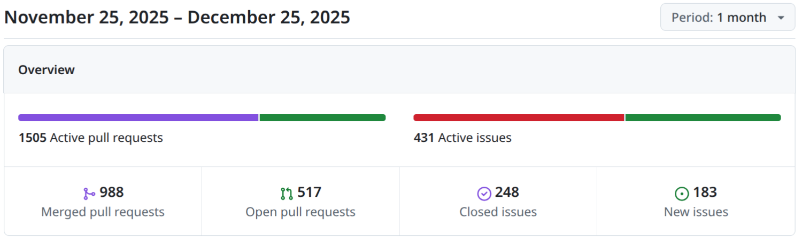
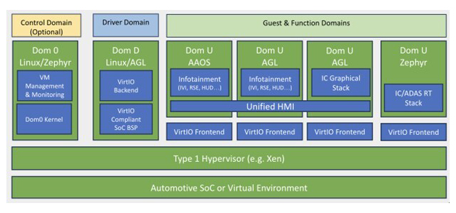

# Zephyr 爱好者月刊（第 12 期 202512）

这里记录 Zephyr 最新的消息和值得分享的内容，每月最后一周发布。

本杂志开源（GitHub: [lgl88911/Zephyr_Fans_Monthly](https://github.com/lgl88911/Zephyr_Fans_Monthly)），欢迎提交 issue，投稿或推荐 Zephyr 内容。

## 项目数据

不包括合并，349 位作者向主分支推送了 1888 次提交，向所有分支推送了 1971 次提交。
在主分支上，共有 5575 个文件发生了变化，新增了 125077 行，删除了 44315 行。

近期动向：
- [增加 Forward Tree Protocol](https://github.com/zephyrproject-rtos/zephyr/pull/95945)
- [添加通用数字电位器（digipot）驱动接口](https://github.com/zephyrproject-rtos/zephyr/pull/99077)
- [集成 libsrtp](https://github.com/zephyrproject-rtos/zephyr/pull/99132)
- [导入生物识别子系统](https://github.com/zephyrproject-rtos/zephyr/pull/100139)
- [Zephyr 中 Vendor 特定 API 的设计与管理](https://github.com/zephyrproject-rtos/zephyr/issues/91373)
- [驱动、库和子系统边界的定义](https://github.com/zephyrproject-rtos/zephyr/issues/99250)
- [ZBus: Multi-domain 支持](https://github.com/zephyrproject-rtos/zephyr/pull/96086)
- [导入 libMP](https://github.com/zephyrproject-rtos/zephyr/pull/98514)
- [移除 devicetree 中 MSPI 总线使用的讨论](https://github.com/zephyrproject-rtos/zephyr/issues/100514)
- [ring buffer API 重构](https://github.com/zephyrproject-rtos/zephyr/issues/96860)
  

## 新闻&活动

1、[OpenEuler 成为 Zephyr 的社区会员 (Associate Members)](https://www.zephyrproject.org/project-members/)

继北邮和湖大之后，OpenEuler 也成为了 Zephyr 的社区会员 (Associate Members)。

2、12 月线下见面会

- 2025 年 12 月 4 日德国卡尔斯鲁厄 SMIGHT GmbH 主办
  - https://www.zephyrproject.org/recap-of-the-zephyr-project-meetup-december-4-2025-karlsruhe-germany/
- 2025 年 12 月 8 日 东京丰洲，瑞萨电子公司丰洲办公室
  - https://www.zephyrproject.org/open-source-summit-tokyo-japan-2025-zephyr-track-and-community-meetup/

3、Zephyr 播客持续发布

本月 Zephyr 发布 4 期播客：
- https://www.zephyrproject.org/the-flash-thats-not-a-flash-zephyr-podcast-013/
- https://www.zephyrproject.org/from-cars-to-space-zephyr-podcast-014/
- https://www.zephyrproject.org/active_low-on-0xc0ffee-zephyr-podcast-015/
- https://www.zephyrproject.org/about-time-and-timing-zephyr-podcast-016/

4、[Zephyr Project 将参加 2026 年的 FOSDEM 大会](https://www.zephyrproject.org/event/zephyr-project-at-fosdem-2026/)

Zephyr Project 将在 2026 年 1 月 31 日至 2 月 1 日的 FOSDEM 大会上展示其开源技术。此次 Zephyr 与 Dronecode Foundation 共享展位，将通过产品展示和现场演示，让参与者深入了解 Zephyr 的应用和技术优势。

## 文摘&观点

1、[Zephyr 2025 年项目评分](https://insights.linuxfoundation.org/project/zep?timeRange=past365days)

Linux 基金会对 Zephyr 项目的评分如下：

**项目简介**：Zephyr Project 是一个可扩展的实时操作系统（RTOS），支持多种硬件架构，专为资源受限的设备设计，注重安全性和可靠性。

**首次提交时间**：2014 年 12 月。

**软件价值**：估算为 1.5 亿美元。

Zephyr Project 的健康评分为"优秀"，综合了贡献者、受欢迎程度、开发活动和安全最佳实践四个关键领域的表现。过去一年的数据如下：

- **贡献者相关指标**
  - **活跃贡献者**：每季度有 1,537 名活跃贡献者，表明项目拥有庞大且活跃的开发者社区。
  - **贡献者多样性**：50 名贡献者贡献了 51% 以上的代码，显示项目在贡献者多样性方面的优势。
  - **贡献者留存率**：38% 的贡献者持续在多个季度贡献代码，说明社区具有较高的参与度和稳定性。
  - **组织依赖性**：5 个组织贡献了 51% 以上的代码，表明项目在组织层面的贡献分布较为集中。
- **受欢迎程度**
  - **GitHub 星标数**：项目在 GitHub 上获得 15,011 个星标，有较高的可见性。
  - **GitHub 分支数**：拥有 8,579 个分支，表明项目具有广泛的影响力和参与度。
  - **每月搜索查询量**：每月有 34,445 次搜索查询，反映了项目的高关注度。
- **开发活动**
  - **每月新拉取请求**：每月有 13,421 个新拉取请求，显示了活跃的开发活动。
  - **活跃天数**：项目每天都在活跃，表明开发活动非常频繁。
  - **问题解决时间**：平均问题解决时间为 25 天，显示出合理的维护和响应能力。
  - **非工作时间贡献比例**：33% 的贡献发生在非工作时间，大部分贡献集中在工作时间内。
  - **拉取请求合并时间**：平均拉取请求合并时间为 15 天，存在一定的延迟，可能会影响开发速度。
- **安全与最佳实践**
  - **合规性（Legal）100%**：确保代码遵循有效的开源许可证，降低知识产权风险，保障合法分发与使用。
  - **治理（Governance）60%**：制定政策与流程，指导决策与社区行为，提前应对风险，支撑项目可持续发展。
  - **构建与发布（Build and Release）100%**：通过受控的工具和流程，确保软件构建与分发的安全性、一致性与可追溯性。
  - **质量（Quality）64%**：通过严格的流程保障代码安全、可靠、易维护，减少缺陷与漏洞。
  - **访问控制（Access Control）100%**：限制版本控制与 CI/CD 系统的访问权限，仅授权用户可操作，防止敏感数据泄露。

2、[Wind River 提供 Zephyr 定制支持](https://www.windriver.com.cn/services/zephyr/)

风河作为 Zephyr 项目的创始成员，为 Zephyr RTOS 提供全面的生命周期服务。其服务涵盖增强团队力量、拓展专业能力、扩大行业影响力等多个方面，旨在帮助客户提升技能、获得指导、扩展人员配置，并在社区中增强影响力，从而加快嵌入式设计的创新节奏。风河凭借其在开源技术领域的领先地位和丰富的行业经验，为客户提供从项目启动到部署的全方位支持，助力客户在 Zephyr 项目中取得成功。

3、[航空制造公司 Relativity Space 招聘 Zephyr 人才](https://job-boards.greenhouse.io/relativity/jobs/8348818002)

Relativity Space 正在招聘嵌入式软件工程师，旨在寻找能够为火箭开发安全关键软件的人才，Zephyr 技能是加分项。

## 课程&教程

1、[Zephyr RTOS 入门](https://www.ruanx.net/zephyr-rtos/)

一篇质量较高的中文博客，详细介绍了 Zephyr RTOS 的入门过程，从开发环境搭建到基础示例的实现，再到文件系统和 Lua REPL 的集成。Zephyr 的设计理念先进，提供了标准化和可插拔的模块化架构，但在实际使用中也遇到了一些问题，如文件系统和标准库的兼容性问题。尽管如此，Zephyr 社区的响应速度较快，能够及时解决问题。对于嵌入式开发人员来说，Zephyr 是一个值得尝试的框架，尤其是在需要快速开发和集成多种功能的场景中。

2、[Linux 内核与 Zephyr RTOS 中的驱动程序开发](https://baremetallics.com/blog/driver-development-linux-zephyr)

深入探讨了 Linux 内核和 Zephyr RTOS 在驱动程序开发中的关键机制：多态和自动注册。通过 C 语言的结构体和函数指针实现多态，允许开发者扩展基类功能。自动注册则通过宏在系统启动时自动加载驱动程序，避免硬编码。这种模式使得 Linux 和 Zephyr RTOS 能够高效地支持多种硬件设备，同时简化了新硬件的开发流程。特点如下：

- Linux 和 Zephyr RTOS 都通过"通用接口 + 自动注册"模式支持多种硬件设备。
- 这种模式使得核心系统只需要与接口交互，而不需要关心具体的驱动程序。
- 开发者可以通过编写驱动程序并注册来支持新硬件，而无需修改核心系统。
- 内核/RTOS 在启动时自动发现所有驱动程序。

3、[Zephyr RTOS 上手体验：从安装到实践](https://www.allaboutcircuits.com/industry-articles/my-experience-with-the-zephyr-rtosa-hands-on-review/)

Microchip 工程师 Robert Perkel 使用 Zephyr RTOS 的体验分享。详细描述了在 Windows 和 Linux 环境下安装 Zephyr 的体验，指出 Windows 环境下的安装较为复杂，而 Linux 环境下则更为顺利。在实践过程中，作者通过 HTTP 服务器示例项目，展示 Zephyr 的 Devicetree、KConfig 和用户代码三个核心部分的功能和使用方法。尽管 Zephyr 的复杂性给初学者带来了一定的挑战，但其强大的跨平台能力和社区支持使其在复杂应用中具有显著优势。作者认为，尽管存在一些痛点，Zephyr 的跨设备、跨厂商和跨架构的能力将继续吸引开发者，并推动其持续发展。

4、[Sysbuild Zephyr 中变量传递问题及解决方法](https://baremetallics.com/blog/passing-variables-sysbuild-zephyr)

文章主要探讨了在 Zephyr 中使用 Sysbuild 构建系统时，如何解决无法通过 -D 标志传递变量的问题。作者通过一个简单的示例展示在 CMake 中使用 -D 标志传递变量的方法，但发现迁移到 Sysbuild 后该方法失效。经过研究发现通过使用 zephyr_get() 函数可以从 Sysbuild 中正确获取变量。通过在 CMakeLists.txt 中添加该函数并重新构建解决了问题。文章最后强调 Zephyr 生态系统的强大功能以及分享经验的重要性，提到尽管文档不够完善，但通过社区的共同努力可以克服这些问题。

## 技术&工具

1、[Zephyr RTOS 与 Bluetooth LE 5.4 PAwR 技术的协同应用](https://www.zephyrproject.org/pawr-simplified-zephyr-and-bluetooth-le-5-4-in-action/)

通过英飞凌的 AIROC™ CYW20829 Bluetooth® LE SoC 评估套件上的实际项目展示了蓝牙低功耗 5.4 版本中的 PAwR 功能与 Zephyr 实时操作系统的结合如何实现高效的物联网通信。

2、[Alyn - 基于 Zephyr 的为特殊儿童设计的游戏平台](https://yairgadelov.me/accessible-embedded-games-with-stm32-zephyr-and-lua/)

名为 Alyn 的项目，旨在为特殊需求儿童设计一个可在游泳池环境中使用的嵌入式游戏平台。该项目结合了 STM32 微控制器、Zephyr RTOS 和 Lua 脚本语言。

**选择 Zephyr RTOS 的原因**是因为 Zephyr 提供了类似 Linux 的开发模式，包括：
- **设备树（Device Tree）**：用于硬件抽象，使代码更清晰且易于移植。
- **Kconfig 构建系统**：允许在编译时切换驱动程序和子系统。
- **线程和优先级**：隔离关键 I/O 任务与 Lua 脚本。
- **生态系统**：包括活跃的上游支持、长期维护以及工具（如 `west` 和 CMake）。

3、[施耐德电气驱动解决方案从 Cesium 迁移到 Zephyr RTOS](https://medianesysteme.com/en/realisations/cesium-to-zephyr-rtos-migration/)

本文介绍了 Médiane Système 为施耐德电气实施的 Cesium 到 Zephyr RTOS 迁移项目。该项目将施耐德电气的强实时嵌入式解决方案从 Cesium 迁移到 Zephyr RTOS，以提升系统性能和灵活性。项目涉及需求分析、概念验证、性能评估、功能扩展、工业化等多个阶段，同时包括内核配置优化、特定驱动开发和协议栈集成等关键技术任务。项目规模庞大，涉及 1500 个源文件和 20 个线程。此次迁移后系统与现有系统具有相当的性能，增强了系统的实时性和敏捷性，为未来服务的拓展奠定了基础。

4、[开源的软件定义车辆系统 SoDeV 使用 Zephyr](https://www.itbiznews.com/news/articleView.html?idxno=189672&utm_campaign=Zephyr)

Automotive Grade Linux（AGL）宣布推出 SoDeV，这是一个开源的软件定义车辆（SDV）参考平台。该项目由松下汽车系统、本田等公司主导，旨在通过软件优先的开发方式，加速 SDV 技术的开发和部署，提升车辆的整体价值。SoDeV 将于 2026 年初支持多种硬件环境，为汽车行业提供更灵活的开发解决方案。SoDeV 结合了 AGL 统一代码库（UCB）、Linux 容器、VirtIO、Xen 虚拟化程序和 Zephyr 实时操作系统。

5、[grvl 为基于 Zephyr 的 MCU 设计的轻量级 GUI](https://antmicro.com/blog/2025/12/grvl-a-lightweight-gui-library-for-zephyr-based-mcus)

Antmicro 开发的 grvl（Graphics Rendering Visual Library）是一个为基于 Zephyr 的微控制器（MCU）设计的轻量级图形用户界面（GUI）库。核心优势在于其轻量级设计、低功耗特性以及对多种架构的支持，特别适合资源受限的嵌入式设备。通过 XML 配置文件和嵌入式 JavaScript 引擎，简化 GUI 的开发流程，降低了开发门槛，使前端开发者和图形设计师能够轻松参与项目。grvl 的兼容性和预制组件功能能提升开发效率。

grvl 库的 GitHub 仓库：https://github.com/antmicro/grvl。从提交记录看该项目还比较新，第一笔提交是 2024 年发生的。目前 Antmicro 才正式向外推广，文档和说明都还不够完善。

## Zephyr 每月小知识

1、当 Zephyr 的 logging 系统提示 drop message 时，通常是因为日志缓冲区已满，导致新的日志消息无法被记录。通过增加日志缓冲区的大小来改善：在 `prj.conf` 文件中，设置 `CONFIG_LOG_BUFFER_SIZE` 为一个较大的值，例如 `CONFIG_LOG_BUFFER_SIZE=4096`。该配置项最大可到 1048576。