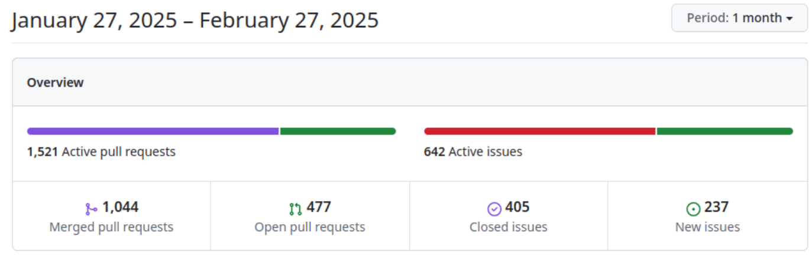
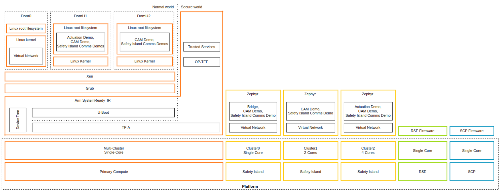

# Zephyr 爱好者月刊（第 2 期 202502）

这里记录 Zephyr 最新的消息和值得分享的内容，每月最后一周发布。

本杂志开源（GitHub: [lgl88911/Zephyr_Fans_Monthly](https://github.com/lgl88911/Zephyr_Fans_Monthly)），欢迎提交 issue，投稿或推荐 Zephyr 内容。

## 项目数据

不包括合并，366 位作者向主分支推送了 1,849 次提交，向所有分支推送了 1,927 次提交。
在主分支上，共有 4,118 个文件发生了变化，新增了 112,279 行，删除了 28,241 行所有的数据都较上月有提升。

近期动向：
- [ZVM：新一代 1.5 类 RTOS 虚拟化方案](https://github.com/zephyrproject-rtos/zephyr/pull/84123) 湖南大学嵌入式与网络计算湖南省重点实验室，谢国琪教授团队力作 ZVM 向 upstream 提交
- [驱动程序支持 PSI5 协议](https://github.com/zephyrproject-rtos/zephyr/issues/83982)
- [驱动程序支持 SENT 传输协议](https://github.com/zephyrproject-rtos/zephyr/issues/83983)
- [添加设备 init/deinit](https://github.com/zephyrproject-rtos/zephyr/pull/84394)
- [添加初始的 OpenRISC 支持](https://github.com/zephyrproject-rtos/zephyr/pull/83933) NVIDIA 对支持这一架构移植感兴趣，并预计至少能支持 5 年
- [支持瑞萨 RX 架构](https://github.com/zephyrproject-rtos/zephyr/pull/81507)
- [添加 VIRTIO PCI 驱动程序](https://github.com/zephyrproject-rtos/zephyr/pull/83892)
- [延迟事件管理子系统](https://github.com/zephyrproject-rtos/zephyr/pull/83592)
- 
## 新闻&活动

1、[Zephyr 在 Embedded World 2025 的主题日程](https://zephyrproject.org/zephyr-project-at-embedded-world-germany-2025-tracks-you-cant-miss/)

Zephyr 项目作为为展会的官方社区合作伙伴，将通过多个议题展示其技术路线图与行业解决方案，并基于 2024 年社区增长、技术里程碑及安全创新持续推动嵌入式生态发展。

2、[Zephyr 项目 2025 年 FOSDEM 回顾](https://www.zephyrproject.org/zephyr-project-at-fosdem-2025-a-recap-blog/)

Zephyr 在 FOSDEM 2025 的议题覆盖行业落地、技术深度、生态协作三大维度，展示其在太空等高端场景的应用，也直面社区反馈推动工具链优化，为开发者提供从协议层到系统集成的全栈参考。主要内容包括：

- 行业应用与创新案例
  - 在太空领域的应用：SatNOGS-COMMS
  - 开源智能手表：ZSWatch
- 技术开发与实践
  - ​BLE 主机应用开发
  - USB-MIDI 2.0 设备支持
  - RISC-V CFU 硬件加速
- 安全与开源生态
  - 开源项目最佳实践
  - 嵌入式视频系统
- 社区互动与反馈
  - ​Zephyr“烤肉派对”​: 开放讨论 Zephyr 的争议点（如实时性能、设备树复杂性、驱动成熟度），直面开发者痛点并解释设计取舍，促进社区理解与改进
-  工具链与开发支持
   - Nordic SDK 与 Zephyr 集成

3、[多家公司成为 Zephyr 项目会员](https://www.zephyrproject.org/doulos-honda-hubble-network-iar-inovex-and-microchip-technology-join-the-zephyr-project-as-it-gets-closer-to-safety-certification/)

Zephyr 项目宣布 Doulos、Honda、Hubble Network、IAR、inovex 和 Microchip Technology 已加入成为银牌会员。

Zephyr 项目在功能安全领域取得关键突破，其内核已通过 IEC 61508 SIL3 级认证概念批准，成为首个提交该认证的开源实时操作系统。项目正基于此构建全生命周期管理体系，覆盖设计到运维各环节，通过全流程管控实现研发透明化与责任可追溯

[IAR 宣布成为 Zephyr 项目银牌会员](https://www.iar.com/dev-dynamic-custom-objects/iar-joins-zephyr-project-as-a-silver-member-strengthening-its-commitment-to-open-source-collaboration)

2025 年 2 月 11 日嵌入式系统开发软件解决方案的领先提供商 IAR，宣布其正式成为 Zephyr 项目的银牌会员。这代表着 IAR 致力于与开源社区和领先的硅谷供应商合作，为 Zephyr 开发者提供业界领先的工具。Zephyr 的开发入门门槛较高，IAR 的加入有望改善这一入门通点。

2 月中，IAR 已经发布了第一个针对 Zephyr 的 arm-build-tool，https://github.com/iarsystems/zephyr-iar/releases 。

## 文摘&观点
1、[如何找到合适的 Zephyr 开发者](https://www.emtechsa.com/post/everything-you-need-to-know-about-zephyr-and-how-to-select-the-best-developers)

这篇文章介绍了如何找到合适的 Zephyr 开发者，包括对 Zephyr 的理解、对嵌入式系统的理解、对 Zephyr 的贡献、对 Zephyr 的社区的理解等。但从行文上来看很像是一篇由 AI 生成的文章。

2、[高通正在招聘 Zephyr 高级工程师](https://www.jointaro.com/jobs/qualcomm/embedded-real-time-operating-system-senior-software-engineer-qurt-os-zephyr/)

高通正在招聘 Zephyr 的嵌入式工程师，看起来是和汽车相关的。这是否意味着距离 Zephyr 项目在汽车领域的落地又进一步

3、[ARM auto 解决方案中包含 Zephyr](https://arm-auto-solutions.docs.arm.com/en/v1.1/overview.html#arm-automotive-solutions-overview)

在 ARM automotive 的架构中提到：在安全岛中运行了 3 个 Zephyr RTOS。ARM 能够选择 Zephyr 作为其自动驾驶方案的一部分，可以说明 Zephyr 的安全性得到了认可。

## 技术

1、[从 FreeRTOS 迁移到 Zephyr](https://docs.amd.com/r/en-US/wp560-rtos-zephyr-porting/FreeRTOS-to-Zephyr-Porting-Example)

在 AMD 的技术网站上发布的白皮书，全面概述了从 FreeRTOS 系统过渡到 Zephyr 的优势。说明 Zephyr 工具的高级特性，如模块化、集成的设备驱动程序接口和原生网络栈，这些高级特性使其成为复杂嵌入式系统的优选方案。此外，该白皮书还包括了内核对象迁移的对比说明，移植演示应用的实用示例，为迁移过程提供了宝贵的见解。

## 课程&教程

1、[使用 qemu 和 vscode 搭建 Zephyr 开发环境](https://dojofive.com/blog/using-the-qemu-emulator-with-zephyr-builds-and-vscode/)

在 ​VSCode中配置Zephyr项目，通过 ​QEMU模拟器​ 实现嵌入式应用程序的 ​跨平台调试与性能优化。

2、[如何将 Golioth 添加到现有的 Zephyr 项目中](https://blog.golioth.io/how-to-add-golioth-to-an-existing-zephyr-or-ncs-project/)

Golioth 是一个面向商业物联网开发的云服务平台，旨在简化嵌入式设备的规模化部署与全生命周期管理，提供与 Zephyr RTOS 深度集成的 SDK，支持多线程应用程序开发、远程调试（如 SEGGER Ozone 工具链集成）和实时系统行为分析（SystemView 工具支持），本文说明如何将 Golioth 添加到 Zephyr 中。

## Zephyr 每月小知识

1、通过添加`CONFIG_COMPILER_SAVE_TEMPS=y`配置项可以得到 Zephyr 构建过程中的预处理文件，方便理解 Zephyr 中复杂宏的最终结果。

