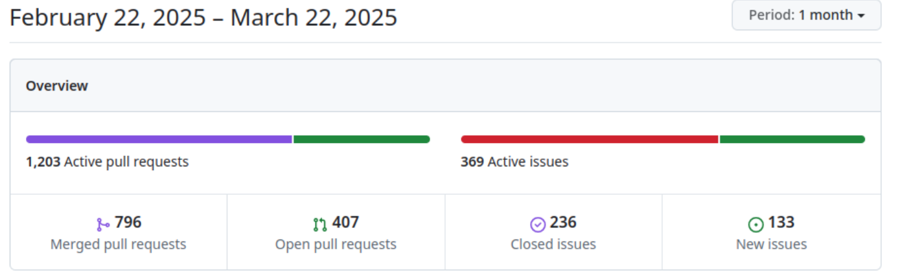
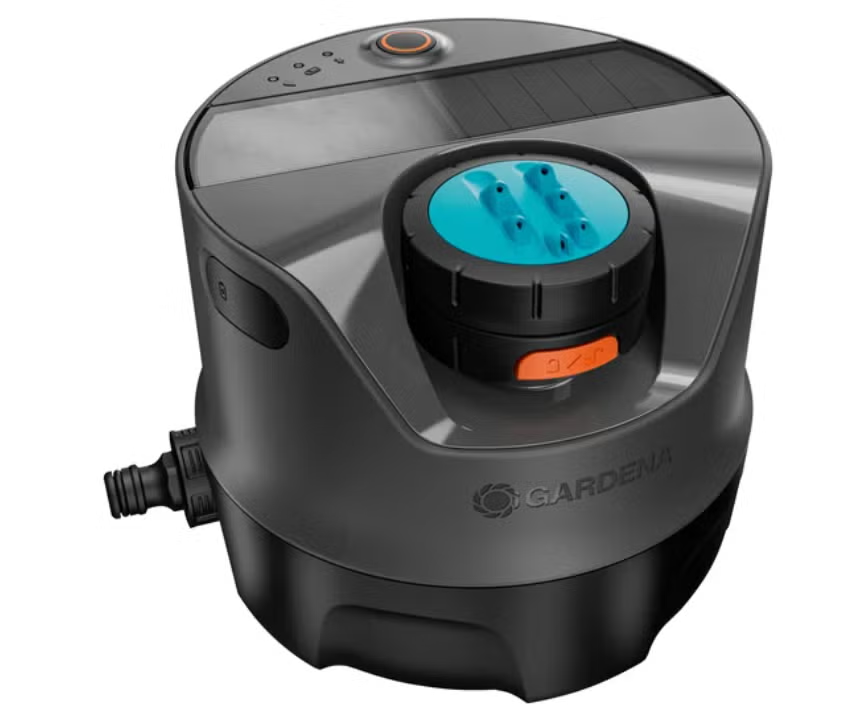

# Zephyr 爱好者月刊（第 3 期 202503）

这里记录 Zephyr 最新的消息和值得分享的内容，每月最后一周发布。

本杂志开源（GitHub: [lgl88911/Zephyr_Fans_Monthly](https://github.com/lgl88911/Zephyr_Fans_Monthly)），欢迎提交 issue，投稿或推荐 Zephyr 内容。

## 项目数据

不包括合并，314 位作者向主分支推送了 1431 次提交，向所有分支推送了 1486 次提交。
在主分支上，共有 3,962 个文件发生了变化，新增了 89,844 行，删除了 42,027 行。

近期动向：
- [驱动程序支持 PSI5 协议](https://github.com/zephyrproject-rtos/zephyr/issues/83982)
- [驱动程序支持 SENT 传输协议](https://github.com/zephyrproject-rtos/zephyr/issues/83983)
- [使用统一前缀公共 API 的长期计划](https://github.com/zephyrproject-rtos/zephyr/issues/64627)
- [添加 VIRTIO PCI 驱动程序](https://github.com/zephyrproject-rtos/zephyr/pull/83892)
- [延迟事件管理子系统](https://github.com/zephyrproject-rtos/zephyr/pull/83592)

sig-Zephyr
- [提供 Zephyr 国内完整镜像](https://gitee.com/src-openeuler/zephyr/tree/mirror/)：包含 4.1.0 代码，工具链和外部 moudle
- [Zephyr 和 openEuler Embedded 的集成构建和混合关键性特性的支持](https://gitee.com/openeuler/yocto-meta-openeuler/pulls/2509)

## 新闻&活动

1、[Zephyr 4.1 版本正式发布](https://zephyrproject.org/zephyr-rtos-4-1-is-available/)

Zephyr RTOS 4.1 版本正式发布，主要聚焦性能优化与工具链扩展。新版本通过改进内核调度算法、内存管理及线程优先级机制，显著提升了系统响应速度和资源效率。同时，新增对 IAR 工具链的官方支持，允许开发者利用 IAR Compiler 和调试工具进行开发，增强了开发灵活性。其他更新包括对 Arm Cortex-M85 架构、RISC-V 处理器及多款新开发板（如 Nordic nRF54 系列）的兼容性支持，并强化了网络协议栈（如 CAN 总线、OpenThread）功能。此外，版本修复了此前存在的漏洞，优化了文档结构以提升开发体验。此次升级旨在为嵌入式及物联网设备提供更高性能、更安全的实时操作系统支持。

2、[Zephyr 项目 在中国举行线下活动](https://www.zephyrproject.org/event/zephyr-project-meetup-shanghai-china/)

Zephyr 项目将于 2024 年 3 月 28 日 18:00-21:00 在上海 NXP 办公室举办线下技术交流会，聚焦开源技术、嵌入式系统开发及 Zephyr OS 应用案例，涵盖子系统功能与新特性分享。活动本次活动是 Zephyr 项目首次在国内举行线下活动，由 NXP 主办，面向嵌入式开发者（含初学者），以中文交流为主，提供技术研讨与行业社交机会。

3、[Silicon Labs 扩大对 Zephyr 的支持](https://www.silabs.com/blog/silicon-labs-expands-support-for-zephyr-project)

Silicon Labs（芯科科技）宣布扩大对其无线解决方案与开源实时操作系统 Zephyr RTOS 的集成支持。作为 Zephyr 项目成员（自 2021 年加入），该公司将深化对多款设备的支持，尤其聚焦在蓝牙低功耗（BLE）领域，使开发者能更便捷地基于 Zephyr 平台开发物联网产品。

4、[Zephyr 在科学和教育中的应用](https://www.zephyr-sceduconf.org/en)

Navimatix 是一家德国软件公司，专注于物联网与跨行业定制化软件开发。该公司将在 2025.9.23 举办会议讨论 Zephyr 在科学和教育领域的应用。

## 文摘&观点

1、[CircuitPython 9.2.5 引入对 ​Zephyr RTOS 的初步支持](https://blog.adafruit.com/2025/03/18/circuitpython-9-2-5-released/)

CircuitPython 9.2.5 开始引入对 ​Zephyr RTOS 的初步支持（alpha 阶段），覆盖 Nordic、瑞萨和 STM32 等硬件平台。尽管当前功能尚不完善，但已通过关键修复（如串口输出兼容性）为开发者提供了实验性集成选项，通过 Zephyr 的 Porting 层，CircuitPython 未来可能进一步扩展多平台物联网应用的开发能力。

2、[Linux 基金会系列研究报告揭示 CRA 合规准备与达标的广泛现状](https://openssf.org/press-release/2025/03/18/linux-foundation-research-reports-reveal-wide-spectrum-for-cyber-resilience-act-readiness-and-compliance/)

欧盟 CRA(cyber-resilience-act) 旨在通过降低漏洞、全生命周期安全维护及透明标准，提升数字产品网络安全，覆盖软硬件并明确制造商主体责任。
CRA 的一些内容可以参考：https://www.huxiu.com/article/4146198.html

Linux 基金会的研究报告：https://www.linuxfoundation.org/hubfs/LF%20Research/lfr_cra_031725a.pdf?hsLang=en 提到 Zephyr 的最佳实践：

- 结构化开发实践：
基于 GitHub 的版本管理，每四个月发布新版本。 提供每个版本的支持窗口，每 2.5 年发布一个长期稳定版本，支持 2.5 年。 通过多个渠道（如存储库标记、邮件列表公告、Discord 通知和专门的问答环节）进行软件发布沟通。发布过程在项目的在线文档中全面记录，确保透明度和可审计性。

- 网络安全政策：
维护广泛的安全文档，包括安全概述、安全编码指南和传感器设备威胁模型。作为 CVE 编号机构，拥有建立的产品安全事件响应团队（PSIRT）。 提供自愿漏洞报告渠道，并维护包含补救信息的漏洞注册表。

- 与市场监督机构（MSA）的合作： 
作为 CVE 编号机构，直接与 PSIRT 当局沟通漏洞通知。维护响应迅速的志愿者系统，通常在一到两天内处理安全相关请求。

- 安全认证计划：
参与 OpenSSF Scorecard 和 OpenSSF 最佳实践徽章计划，确保持续合规。 生成符合 SPDX 格式的构建特定软件物料清单（SBOM）。 维护公共仪表板，展示广泛的构建目标的 SBOM。 
​
- 超越 CRA 要求的网络安全实践：
实施禁运政策，补充结构化的 PSIRT。 通过自动化工具（如 MISRA 扫描）预防安全回归，并为贡献者提供专门的安全实践培训。

3、[最佳开源机械键盘固件](https://www.xda-developers.com/best-open-source-firmwares-custom-mechanical-keyboard/)

基于 Zephyr 构建的开源机械键盘 ZMK 上榜。ZMK 以无线能效与开源灵活性为核心，虽功能尚未全面，但其 MIT 许可与 Zephyr 技术栈使其在无线键盘领域具备独特优势，适合追求长续航与未来兼容性的开发者。

4、[MCUXpress SDK Release](https://mcuxpresso.nxp.com/mcuxsdk/latest/html/introduction/README.html)

NXP MCUXPress SDK 的 Release Note 中提到：收到 Zephyr 软件交付管理方法的启发，MCUXpress SDK 开始使用 west 来进行软件包的管理和交付。

5、[Sonitor Technologies 正在招聘 Zephyr 工程师](https://arbeidsplassen.nav.no/stillinger/stilling/5ca9cbe1-0e19-499e-a0a4-f6f3e6936bcc)

Sonitor Technologies 是一家专注于 ​高精度室内实时定位系统（RTLS）​ 的全球领先企业，其招聘嵌入式固件工程师的要求中要求有 Zephyr 相关经验，说明不同的行业对 Zephyr 的认可。

## 课程&教程

1、[NXP 提供的 Zephyr 资源](https://www.nxp.com.cn/design/design-center/software/embedded-software/zephyr-os-for-edge-connected-devices:ZEPHYR-OS-EDGE)

列举了 NXP 支援 Zephyr 的系列芯片和一些入门文档。

2、[在 Arduino UNO R4 WiFi 上运行 Zephyr](https://leonardocavagnis.medium.com/getting-started-with-zephyr-os-on-arduino-5b87a7ccbf4c)

一篇指导文章，说明如何在 Arduino UNO R4 WiFi 上运行 Zephyr。

## 使用 Zephyr 的产品

1、[灌溉控制器 AquaPrecise](https://www.zephyrproject.org/portfolio/gardena-aquaprecise/)

AquaPrecise 是一款太阳能驱动的全能灌溉解决方案，适用于草坪，可灌溉面积高达 320 平方米。该产品使用了 Zephyr，但没有找到更多与 Zephyr 相关的详细信息。

2、[Google Chromebook](https://www.zephyrproject.org/portfolio/google-chromebook/)

Google 的笔记本，其 EC（Embedded Controller ）使用了 Zephyr。https://chromium.googlesource.com/chromiumos/platform/ec/+/HEAD/docs/zephyr/README.md

3、[voi 电动滑板自行车](https://www.zephyrproject.org/portfolio/voiager-v4-v5-v7-and-v8-scooters/)

Voi 是一家致力于通过共享电动微出行（如电动滑板车）推动城市交通绿色转型的欧洲公司。Zephyr 是该公司过去 6 年所有车辆的首选嵌入式系统。Zephyr 被用于控制其超过 10 万辆的电动滑板车上。

## Zephyr 每月小知识

1、通过添加`west build -t initlevels`可以得到 Zephyr 设备初始化的排列信息，了解运行时设备的初始化顺序。
