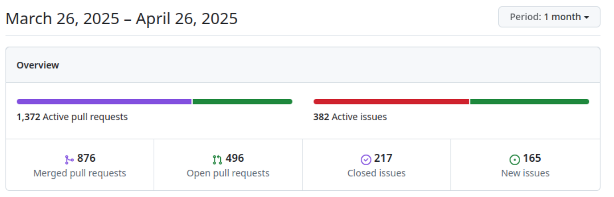
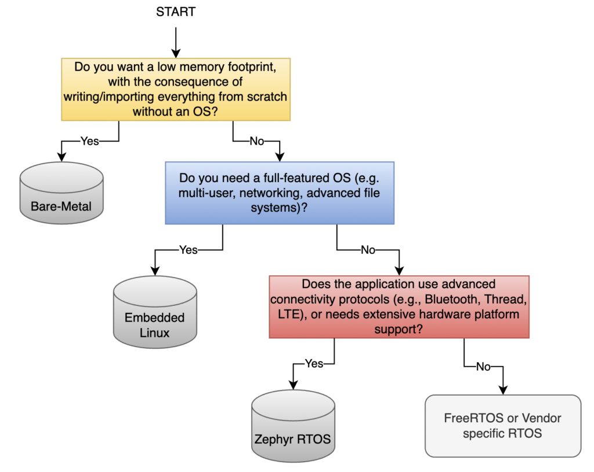
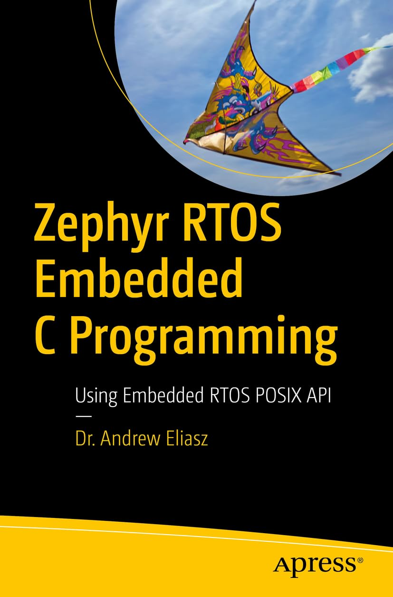
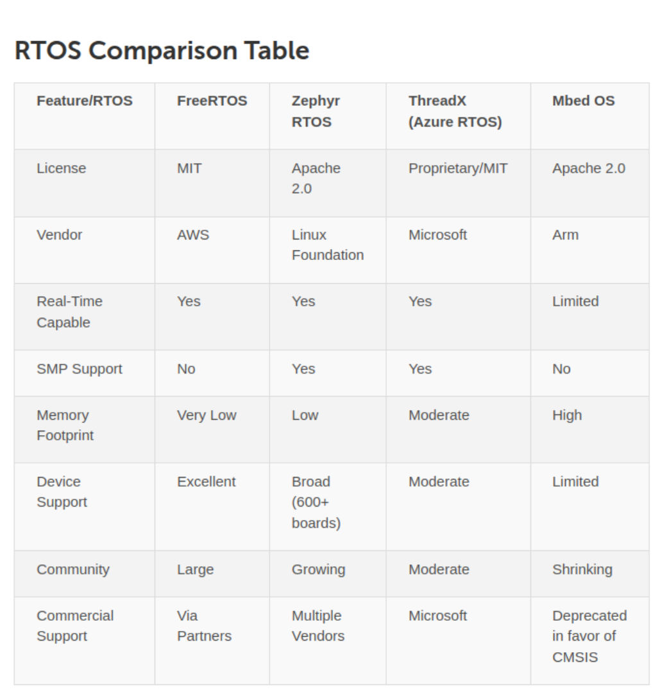

# Zephyr 爱好者月刊（第 3 期 202503）

这里记录 Zephyr 最新的消息和值得分享的内容，每月最后一周发布。

本杂志开源（GitHub: [lgl88911/Zephyr_Fans_Monthly](https://github.com/lgl88911/Zephyr_Fans_Monthly)），欢迎提交 issue，投稿或推荐 Zephyr 内容。

## 项目数据

不包括合并，367 位作者向主分支推送了 1770 次提交，向所有分支推送了 1884 次提交。
在主分支上，共有 4869 个文件发生了变化，新增了 164,915 行，删除了 45,069 行。

近期动向：
- [4.2.0中下一代USB](https://github.com/zephyrproject-rtos/zephyr/issues/42066)
- [使用统一前缀公共 API 的长期计划](https://github.com/zephyrproject-rtos/zephyr/issues/64627)
- [将 DALI 驱动程序添加到 Zephyr](https://github.com/zephyrproject-rtos/zephyr/pull/88128)
- [为 Renesas 设备添加支持 renesas_elc 驱动程序](https://github.com/zephyrproject-rtos/zephyr/pull/88141)
- [废弃阻塞读取传感器 API](https://github.com/zephyrproject-rtos/zephyr/issues/70651)
- [添加 Silicon Labs 数据包跟踪接口驱动程序](https://github.com/zephyrproject-rtos/zephyr/pull/88035)
- [Renesas RX Zephyr 架构支持](https://github.com/zephyrproject-rtos/zephyr/pull/81507)
- [HWM2：扩展以包括 SiP 支持](https://github.com/zephyrproject-rtos/zephyr/pull/84107)

[Zephyr架构看板](https://github.com/orgs/zephyrproject-rtos/projects/35)

## 新闻&活动

1、[2025 Zephyr上海见面会精华总结](https://zephyrproject.org/recap-blog-zephyr-project-meetup-shanghai-china-march-28-2025/)

2025年3月28日，Zephyr项目在上海恩智浦半导体园区举办中国首场开发者见面会。活动聚焦蓝牙协议栈应用、NXP边缘计算支持及ZVM虚拟化技术，涵盖小米IoT生态实践、车企本地化合作与高校创新成果，通过技术分享与开放交流推动社区共建，未来计划拓展中国区域活动。

2、[Zephyr Project 在 Linaro Connect 2025 的活动信息​](https://www.zephyrproject.org/event/zephyr-project-at-the-linaro-connect-2025/?utm_campaign=Zephyr%20Event&utm_content=329063457&utm_medium=social&utm_source=twitter&hss_channel=tw-4889353644)

2025年5月14-16日，Zephyr Project于Linaro Connect（里斯本）分享开源实时操作系统进展，聚焦Rust语言集成、安全认证及嵌入式开发实践，助力开发者与行业领袖深度交流，推动技术创新。

3、[2025年北美开源峰会Zephyr项目日程安排](https://zephyrproject.org/schedule-for-zephyr-track-at-the-open-source-summit-2025-north-america-is-now-live/?utm_campaign=Zephyr%20Blog&utm_content=330425746&utm_medium=social&utm_source=twitter&hss_channel=tw-4889353644)

会议聚焦嵌入式开发，涵盖Zephyr RTOS前沿技术：
​- ​6月23日​​：探讨Rust与Zephyr的协同开发（Linaro）、开源健康设备实践（Protocentral）、LoRaWAN固件无线更新（Zylum）、实时I/O（RTIO）优化（Croxel）及系统性能调优策略（Beningo嵌入式）。
​​- 6月24日​​：覆盖边缘AI/MLOps全流程（Edge Impulse）、轻量AI子系统实验（IMEC）、Yocto构建FPGA方案（AMD）、硬件模拟工具链（QEMU/BabbleSim）及West元工具实战指南（AC6）。
亮点包括低功耗设计、跨平台开发、实时性优化及开源生态整合，助力开发者提升效率与扩展应用场景

4、[Zephyr Weekly Update恢复正常]

Zephyr的Weekly Update博客开始正常化, Zephyr Weekly Update对最近Zephyr的重点变化进行介绍，能帮你快速了解Zephyr的最新变化和引入的功能。
- [3.28](https://zephyrproject.org/zephyr-weekly-update-mar-28-2025/)
- [4.11](https://zephyrproject.org/zephyr-weekly-update-apr-11-2025/)
- [4.18](https://zephyrproject.org/zephyr-weekly-update-packet-filtering-uuids-more/)

## 文摘&观点

1、[​​为Kenning框架下的Zephyr平台生成基于AutoML的模型​](https://zephyrproject.org/generating-automl-based-models-for-zephyr-platforms-in-kenning/)

Antmicro与ADI合作在Kenning框架中引入AutoML模块，通过自动化模型架构搜索和超参数优化，为Zephyr平台（如MAX32690 MCU）生成定制化AI模型。该工具结合SMAC算法和硬件感知训练，简化嵌入式开发流程，并通过Renode仿真验证模型性能，显著降低资源受限设备部署AI的门槛。

2、[​在Renode模拟器中结合Zephyr RTOS测试NXP S32K汽车通用微控制器​](https://zephyrproject.org/testing-nxp-s32k-automotive-general-purpose-mcu-in-renode-simulation-with-zephyr-rtos/)

Antmicro扩展了Renode仿真平台对NXP S32K388汽车MCU的支持，新增FlexCAN、FlexIO等外设模型，并验证了Zephyr RTOS在多核场景下的兼容性。通过自动化测试（如CAN通信、以太网传输），确保仿真模型的准确性，助力汽车软件开发。其意义在于通过确定性仿真提前发现集成问题，减少硬件依赖，加速软件定义汽车的开发周期，同时提升系统可靠性与安全性，符合汽车行业严苛标准，推动高效、低成本的开发流程

3、[宝马E30车型的电子改装](https://hobby.farit.ru/)

宝马E30仪表盘的改装基于STM32使用了大量的Zephyr技术

4、[reddit上Zephyr的入门开发者使用Zephyr感受](https://www.reddit.com/r/embedded/comments/1k1qlq0/zephyr_6_months_experience/)

一位使用了6个月Zephyr开发者在Reddit上发表的感受，后面有一些其他开发者的反馈，虽然有一些吐槽，大部分的感受都偏正向。

5、[Zephyr RTOS 及其对物联网的影响](https://emlogic.no/2025/04/zephyr-rtos-and-its-impact-on-iot/)

emlogic发布的观点:Zephyr RTOS 及其对物联网的影响，文章给出了裸机/FreeRTOS/嵌入式linux/Zephyr的选择决策

6、[施耐德招聘zephyr技术leader](https://www.simplyhired.es/job/Gkxliyj8txZvhZKoF9ZvSMVEnvcXT2V-f7-7X9OSfb0Q_va-qOKJNA)

从招聘信息可以推测，施耐德将Zephyr RTOS作为工业物联网（IIoT）转型的核心技术。其开源特性与Linux基金会支持推动标准化开发，助力企业降低研发成本。作为轻量级实时操作系统，Zephyr在施耐德电气的战略定位中承担边缘计算平台开发，整合工业设备控制、能源管理及AIoT应用，尤其擅长智能电网、自动化产线等场景。

## 课程&教程

1、[将memfault集成到zephyr](https://docs.memfault.com/docs/mcu/zephyr-guide)

Memfault是物联网设备诊断平台，为Zephyr RTOS提供嵌入式故障监控解决方案。其SDK深度集成于Zephyr，实时采集设备崩溃日志、性能数据和硬件指标，通过云端分析实现远程故障诊断、OTA更新和固件回溯。该集成增强了Zephyr生态的运维能力，帮助开发者快速定位边缘设备问题，提升系统可靠性，降低现场维护成本，加速产品迭代周期。

2、[Raspberry Pi Pico 2开发板上快速搭建Zephyr RTOS开发环境](https://www.hackster.io/cdwilson/zephyr-rtos-on-raspberry-pi-pico-2-part-1-cf39f0)

这篇教程介绍了如何在Raspberry Pi Pico 2开发板上快速搭建Zephyr RTOS开发环境。主要内容包括：通过west工具链编译Blink示例程序，使用UF2引导程序烧录固件；通过CDC-ACM虚拟串口实现USB通信，启用Zephyr Shell交互功能；演示了通过虚拟传感器使用传感器指令集读取模拟数据。教程还预告了后续将讲解如何创建自定义应用，连接真实传感器并显示数据。

3、[Zephyr RTOS嵌入式C语言编程：使用嵌入式RTOS的POSIX API](https://www.amazon.com/-/es/Zephyr-RTOS-Embedded-Programming-Using/dp/B0CMZ4FSCJ)

一本Zephyr的书，主要内容如下：
- Cortex-M 架构概述  
- 高级数据结构和算法编程（链表、循环缓冲区和列表）  
- 如何构建 Zephyr 应用程序，包括在 Linux 上设置命令行 Zephyr 开发环境  
- 实时操作系统中的任务调度和抢占模式  
- 调度、中断和同步，包括线程、调度和系统线程。  
- 对称多处理（SMP）概述及 Zephyr 对 SMP 的支持。  
- 内存管理，包括内存堆、内存块和内存池。

## 技术&工具

1、[Zephyr工作平台](https://zephyr-workbench.com/)

Zephyr 工作台是 Zephyr 项目的 Visual Studio Code 扩展，提供用户友好的界面和强大的功能集。该插件是AC6开发(AC6 提供从培训到技术支持和咨询服务的全方位服务，涵盖嵌入式电子系统。最近增加了开发工具，以向电子开发者提供完整的服务)
https://github.com/Ac6Embedded/vscode-zephyr-workbench
该插件将 SDK 管理、West 工作空间配置、项目创建、构建、烧录和调试直接集成到 VS Code 中，消除了设置和管理 Zephyr 项目的许多传统复杂性。
- 无缝设置
- 自动安装原生主机工具（如 Python 和 CMake）并导入 Zephyr SDK，最小化手动配置
- west集成
- 利用west工作区组织项目，并提供对常用操作的必要west命令的访问
- 项目向导
- 提供直观的基于示例的模板系统，快速创建新应用程序
- 构建和调试
- 提供与 STM32 设备的强大集成，包括 STM32WBA、STM32L、STM32U 等系列。

2、[ESP-IDF的ROM包含Zephyr RTOS USB协议栈](https://docs.espressif.com/projects/esp-idf/zh_CN/v5.4-rc1/esp32p4/COPYRIGHT.html)

继Zephyr 蓝牙软件栈被广泛采用后，USB协议栈也在逐渐被其它项目接受。

3、[如何实现Zephyr的网页应用](https://bec-systems.com/2420/how-to-implement-zephyr-web-applications/)

该文章探讨在Zephyr RTOS的MCU设备上开发Web应用的挑战与方案。作者对比多种前端框架后，推荐使用Elm语言：其编译后代码体积小（适合Flash存储限制），纯函数式特性保障稳定性（几乎无运行时错误），且工具链成熟（如elm-ui简化CSS布局）。相较于传统JS框架（React/Vue等），Elm避免了NPM依赖臃肿和JS易崩溃问题；而htmx/Svelte虽轻量，仍存在后端渲染依赖或JS固有风险。作者基于Simple IoT项目实践，验证Elm在资源受限设备中可实现高可靠、易维护的SPA架构，尤其适合需要长期稳定运行的嵌入式场景。

4、[主流RTOS比较和选择](https://promwad.com/news/choosing-rtos-freertos-zephyr-threadx-comparison)

该文章对比了2025年主流实时操作系统（RTOS）：FreeRTOS（轻量、MIT许可，适合微控制器）、Zephyr（模块化、多架构支持，专注IoT安全）、ThreadX（微软Azure集成，商用稳定）和Mbed OS（教育原型开发，逐步淡出）。核心评估指标包括实时性能、许可证、内存占用及生态兼容性。趋势指向安全强化、AI边缘计算和RISC-V架构支持。专家建议根据项目周期、认证需求及云服务整合选择，强调实际场景测试，避免技术锁定。

## Zephyr 每月小知识

1、通过添加`west build -t ram_report`和`west build -t rom_report`可以得到 Zephyr 镜像中不同文件的内存占用量，可以指导如何缩减Zephyr尺寸。

