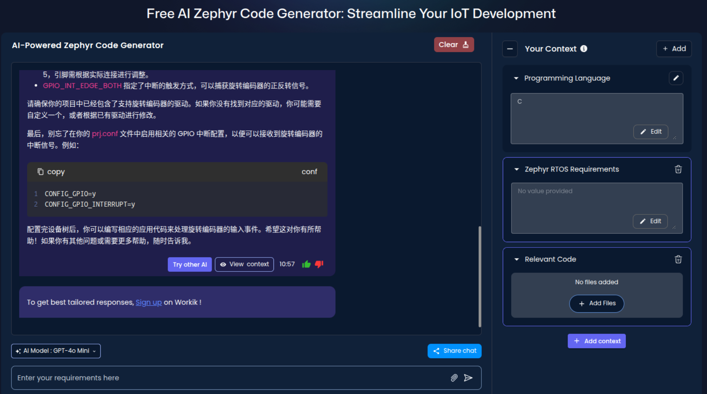

# Zephyr 爱好者月刊（第 5 期 202505）

这里记录 Zephyr 最新的消息和值得分享的内容，每月最后一周发布。

本杂志开源（GitHub: [lgl88911/Zephyr_Fans_Monthly](https://github.com/lgl88911/Zephyr_Fans_Monthly)），欢迎提交 issue，投稿或推荐 Zephyr 内容。

## 项目数据

不包括合并，355 位作者向主分支推送了 1676 次提交，向所有分支推送了 1771 次提交。
在主分支上，共有 4414 个文件发生了变化，新增了 138,487 行，删除了 49,870 行。

近期动向：
- [4.2.0 中下一代 USB](https://github.com/zephyrproject-rtos/zephyr/issues/42066)
- [使用统一前缀公共 API 的长期计划](https://github.com/zephyrproject-rtos/zephyr/issues/64627)
- [将 DALI 驱动程序添加到 Zephyr](https://github.com/zephyrproject-rtos/zephyr/pull/88128)
- [为 Renesas 设备添加支持 renesas_elc 驱动程序](https://github.com/zephyrproject-rtos/zephyr/pull/88141)
- [驱动 API 与线程安全](https://github.com/zephyrproject-rtos/zephyr/issues/89109)
- [导入 counter capture api](https://github.com/zephyrproject-rtos/zephyr/pull/89127) 
- [废弃阻塞读取传感器 API](https://github.com/zephyrproject-rtos/zephyr/issues/70651)

[Zephyr 架构看板](https://github.com/orgs/zephyrproject-rtos/projects/35)

## 新闻&活动

1、[Zephyr 以​**​生态系统合作伙伴​**​身份参加The Things Conference](https://www.zephyrproject.org/zephyr-project-joins-the-things-conference-2025-as-ecosystem-partner/)

2、[印度的开源峰会中 Zephyr 演讲主题​](https://www.zephyrproject.org/open-source-summit-india-check-the-talks-featuring-zephyr-rtos/)

8.5 在印度的开源峰会中的 Zephyr 演讲主题
- ProtoCentral Electronics: **开源健康设备中的 Zephyr 应用
- TI: **异构 SoC 的 Zephyr 支持挑战与决方案**
- AMD: **Twister 测试框架与硬件运器集成**

3、**5 月份的 Zephyr Project Meetup**
- [印度浦那 5.23](https://www.zephyrproject.org/zephyr-project-meetup-may-23-2025pune-india-what-to-expect/)
- [波兰，克拉科夫 5.22](https://www.zephyrproject.org/zephyr-project-meetup-may-23-2025pune-india-what-to-expect/)
- [美国，波士顿：5.22](https://www.zephyrproject.org/zephyr-project-meetup-may-22-2025-boston-usa-what-to-expect/)
- [印度班加罗尔：5.17](https://www.zephyrproject.org/zephyr-project-meetup-may-17-2025-bangalore-india-what-to-expect/)

4、[Zephyr Weekly Update 5.23](https://www.zephyrproject.org/zephyr-weekly-update-video-killed-the-radio-star/)
- Zephyr SDK 0.17.1 提供了 RX 工具链
- 新的视频框架已可用 (PR [#82158](https://github.com/zephyrproject-rtos/zephyr/pull/82158)) 支持 Bayer, RGB, and YUV 格式，增加视频 shell 和 CCI 工具
- **west patch** 和 patches.yml 管理下游补丁
- 增加 board 和驱动
- zephyr.dts 开始包含注释，方便调试错误
- 文档中的板卡目录包含** shields**
- 支持 CoAP Secure
- LLEXT 支持** x86 architecture** (PR [#90176](https://github.com/zephyrproject-rtos/zephyr/pull/90176)) 和 **ARC MPU** (PR[#89118](https://github.com/zephyrproject-rtos/zephyr/pull/89118))
- LVGL 支持多显示器 (PR [#86815](https://github.com/zephyrproject-rtos/zephyr/pull/86815)).
- 不再支持** Altera NIOS-II**
- `west` 提供基本的 PowerShell 自动补全功能

5、[Percepio 推出免费 Zephyr 调试工具 Percepio View](https://www.zephyrproject.org/tracing-zephyr-applications-with-percepio-view/)

​Percepio 推出免费 Zephyr 调试工具 Percepio View，支持快照追踪及内核事件可视化，基于 TraceRecorder 库，商业版提供高级分析功能。

6、[​Variscite 提供 Zephyr 解决方案](https://www.variscite.com/newsroom/zephyr-rtos-now-supported-on-variscite-systems-on-module-enhanced-flexibility-for-embedded-projects/)

全球知名的嵌入式系统模块（System on Module, SoM）供应商​​Variscite 提供 Zephyr 解决方案。

7、[ADI 的 codefusion-studio 支持 Zephyr](https://developer.analog.com/docs/codefusion-studio/1.1.0/release-notes/1.1.0/)

ADI 的 codefusion-studio 支持 Zephyr 4.1，但还有一些问题。

8、[玄铁处理器支持 Zephyr](https://www.xrvm.cn/community/download?id=4402506918707400704)

玄铁 Zephyr SDK 是玄铁处理器配套的软件开发工具包，该 SDK 以 Zephyr v3.7.0 LTS 版本为基础开发，用户可在 Linux 命令行下使用玄铁工具链及模拟器进行的编译开发和运行。

## 文摘&观点

1、[一位老哥在 reddit 上对 Zephyr 的吐槽​](https://www.reddit.com/r/embedded/comments/1kd5afc/zephyr_is_the_worst_embedded_rtos_i_have_ever/)

一位老哥在 reddit 上从模块依赖，复杂度，尺寸方面吐槽 Zephyr，认为 Zephyr 是他遇到的最糟糕的嵌入式 RTOS，下面的评论从各方面进行讨论，很大部分都站 Zehyr 并解释说明其优点。

2、[​5 个原因说明 Zephyr RTOS 将主导嵌入式世界](https://www.designnews.com/embedded-systems/zephyr-rtos-5-reasons-why-it-will-dominate-the-embedded-world-transform-industry)

从以下 5 个原因说明 Zephyr RTOS 将主导嵌入式世界：
- ​​活跃的开源社区与产业协作​​
- ​跨平台兼容性与协议支持
- ​​模块化架构与高效资源管理
- ​​内置专业级可观测性工具
- ​​降低嵌入式开发门槛

前 2 点是 Zephyr 的生态优势。后面三点是技术优势，但由于学习曲线的陡峭，大多数才入门的开发者还没体会到后面 3 点就放弃了，前面 reddit 的吐槽刚好就是后面 3 点。

3、[Nordic 为什么要将 SDK 切换到 Zephyr](https://www.byte-lab.com/from-nrf5-sdk-to-nrf-connect-sdk/)

这篇文章说明 Nordic 为什么要将 SDK 切换到 Zephyr，以及切换过程和经验教训。

4、[ADI 招聘嵌入式软件技术主管](https://analogdevices.wd1.myworkdayjobs.com/en-US/External/job/Technical-Lead---Embedded-Software--Developer-Toolchains---AI-Tooling_R252234-1)

ADI 招聘嵌入式软件技术主管，主导 AI 集成与框架开发；Zephyr RTOS 经验属加分项，体现了各大公司正在加大对 Zephyr 的投入。

5、[ABB 在招聘 Zephyr 方面的实习生](https://www.jobteaser.com/en/job-offers/dd8ea677-e884-4687-893c-a28829a21c26-abb-internship-or-student-worker-m-f-d-safe-and-secure-iot-devices-with-zephyr)

ABB 实习岗位凸显 Zephyr RTOS 在工业物联网安全的核心价值。

## 课程&教程

1、[瑞萨官网上提供的 Zephyr 资源](https://www.renesas.com/en/products/microcontrollers-microprocessors/ra-cortex-m-mcus/ra-partners/zephyr-rtos)

与瑞萨 MCU 相关的 Zephyr 资源

2、[Zephyr 内核的基本概念](https://embeddedexplorer.com/mastering-zephyr-os-12-essential-concepts-every-embedded-developer-must-know/)

Zephyr 内核中的一些基础概念和名词介绍。

## 技术&工具

1、[Zephyr：嵌入式 MCU 开发的安全之选​](https://yuanbao.tencent.com/chat/naQivTmsDa/b05c31a7-350e-49c1-a24e-0a9de83dfcbe)

Zephyr RTOS 为嵌入式设备提供多层次安全解决方案，集成 MCUboot 实现安全启动验证固件合法性，支持加密 OTA 更新（如 Mender）确保远程升级安全。其模块化设计通过 Device Tree/Kconfig 简化开发，加速原型到量产进程。通信安全方面内置 mbedTLS 支持 TLS 加密协议，保障数据传输。通过用户模式隔离代码权限，结合内存分区和 TF-M 可信执行环境（针对 Cortex-M），实现硬件级敏感操作保护，防止恶意访问。Zephyr 兼顾安全性与开发效率，成为物联网 MCU 开发的优选系统。

2、[基于 MCUboot 与 Zephyr RTOS 的可靠启动流程设计​](https://www.aerlync.com/blogs/robust_boot_process)

文章阐述了在 Zephyr RTOS 中使用 MCUboot 设计启动程序的关键要素，强调需在系统设计早期确定闪存分区布局（单/双槽）、安全签名算法、固件升级策略（覆盖/交换）、版本防回滚机制及串口恢复支持，并通过严格测试确保系统可靠性。

3、[全球芯片短缺启示](https://www.mikebuss.com/posts/lessons-learned-from-a-global-chip-shortage)

作者 2020 年遭遇芯片短缺，用了 2 个月的时间将固件移植到 Zephyr，使用 Zephyr 这样的实时操作系统，使其能够在配置文件中定义的硬件，芯片短缺时易于切换到其它平台，以应对芯片短缺的问题。

4、[Zephyr 代码生成 AI](https://promwad.com/news/choosing-rtos-freertos-zephyr-threadx-comparison)

为所有 Zephyr 兼容框架、平台和工具提供全面的 AI 支持：
- 使用 AI 生成符合 Zephyr 标准的设备树、Kconfig 和子系统代码，基于硬件输入。
- AI 分析任务调度、线程优先级和资源分配，提出改进建议以最小化延迟。
- AI 可以利用 Zephyr 的 HAL 库识别和配置 GPIO、I2C、UART 和其他外设。
- 检测应用程序中的逻辑错误，并使用 GDB 和 Zephyr 的原生日志子系统提供修复方案。

## Zephyr 每月小知识

1、默认情况下 Zephyr 的 console 是在 POST_KERNEL 阶段初始化的，之前的 log 都无法看到，一些情况下需要调试看到 PRE_KERNEL_1 阶段的 log，可以通过添加`CONFIG_EARLY_CONSOLE=y`让 console 在 PRE_KERNEL_1 阶段初始化。
