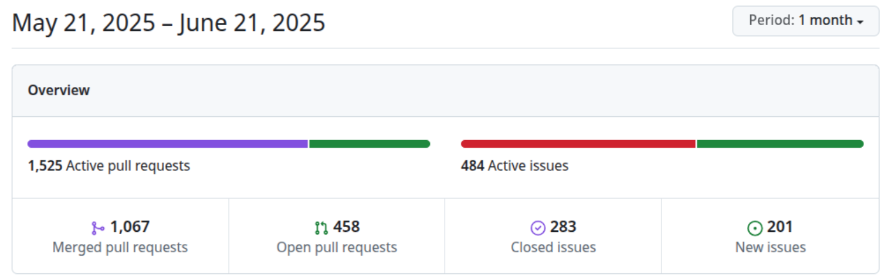
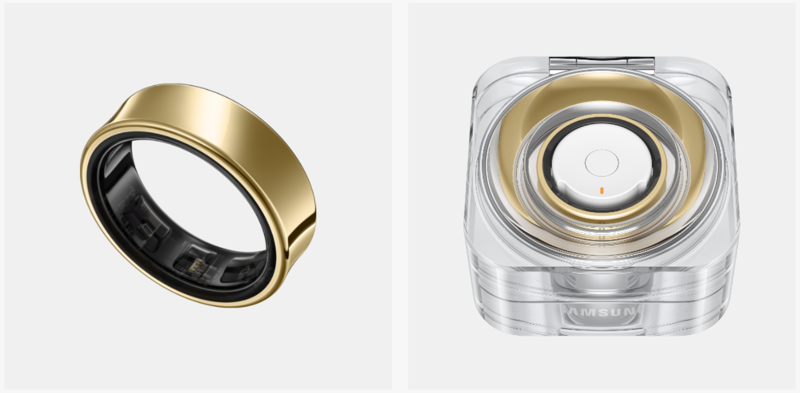
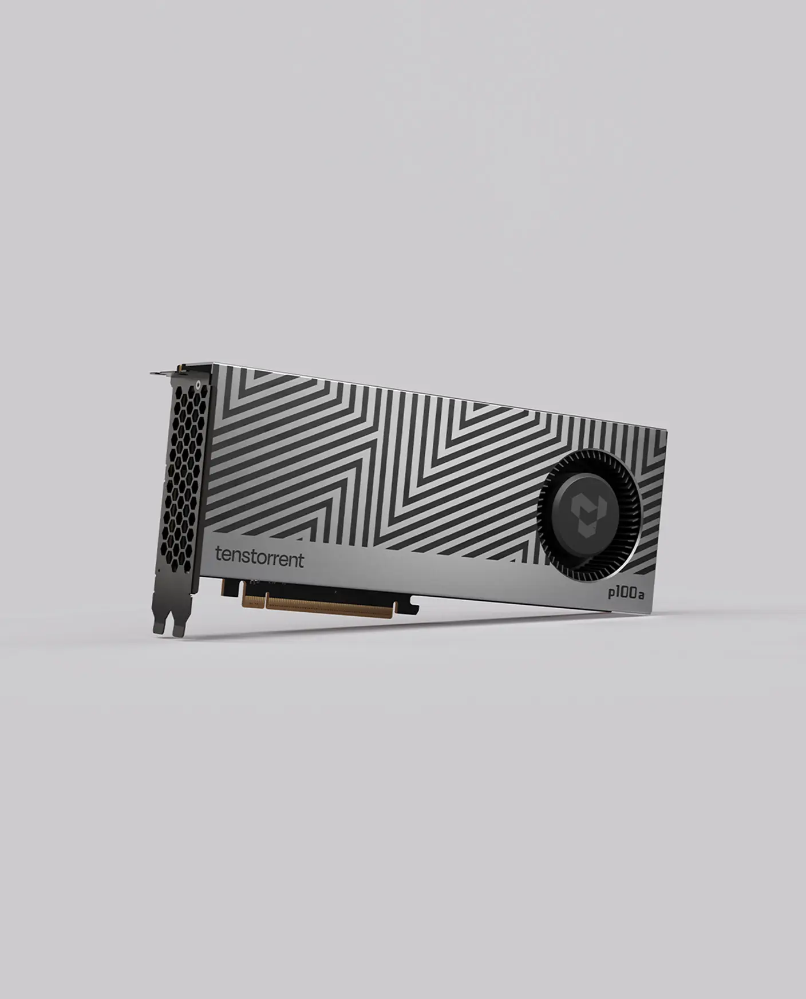

# Zephyr 爱好者月刊（第 6 期 202506）

这里记录 Zephyr 最新的消息和值得分享的内容，每月最后一周发布。

本杂志开源（GitHub: [lgl88911/Zephyr_Fans_Monthly](https://github.com/lgl88911/Zephyr_Fans_Monthly)），欢迎提交 issue，投稿或推荐 Zephyr 内容。

## 项目数据


不包括合并，380 位作者向主分支推送了 1925 次提交，向所有分支推送了 2054 次提交。
在主分支上，共有 4706 个文件发生了变化，新增了 153,225 行，删除了 25,931 行。


近期动向：
- [SDK 0.18 将支援 llvm](https://github.com/zephyrproject-rtos/zephyr/issues/3689)
- [驱动 API 与线程安全](https://github.com/zephyrproject-rtos/zephyr/issues/89109)
- [增强电源管理](https://github.com/zephyrproject-rtos/zephyr/issues/84049)
- [net_mgmt 的 event 从 uint32_t 切换为 uint64_t](https://github.com/zephyrproject-rtos/zephyr/issues/91307)
- [为 Renesas 设备添加支持 renesas_elc 驱动程序](https://github.com/zephyrproject-rtos/zephyr/pull/88141)
- [4.2.0 中下一代 USB](https://github.com/zephyrproject-rtos/zephyr/issues/42066)
- [导入 counter capture api](https://github.com/zephyrproject-rtos/zephyr/pull/89127) 
- [NRF DVFS(Desktop Dynamic Voltage and Frequency Scaling )](https://github.com/zephyrproject-rtos/zephyr/pull/90755)
- [apollo510 支持 MSPI](https://github.com/zephyrproject-rtos/zephyr/pull/88858)
- [解耦 ISO C 时间功能与 POSIX 的依赖](https://github.com/zephyrproject-rtos/zephyr/pull/90096)

## 新闻&活动

1、[Zephyr 会员变化](https://www.morningstar.com/news/pr-newswire/20250618dc13163/zephyr-rtos-expands-ecosystem-with-renesas-and-wind-river-upgrading-to-platinum-membership-and-new-silver-members-blecon-and-embeint)

- Renesas 和 Wind River 升级为铂金会员
- 新增银牌会员 Blecon 和 Embeint

2、6 月份的 Zephyr Project Meetup

- [维也纳 6.5](https://www.zephyrproject.org/zephyr-project-meetup-june-5-2025-vienna-austria-what-to-expect/)

## 文摘&观点

1、[为什么 NXP 全力投入 Zephyr​](https://www.nxp.com/company/about-nxp/smarter-world-blog/BL-NXP-ZEPHYR-REAL-TIME-OS)

NXP 通用 MCU 生态系统总监从​​Zephyr 核心价值，​​NXP 生态战略，Zephyr 行业影响等方面说明为什么 NXP 会全力投入 Zephyr。

2、[如何选择 RTOS](https://dojofive.com/blog/selecting-an-rtos-which-should-i-use/)

文章对比多个 RTOS，说明如何选择 RTOS，并给出了一些关于 Zephyr 的判断：
- **开发中，尚未完全成熟**
- 如果开发一个复杂或可扩展的物联网/网络平台，并希望使用现代工具、开源灵活性、跨平台/可移植性以及一个活跃的开发社区，选择 Zephyr。
- 选择流程图中，选择 Zephyr 主要的判断点是需要网络和 BLE

3、[Zephyr：驱动嵌入式系统的未来](https://swayalgo.com/zephyr-rtos-powering-the-future-of-embedded-systems/)

zephyr 的介绍，其中提到 zephyr 使用的领域：
- 智能家居：照明、安防系统和恒温器  
- 可穿戴设备：健身追踪器和健康监测器  
- 工业自动化：传感器网络和控制器  
- 汽车系统：车载诊断和信息娱乐  
- 医疗保健：便携式诊断和监控设备  
- 航空航天：轻量化航空电子设备和环境监测

4、[AMD 招聘固件工程师](https://careers.amd.com/careers-home/jobs/66438?lang=en-us)

AMD 招聘固件工程师，工作涉及到服务器和定制 ASIC，技能要求有一项是熟悉 Zephyr

5、[Intel 招聘嵌入式 AI 软件工程师](https://apna.co/job/bengaluru/ai-software-solutions-engineer-embedded-1476256564)

Intel 招聘嵌入式 AI 软件工程师，技能 要求中有提到 Zephyr

6、[Zephyr 的领英帐号](https://www.linkedin.com/company/the-zephyr-project)

## 课程&教程

1、[DigiKey 提供虚拟 Zephyr 操作系统研讨会和培训视频](https://www.electronicsweekly.com/news/business/distribution/digikey-offers-zephyr-rtos-workshop-video-training-2025-06/)

与瑞萨 MCU 相关的 Zephyr 资源

2、[Zephyr 的开源教程](https://github.com/maksimdrachov/zephyr-rtos-tutorial)

github 上一个开源的 Zephyr 教程。一共 10 节课，主要是对 Zephyr 基本组件的使用讲解。

## 技术&工具

1、[从裸机到 Zephyr​](https://www.zephyrproject.org/why-and-how-to-migrate-from-bare-metal-to-zephyr-rtos/)

这篇文章说明为什么要从裸机迁移到 Zephyr，以及如何从裸机迁移到 Zephyr。主要是方法论，并不涉及具体平台。

2、[使用 Zephyr 在异构 SoC 上实现软件定义硬件接口​](https://www.zephyrproject.org/increasing-flexibility-software-defined-hardware-interfaces-on-heterogeneous-socs-with-zephyr/)

Linux (A55) 运行 FlexIO 驱动器会导致处理器开销，在较高的波特率下由于中断过多而可能造成数据丢失，将这部分移到异构的 Zephyr 上 (M33)。 Linux 和 Zephyr 通过 RPMsg 通信。用该异构的架构来解决 Linux 上使用 FlexIO 的困境。

3、[wolfTPM 支持 Zephyr](https://www.wolfssl.com/wolftpm-support-for-zephyr-rtos/)

wolfSSL 通过新增的 wolfTPM Zephyr 端口支持 Zephyr RTOS。使用 Zephyr 的嵌入式项目能够轻松集成 TPM 2.0 功能，扩展安全应用的灵活性和可移植性。

4、[croxel： 支持 Zephyr 商业化的公司](https://www.croxel.com/zephyr-rtos)

​**​Croxel​**​ 是一家专注于​**​嵌入式系统开发​**​的技术公司，与​**​Zephyr RTOS​**​ 的关系主要体现在​**​技术贡献、社区合作与应用实践​**​层面，可以提供：
- 全周期 Zephyr 产品开发
- Zephyr 专家咨询与架构
- 专业的 Zephyr 团队增强

## 产品
1、[Galaxy Ring](https://www.samsung.com/nz/rings/galaxy-ring/galaxy-ring-titanium-silver-size-13-sm-q503nzsaxnz/?srsltid=AfmBOooVtHjYR8Oa6pyXkItQUrB_QeEtPwsOulLzglIhhXW8ie4pjMZe)

三星的 Galaxy Ring--AI 健康指环，使用了 Zephyr


2、[可无限可扩展的 Blackhole™ PCIe 板](https://www.zephyrproject.org/portfolio/blackhole-pcie-ai-accelerator/)

Blackhole™ PCIe 板具有无限可扩展性，专为高性能 AI 处理而设计。每片芯片配备 16 个支持 Linux 的 RISC-V 核心，以及 32 GB 的 GDDR6 内存，Zephyr 运行在 SMC（系统管理控制器）和 DMC（设备管理控制器）上。
- SMC 是 Blackhole™ ASIC 上的一个 ARC hs4xd 集群，支持高速接口，负责遥测，并处理电压频率调整和电源管理。
- DMC 是板载的 STM32 微控制器，负责 ASIC 复位，控制风扇、电源限制、LED，并安全处理热事件。


## Zephyr 每月小知识

1、软件物料清单是一张源文件和可执行文件对应的列表，包含了所有源文件的唯一标识信息，用于对软件的准确追溯。Zephyr 可以通过下面方法生成软件物料清单

```
west spdx --init -d build/
west build -b board_name -d build/ ./sample
west spdx --build-dir=./build/
```

结果生成在 build/spdx/下
```
build/spdx/
├── app.spdx
├── build.spdx
└── zephyr.spdx
```