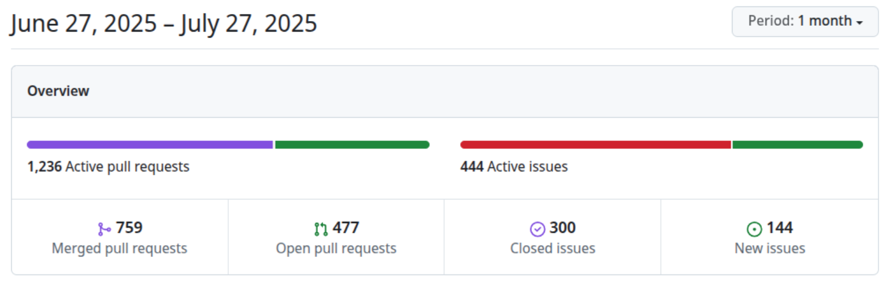
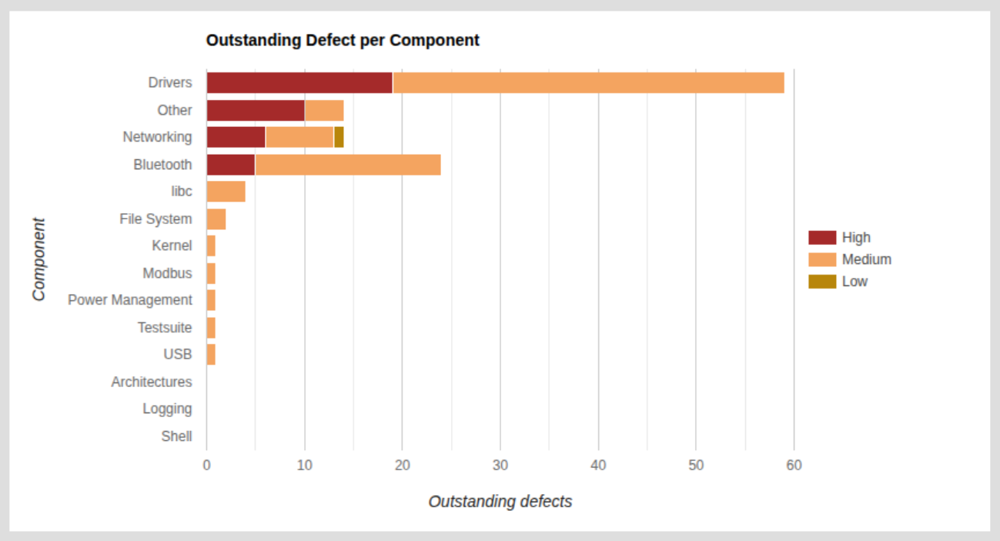
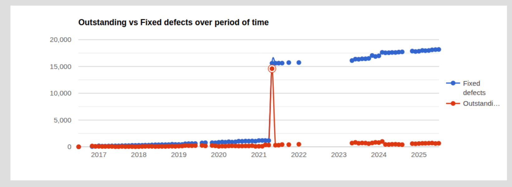
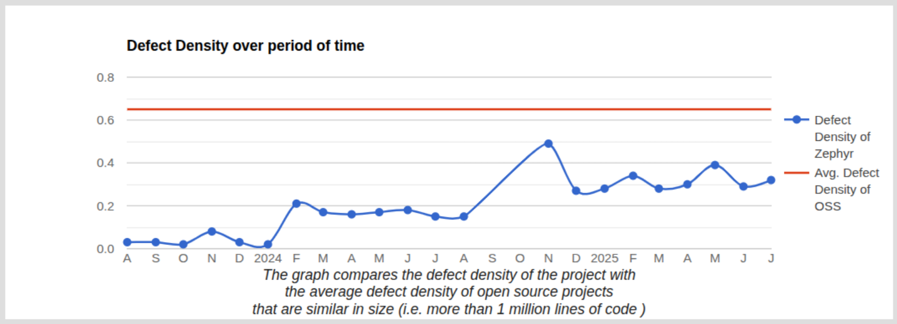

# Zephyr 爱好者月刊（第 7 期 202507）

这里记录 Zephyr 最新的消息和值得分享的内容，每月最后一周发布。

本杂志开源（GitHub: [lgl88911/Zephyr_Fans_Monthly](https://github.com/lgl88911/Zephyr_Fans_Monthly)），欢迎提交 issue，投稿或推荐 Zephyr 内容。

## 项目数据

不包括合并，314 位作者向主分支推送了 1316 次提交，向所有分支推送了 1420 次提交。
在主分支上，共有 2774 个文件发生了变化，新增了 74435 行，删除了 31937 行。

近期动向：
- [Zephyr 4.2.0 发布](https://github.com/zephyrproject-rtos/zephyr/releases/tag/v4.2.0)
- [增强电源管理](https://github.com/zephyrproject-rtos/zephyr/issues/84049)
- [SDK 0.18 将支援 llvm](https://github.com/zephyrproject-rtos/zephyr/issues/3689)

## 新闻&活动

1、[Zephyr + Dronecode 基金会社区见面会](https://www.zephyrproject.org/what-to-expect-at-the-zephyr-project-dronecode-foundation-community-meetup-july-8-2025-guadalajara-mexico/)

Zephyr + Dronecode 基金会社区见面会于 2025 年 7 月 8 日在墨西哥瓜达拉哈拉举行

2、[2025 Zephyr 开发者峰会](https://www.zephyrproject.org/zephyr-developer-summit-2025-preview-whats-new/)

2025ZDS 将和 Open Source Summit Europe 共同开展，于 2025 年 8 月 25 日至 27 日在荷兰阿姆斯特丹 RAI 会议中心举行

3、[Zephyr 4.2.0 发布](https://www.zephyrproject.org/zephyr-rtos-4-2-now-available-introduces-renesas-rx-support-usb-video-class-and-more/)

Zephyr v4.2.0 如期在 2025.7.18 发布，该版本支持截止日期为 2026.3.18。
本次的重大变化
- 加入 Renesas RX 架构支持
- 新增 USB Video Class 驱动
- 在 Twister 中引入 Power Harness 测试，使用硬件电源监视器执行自动数据收集和分析，用于电流检测与结果验证
- 全面支持 MQTT 5.0
- 蓝牙协议栈中新增加 HFP/AG/HF
- zbus API 到 1.0.0，API 状态已稳定
- 新增 96 个主板和 22 个扩展板

更多详情参见 https://mp.weixin.qq.com/s/sjWdbF-MGamDBaZddK6Kng

4、[IAR 对 Zephyr RTOS 的量产级支持](https://www.presseagentur.com/iar/detail.php?pr_id=7409&lang=en)

IAR 发布 Arm 9.70 版工具链，从该版本起正式对 Zephyr RTOS 量产级支持。

5、[tiny-curl 即将支持 Zephyr](https://www.wolfssl.com/coming-soon-tiny-curl-for-zephyr-rtos/)

wolfSSL 即将要把轻量级 https 客户端 tiny-curl 移植到 Zephyr RTOS。

## 文摘&观点

1、[为什么 Zephyr RTOS 搭配 IAR 是嵌入式开发团队的明智之选​](https://www.iar.com/zh/blog/why-zephyr-rtos-with-iar-is-a-smart-choice-for-embedded-teams)

Zephyr​​ 提供开源可移植性，突破硬件绑定；​​IAR​​ 注入量产级能力（安全认证+高级调试+自动化流程），二者协同实现 ​​“灵活开发 → 高效量产”的无缝衔接​​。

从这篇文章可以看到 IAR 已经在商业上开始对 Zephyr 进行推广

2、[掌握 Zephyr RTOS 的 5 个技巧](https://www.designnews.com/embedded-systems/5-tips-for-mastering-zephyr-rtos)

文章从下面几个方面进行说明：
- 掌握现代化构建工具链
- 精通硬件抽象层
- 深度理解内核机制
- 高效调试技巧
- 系统化学习路径

3、[BTA 招聘高级嵌入式软件工程师](https://www.simplyhired.ca/job/w7k0Q5uVP9wnmiJcwfLnolmt0vE3iANzF4YBwbjIW8nsmI-0GSruNw)

BTA 是一家专注于 ASIC 和 FPGA 的设计与验证以及嵌入式软件开发服务的公司。其招聘要求有提到 Zephyr 经验，可以推断有 Zephyr 服务的需求。

4、[OpenAI 招聘嵌入式软件工程师](https://nploy.net/jobs/it-and-technology/san-francisco/embedded-software-engineer/3866pen)

OpenAI 招聘嵌入式软件工程师，有 Zephyr 经验的优先。

## 课程&教程

1、[学习 Zephyr 线程](https://www.zephyrproject.org/what-i-learned-about-zephyr-rtos-threads/)

这是一篇 Zephyr 的入门心得文章，作者通过 Tracealyzer 分析 Zephyr 的哲学家问题示例 (philosopher sample), 学习和了解 Zephyr 的调度机制。可以从中学习如何使用 Tracealyzer 分析 Zephyr 的线程调度过程

2、[将 Zephyr 移植到 G32R501](https://www.hackster.io/geehysemiconductor/here-it-is-zephyr-is-now-available-for-the-g32r501-32b0ca)

有爱好者将 Zephyr 移植到了珠海极海半导体的 G32R501 上，这里的移植的仓库 https://gitee.com/quincyzh/g32r5_zephyr
文章是 Geehy Semiconductor 在 Hackster 上发布的。尚不确认移植是不是极海自己的人员做的。对于 soc 的移植最好还是由原厂持续支持，并进到上游，靠爱好者用爱发电可持续性不强。

3、[将 Zephyr 移植到 CH32V303](https://bootlin.com/blog/step-by-step-guide-to-adding-soc-and-board-support-to-zephyr-with-ch32v303/)

这篇文章以 CH32V303 为例，展示如何在 Zephyr 操作系统中添加新的 SoC 和新主板 。而该演示示例已经被合并到 Zephyr 上游。

## 技术&工具

1、[Kenning 与 Zephyr 的 AutoML 加速器协同优化​](https://www.zephyrproject.org/extending-automl-features-in-kenning-and-zephyr-for-platforms-with-custom-ai-accelerators/)

Zephyr 作为底层 RTOS，为 AutoML 提供了可移植、硬件抽象的部署环境，使其能够无缝适配复杂 AI 加速器，大幅降低边缘 AI 开发门槛。

2 [使用 Zephyr 和 Linux 探索 UART 上的 SLIP 网络](https://swedishembedded.com/developers/connectivity/slip)

在 Zephyr RTOS 上使用 SLIP 框架通过 UART 与 Linux 之间进行网络连接

3 [Zephyr GPT 智能助手](https://chatgpt.com/g/g-adrA62xJn-zephyros-gpt)

一个专为 **Zephyr RTOS（Zephyr 实时操作系统）** 定制的智能助手，基于 OpenAI 的 GPT-4 架构构建和优化。解答有关 **Zephyr RTOS 内核、设备模型、Devicetree、Kconfig、驱动开发、west 构建系统** 等方面的技术问题，提供 **设备树配置、代码模板和驱动示例**，实时访问 [Zephyr 官方文档](https://docs.zephyrproject.org/) 与 [bootlin](https://elixir.bootlin.com/zephyr/v4.2.0/source)，确保内容**权威且最新**

4、[静态扫描 Zephyr​](https://scan.coverity.com/projects/zephyr)

Coverity Scan 静态分析 Zephyr 的缺陷，从扫描的结果来看 Zephyr 在各方面都优于开源项目的平均水平。足以证明 Zephyr 的质量。

Zephyr：总计 5,065,614 行代码，缺陷密度为 0.22 （缺陷密度以每 1,000 行代码中的缺陷数来衡量）
开源项目的统计数据：
- 小于 10 万行，0.35
- 10 万行到 50 万行，0.5
- 50 万行到 100 万行，0.7
- 大于 100 万行，0.65

高风险缺陷集中在驱动，网络，和蓝牙，缺陷最多的是驱动

Zephyr 解决缺陷的速度快于缺陷产生的速度

同期 OSS 的平均缺陷密度为 0.65，Zephyr 最高到 0.5，2025 年后维持在 0.3 左右

## Zephyr 每月小知识

1、bootlin 开始提供 Zephyr 在线代码浏览，Zephyr 和 Linux Kernel 一样都可以在 bootlin 上进行浏览。通过下面地址可以访问：
https://elixir.bootlin.com/zephyr
