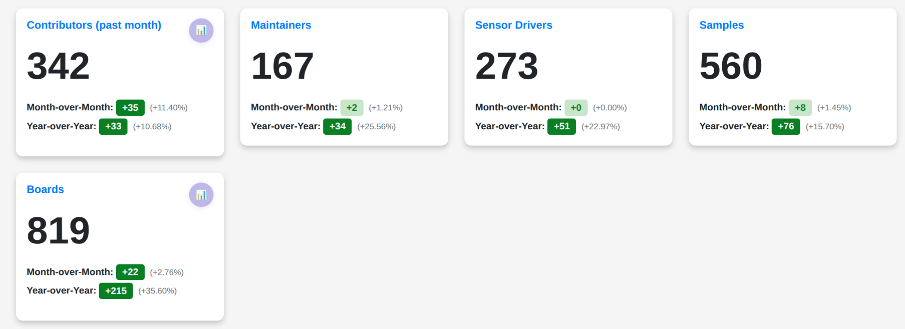

# Zephyr 爱好者月刊（第 8 期 202508）

这里记录 Zephyr 最新的消息和值得分享的内容，每月最后一周发布。

本杂志开源（GitHub: [lgl88911/Zephyr_Fans_Monthly](https://github.com/lgl88911/Zephyr_Fans_Monthly)），欢迎提交 issue，投稿或推荐 Zephyr 内容。

## 项目数据


不包括合并，356 位作者向主分支推送了 1739 次提交，向所有分支推送了 1789 次提交。
在主分支上，共有 4240 个文件发生了变化，新增了 150803 行，删除了 25994 行。


近期动向：
- [ADC stream API](https://github.com/zephyrproject-rtos/zephyr/pull/90285)
- [pwm 扩展 API 支持中断](https://github.com/zephyrproject-rtos/zephyr/pull/93275)
- [为 renesas 添加 crc 驱动](https://github.com/zephyrproject-rtos/zephyr/pull/87557)
- [导入 opamp 设备驱动 API](https://github.com/zephyrproject-rtos/zephyr/pull/94040)
- [增强 PSCI](https://github.com/zephyrproject-rtos/zephyr/issues/93898)
- [ZVM 的 RK3568 方案主板合并入 Zephyr upstream](https://github.com/zephyrproject-rtos/zephyr/pull/64217)

## 新闻&活动

1、2025 北美 OSS 上 Zephyr 的演讲视频集合

- [会议焦点 1](https://www.zephyrproject.org/zephyr-project-voices-from-oss-north-america-2025-session-spotlights-1/)
- [会议焦点 2](https://www.zephyrproject.org/zephyr-project-voices-from-oss-north-america-2025-session-spotlights-2/)
- [会议焦点 3](https://www.zephyrproject.org/zephyr-project-voices-from-oss-north-america-2025-session-spotlights-3/)
- [会议焦点 4](https://www.zephyrproject.org/zephyr-project-voices-from-oss-north-america-2025-session-spotlights-4/)

Zephyr + Dronecode 基金会社区见面会于 2025 年 7 月 8 日在墨西哥瓜达拉哈拉举行

2、[Zephyr 会员变化](https://www.zephyrproject.org/zephyr-expands-ecosystem-august-2025/)

Zephyr 项目扩展生态系统，Silicon Labs 升级为白金会员，并新增银牌会员 Beningo Embedded Group、Raytac 和 Tenstorrent

3、[基于 Zephyr 的 arduino core 发布更新](https://blog.arduino.cc/2025/08/06/updated-arduino-cores-with-zephyros-beta/)

基于 Zephyr 的 arduino core 发布 v0.3.2 更新，将 Zephyr 升级到 v4.2.0

4、[ZDS 2025 日程上线](https://osseu2025.sched.com/overview/type/Zephyr+Developer+Summit)

ZDS 2025 日程上线，8.25-8.27 三天总共 49 个议题

## 文摘&观点

1、[恩智浦 20 年微控制器愿景​](https://www.nxp.com.cn/company/about-nxp/smarter-world-blog/BL-NXP-20-YEAR-MICROCONTROLLER-VISION)

恩智浦 20 年微控制器愿景 特别提到投入 Zephyr RTOS 的开发以及 MCUXpresso 和 Zephyr 深度整合。

2、[电梯设备从 CircuitPython 迁移到 Zephyr](https://blues.com/blog/protect-your-hardware-investment-how-lift-ai-remotely-transformed-their-platform-with-blues-and-croxel/)

Lift AI 与 Blues 和 Croxel 合作，远程完成了其全国电梯管理平台的转型。利用 Blues Notecard 的连接性，将数千台电梯设备从基于 CircuitPython 的系统迁移到生产级的 Zephyr RTOS，实现零停机，节省大量成本。这一转型不仅提升了设备的性能和能效，还为未来的持续发展奠定基础，展示了物联网设备在不更换硬件的情况下实现技术升级的可能性。

3、Zephyr 招聘

三星和戴尔都在招聘有 Zephyr 背景的工程师

https://www.upwork.com/freelance-jobs/apply/Firmware-Development-for-Audio-Wearable-Device-with-Zephyr-RTOS_~021955045652486673396/

https://jobs.dell.com/en/job/austin/firmware-engineer-bios-embedded-controller/375/85293872656

## 课程&教程

1、[Zephyr 初学者教程](https://maksimdrachov.github.io/zephyr-rtos-tutorial/)

一份开源的 Zephyr 初学者教程，有最基础的内核对象讲解和使用实例，最近一次更新是一年前，git 地址是

https://github.com/maksimdrachov/zephyr-rtos-tutorial

## 技术&工具

1、[为 Zephyr 添加 TCPC 以实现 USB 供电​](https://www.beyondlogic.org/adding-a-tcpc-to-zephyr-for-usb-power-delivery/)

介绍了如何在 Zephyr RTOS 中为 USB-C Power Delivery 添加一个 Type-C Port Controller (TCPC)。文章通过使用 FUSB307B TCPC 和 Nordic nRF52840DK 开发板，详细说明了硬件配置、设备树配置以及示例应用程序的实现。

2 [Zephyr 受到 MadeYouReset 漏洞影响](https://cyberinsider.com/new-madeyoureset-method-exploits-http-2-for-stealthy-dos-attacks/)

新发现的“MadeYouReset”（CVE-2025-8671）攻击方法是一种针对 HTTP/2 实现的新型拒绝服务（DoS）技术。通过诱导服务器自身重置连接并过度消耗资源，可能通过分布式拒绝服务（DDoS）活动严重破坏未打补丁的系统。该漏洞由特拉维夫大学的研究人员与 Imperva 的研究人员合作发现，并通过 CERT 协调中心披露。文中提到 Zephyr 的 HTTP/2 的实现受到该漏洞影响。

3 [继 Zephyr 后 Ocre 增加对 Linux 的支持](https://www.zephyrproject.org/ocre-has-a-new-linux-sibling/)

Ocre 项目在 LF Edge 的支持下通过 WebAssembly 技术将类似 OCI 的容器化扩展到资源受限的边缘设备。Ocre 运行时抽象了硬件复杂性，允许软件被分解为独立开发和管理的容器化应用程序。Ocre 最初基于 FreeRTOS 原型开发，后重构为 Zephyr 并贡献给 LF Edge。Zephyr 因其现代架构、活跃社区和广泛的硬件支持而被选中。Ocre 现在增加了对 Linux 的支持，使得开发者可以在资源受限的设备上部署和管理相同的代码和容器二进制文件，显著降低了容器的开销。

Ocre 的 git 仓库：

https://github.com/project-ocre/ocre-runtime

4、[Zephyr 仓库看板​](https://kartben.github.io/zephyr-repo-metrics/)

Zephyr 项目数据看板，展示 Zephyr 当前和历史数据




## Zephyr 每月小知识

1、Zephyr 在构建时将分散的 dts/dtsi 文件合并成一份 zephyr.dts，放到 build/zephyr/下，从 4.2.0 开始又在 zephyr.dts 中添加了描述节点的来源文件，更方便处理 Devicetree 的错误

```
		/* node '/pin-controller/i2c1_default' defined in zephyr/boards/espressif/esp32s3_devkitc/esp32s3_devkitc-pinctrl.dtsi:44 */
		i2c1_default: i2c1_default {
			phandle = < 0x8 >; /* in zephyr/boards/espressif/esp32s3_devkitc/esp32s3_devkitc_procpu.dts:86 */

			/* node '/pin-controller/i2c1_default/group1' defined in zephyr/boards/espressif/esp32s3_devkitc/esp32s3_devkitc-pinctrl.dtsi:45 */
			group1 {
				pinmux = < 0x2e1704 >,
				         < 0x2d96c5 >; /* in zephyr/boards/espressif/esp32s3_devkitc/esp32s3_devkitc-pinctrl.dtsi:46 */
				bias-pull-up;          /* in zephyr/boards/espressif/esp32s3_devkitc/esp32s3_devkitc-pinctrl.dtsi:48 */
				drive-open-drain;      /* in zephyr/boards/espressif/esp32s3_devkitc/esp32s3_devkitc-pinctrl.dtsi:49 */
				output-high;           /* in zephyr/boards/espressif/esp32s3_devkitc/esp32s3_devkitc-pinctrl.dtsi:50 */
			};
		};
```
