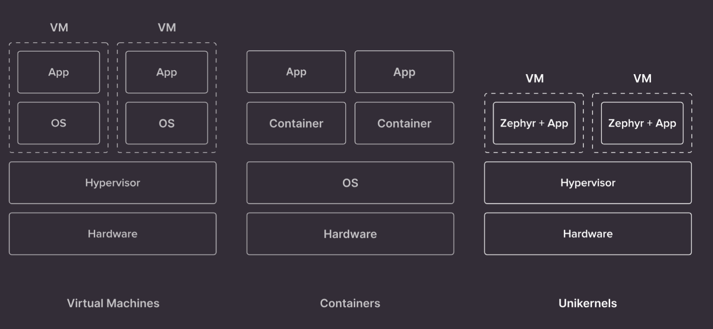
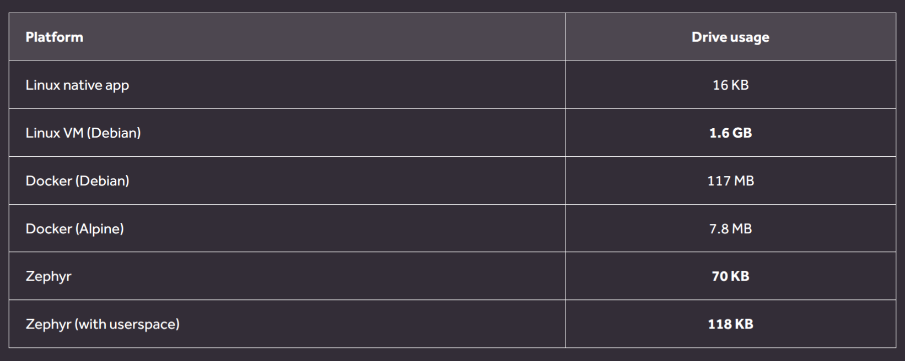
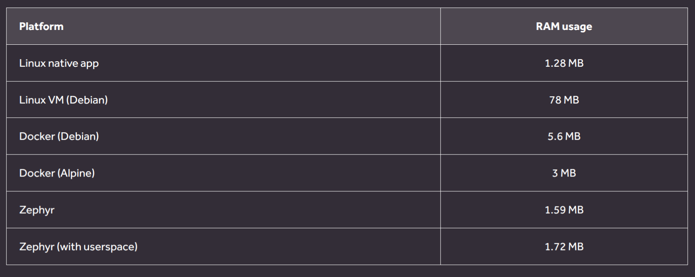
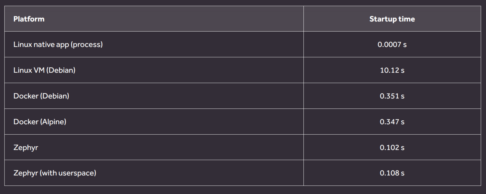
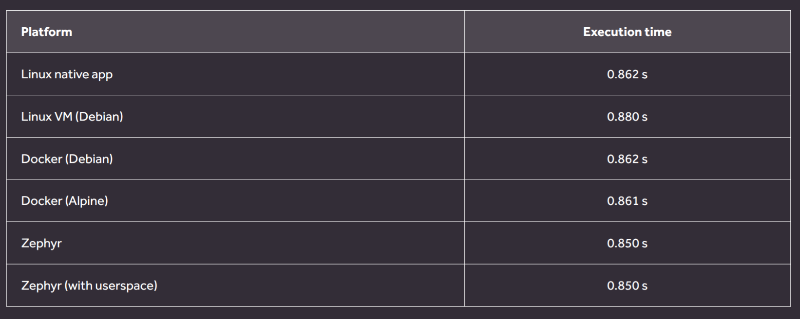

# Zephyr 爱好者月刊（第 9 期 202509）

这里记录 Zephyr 最新的消息和值得分享的内容，每月最后一周发布。

本杂志开源（GitHub: [lgl88911/Zephyr_Fans_Monthly](https://github.com/lgl88911/Zephyr_Fans_Monthly)），欢迎提交 issue，投稿或推荐 Zephyr 内容。

## 项目数据


不包括合并，395 位作者向主分支推送了 2155 次提交，向所有分支推送了 2224 次提交。
在主分支上，共有 7191 个文件发生了变化，新增了 176804 行，删除了 58609 行。


近期动向：
- [STM32高速USB](https://github.com/zephyrproject-rtos/zephyr/pull/89866)
- [添加CR95HF RFID驱动](https://github.com/zephyrproject-rtos/zephyr/pull/91254)
- [引入通用内核入口点符号k_entry](https://github.com/zephyrproject-rtos/zephyr/pull/95670)
- [MIN/MAX/CLAMP宏的评估版本讨论](https://github.com/zephyrproject-rtos/zephyr/pull/96132)
- [支持ESP32 USB-OTG](https://github.com/zephyrproject-rtos/zephyr/pull/85600)
- [导入时钟管理子系统](https://github.com/zephyrproject-rtos/zephyr/pull/72102)
- [引入 OPAMP 设备驱动 API](https://github.com/zephyrproject-rtos/zephyr/pull/94040)
- [引入多路复用器API](https://github.com/zephyrproject-rtos/zephyr/pull/93838)
- [为SPI设备树新增时序等参数](https://github.com/zephyrproject-rtos/zephyr/pull/87427)


## 新闻&活动

1、Zephyr RTOS 推出全新的播客系列

Zephyr RTOS 推出全新的播客系列为开发者提供一个交流和学习的平台，听众可以通过 Discord 分享反馈。订阅平台有iTunes、Spotify、Deezer、YouTube 和 RSS feed。目前已经推出4期：
- https://www.zephyrproject.org/launching-a-new-zephyr-rtos-podcast/
- https://www.zephyrproject.org/the-zephyr-ci-meltdown-zephyr-podcast-002/
- https://www.zephyrproject.org/min1-1-2-zephyr-podcast-003/
- https://www.zephyrproject.org/a-wall-of-zephyr-news-zephyr-podcast-004/
	

2、9月线下见面会

2025年9月18日，在德国慕尼黑附近的加兴举办线下聚会。活动由Microchip赞助
- https://www.zephyrproject.org/what-to-expect-at-the-zephyr-project-meetup-september-18-2025-garching-near-munich-germany/

2025年9月18日，在捷克布拉格举办线下聚会。由 STMicroelectronics 和 NXP Semiconductors 赞助
- https://www.zephyrproject.org/what-to-expect-at-the-zephyr-project-meetup-sep-18-2025-prague-czech-republic/


3、[ZDS 2025](https://www.zephyrproject.org/zephyr-project-at-open-source-summit-europe-zephyr-developer-summit-2025/)

2025年在荷兰阿姆斯特丹举办的Open Source Summit Europe与Zephyr Developer Summit的联合活动。Zephyr项目在此次活动中展示了其在嵌入式开发领域的最新进展和社区活力。通过展位展示、技术演讲和社区活动，Zephyr项目吸引了大量开发人员、维护者和用户的参与。会议涵盖了安全、工具、生产力以及Zephyr在物联网、汽车、医疗和消费设备中的实际应用。社区活动如文档特别兴趣小组和与维护者见面会，进一步促进了社区成员之间的交流与合作。此次活动不仅展示了Zephyr项目的成熟度和多样性，还为未来的发展方向提供了新的思路。

- 视频链接：https://www.youtube.com/playlist?list=PLzRQULb6-ipEgG3_ZR2qj3gO4U65l4BaM
- 总结分享：https://lgl88911.pages.dev/zephyr/zephyr2025%E5%BC%80%E5%8F%91%E8%80%85%E5%A4%A7%E4%BC%9A%E6%BC%94%E8%AE%B2%E6%96%87%E6%A1%A3%E6%A6%82%E8%A7%88/

4、ZVM连续推出3个发行版

ZVM（Zephyr-based Virtual Machine）是一款基于Zephyr的虚拟化产品，面向嵌入式场景的实时Hypervisor，支持在单颗芯片上同时运行多个隔离的功能域，每个域可独立承载客户操作系统。在9月份连续发布3个不同平台的发行版

- [ZVM-E2000](http://esnl.hnu.edu.cn/info/1002/2947.htm)
- [ZVM-D3000](http://esnl.hnu.edu.cn/info/1002/2948.htm)
- [ZVM-D2000](http://esnl.hnu.edu.cn/info/1002/2949.htm)


## 文摘&观点

1、[CLion与Zephyr开发环境的集成​](https://www.reddit.com/r/embedded/comments/1n1iifn/clion_ide_for_zephyr_project/)

Reddit 社区讨论 CLion IDE 与 Zephyr 项目的集成，用户对这一组合的潜力表示认可，但也提到索引速度、项目设置等技术问题。CLion 开发者和 JetBrains 官方均表示愿意改进并提供支持。尽管 VSCode 的调试功能受到一些用户青睐，但 CLion 的通用性和功能优势仍然吸引了不少开发者。

用户 **andrey-gushchin**（JetBrains 产品经理）表示，CLion 支持将 CMake 项目转换为 West 项目。


2、[2025主流RTOS比较](https://www.siliconlogix.it/article/realtimeos2025)

本文对2025年三种主流实时操作系统（RTOS）——FreeRTOS、Zephyr和ThreadX进行了全面对比。FreeRTOS以轻量级和AWS集成著称，适合资源受限的入门级MCU和IoT项目；Zephyr凭借其开放性、模块化和安全性，支持从简单设备到复杂多核系统的扩展，尤其适合智能家居和工业设备；ThreadX则以确定性和工业成熟度闻名，是安全关键领域的首选。文章还讨论了它们的工具链、开发体验、连接性、安全性和生态系统。最终，选择RTOS应根据项目需求权衡资源、安全性和合规性。

3、[RA系列MCU与Zephyr结合在嵌入式开发中的优势](https://www.eet-china.com/mp/a434634.html)

随着智能终端、物联网和安全设备的快速发展，传统的RTOS在多平台移植、协议栈和安全性方面面临挑战。Zephyr作为一个开源的RTOS，提供了统一的跨平台支持、全功能一体化、模块化设计和强大的安全性能。瑞萨的RA系列MCU则以低功耗、丰富的通信接口和硬件安全特性著称。两者的结合为开发者提供了一个高效、灵活且安全的开发平台，特别适合资源受限的设备。瑞萨作为Zephyr项目的白金会员，提供了全面的软件工具包和硬件设计支持，进一步推动了这一生态的发展。

这篇文章可以看出芯片厂商有在国内推Zephyr的迹象。

4、[Raspberry Pi官方是否支持Zephyr](https://forums.raspberrypi.com/viewtopic.php?t=389298)

在 Raspberry Pi 论坛上，用户 gerrikoio 提出关于 Raspberry Pi 是否正式支持 Zephyr RTOS 生态系统的问题，指出当前 Zephyr 在 Raspberry Pi Pico 上的功能缺失（如双核支持、RISC-V 支持和无线功能）。Raspberry Pi 官方回应并未正式支持 Zephyr，但正在通过第三方合作改善部分功能，并开发 VSCode 插件以更好地支持 Zephyr 项目。尽管如此，Raspberry Pi 的主要精力仍集中在 Pico SDK 上，对 Zephyr 的支持仍处于观察阶段。社区用户则强调了双核和 RISC-V 支持的重要性，并希望 Raspberry Pi 官方能提供更多支持，以增强开发者对 Zephyr 的信心。

5、Zephyr 招聘

Qualcomm正在招聘一名高级嵌入式实时操作系统软件工程师，专注于QuRT OS和Zephyr的开发与部署
- https://careers.qualcomm.com/careers/job/446707628913-embedded-real-time-operating-system-senior-software-engineer-qurt-os-zephyr--san-diego-california-united-states-of-america?domain=qualcomm.com

Infineon Technologies正在招聘一名嵌入式软件架构师，专注于Zephyr操作系统的开发和优化
- https://jobs.infineon.com/careers/job/563808966852894-embedded-software-architect-zephyr-portland?domain=infineon.com


## 课程&教程

1、[如何学习 Zephyr 的讨论](https://www.reddit.com/r/embedded/comments/1n9nxe9/how_to_learn_zephyr/)

Reddit 社区的帖子“如何学习 Zephyr？为初学者提供了丰富的学习资源和建议。帖子强调了实践操作的重要性，并建议学习者通过修改示例代码和参与实际项目来加深理解。此外，利用社区资源和与经验丰富的工程师合作也是学习 Zephyr 的有效途径。

2、[Raspberry Pi 上快速启动 Zephyr](https://forums.raspberrypi.com/viewtopic.php?p=2338056)

文章涵盖了从系统更新、安装依赖项到初始化工作区、构建示例程序的全过程。特别强调了如何通过限制安装范围来减少占用空间，并提供了两种烧录方法。此外还介绍了 Zephyr 对 Pico W 和 Pico 2W 的 WiFi 支持，以及用户在实际操作中可能遇到的问题。

3、[利用Zephyr实现环境温度上传](https://myembeddedsystems.com/how-to-tutorials/how-to-implement-a-zephyr-wi-fi-logging-system-with-mqtt-for-dht22-data/)

详细介绍如何使用 Zephyr RTOS 和 ESP32 开发板构建一个简单的物联网项目，通过 Wi-Fi 和 MQTT 协议将 DHT22 温度传感器的数据传输到服务器。适合初学者学习物联网开发，涵盖了从硬件连接到代码实现的全过程

4、[Zephyr 为物联网和嵌入式开发提供可靠基础](https://www.embrill.com/blogs/zephyr-rtos-embedded-firmware-development)

文章提供了很多切实的建议。

- Zephyr 面临的挑战及解决方法
  - **挑战1：自定义硬件的驱动支持有限**
    - **解决方法**：提前审计硬件，选择已支持Zephyr的芯片和组件，为关键自定义部分分配驱动开发时间。
  - **挑战2：构建大小和内存开销**
	- **解决方法**：使用最小配置模板，通过Kconfig禁用未使用的功能，定期监控RAM和闪存使用情况，进行内存分析，使用静态分析或链接时优化，测试实际使用场景下的功耗。
  - **挑战3：实时约束和确定性行为**
	- **解决方法**：使用Zephyr的抢占式调度、优先级反转协议，隔离高优先级任务，最小化中断延迟，使用工具测量最坏情况下的响应时间，尽可能使用静态分配。
  - **挑战4：团队学习曲线**
	- **解决方法**：从小型试点项目开始，使用官方文档，培训开发人员掌握Zephyr概念，跨团队分享最佳实践，使用结对编程或专注于Zephyr模式的代码审查。
  - **挑战5：长期维护和安全更新**
    - **解决方法**：建立固件更新计划（OTA或物理更新），为Zephyr版本固定版本，跟踪上游补丁，定期进行安全审计，使用代码变更的可追溯性。

- 使用Zephyr的步骤
  - **评估硬件和资源限制**：确定微控制器/SoC、内存、功耗预算和外设，检查Zephyr的板级支持列表，验证设备树条目或现有驱动是否覆盖所需外设。
  - **定义项目需求**：明确实时截止时间、通信协议、功耗状态、安全需求（安全启动、签名）和更新途径（OTA或本地），记录功能和非功能需求。
  - **设置工具链和开发环境**：安装Zephyr SDK、CMake、West和Python工具，配置构建服务器或CI，创建版本控制结构，包含硬件仿真或仿真。
  - **使用最小功能集进行原型开发**：在开发板上构建最小应用程序（传感器读取、通信、功耗模式），验证设备启动、测量启动时间、中断延迟和功耗，迭代配置。
    - **逐步添加模块**：引入所需的网络栈、驱动程序和连接性，尽可能使用Zephyr的现有组件，测试每个添加的模块的性能、稳定性和资源使用情况。
    - **集成安全性和更新路径**：启用安全启动、签名，规划OTA框架，包含加密支持，测试固件回滚以应对失败的更新，安全存储密钥。
    - **测试、验证和合规性**：使用Zephyr测试套件，进行硬件在环测试，执行压力测试、边缘情况和电源循环测试，如果是受监管的产品，准备审计、安全性和可追溯性文档。
    - **维护计划**：固定或跟踪Zephyr版本发布，监控上游安全公告，定义补丁管理流程，分配更新所有权，规划长期产品生命周期

- 开发者使用Zephyr RTOS的技巧
  - 使用最小配置模板，仅保留必要的功能，以减少闪存、RAM和功耗。
  - 使用设备树覆盖层适应硬件变体，而不是重写驱动代码，提高可重用性。
  - 保持中断处理程序小巧，将重处理任务分配给工作队列，以降低延迟。
  - 定期运行内存和性能分析，使用Zephyr内置的日志记录和跟踪功能识别瓶颈。
  - 自动化构建和测试，使用CI尽早发现集成错误。
  - 记录配置选择，以便后续修改Kconfig或设备树设置时能够追踪回归。
  - 对固件版本进行版本控制，为每个产品版本保留标签，存储构建工件。
  - 从早期设计阶段就规划OTA，无法进行固件修补的设备存在长期风险。

## 技术&工具

1、[如何在生产过程中烧录预加载的文件系统​](https://www.zephyrproject.org/how-to-flash-a-pre-loaded-filesystem-during-production/)

本文由 Golioth 的 Mike Szczys 撰写，介绍了如何在生产过程中烧录预加载的文件系统。通过 Zephyr 的LFS，可以将文件系统与固件分离，从而提高设备的灵活性和更新效率。这种方法不仅节省了带宽和功耗，还简化了生产部署和 OTA 更新流程。

2、 [Cucumber测试框架与Zephyr结合](https://www.bytesatwork.io/en/blog/Cucumber-Tests-with-Zephyr2.php)

本文介绍了如何使用Cucumber测试框架与Zephyr结合，以实现嵌入式应用的自动化测试。文章通过一个简单的LED闪烁应用演示了Cucumber测试的设置、运行和集成过程，并展示了如何在虚拟环境中验证应用行为，而无需依赖物理硬件。

3、 [帮忙理解Zephyr West结构的MCP](https://lobehub.com/zh/mcp/leog25-mcp-zephyr-west)

MCP Zephyr 旨在帮助 AI 助手更好地理解和处理基于 Zephyr RTOS 和 West 的嵌入式开发项目。它提供了丰富的功能，包括工作空间分析、版本检测、组件发现和构建系统信息提取。通过简单的安装和配置，用户可以轻松将其集成到 Claude Desktop 中，从而提升开发效率。无论是独立的 Zephyr 项目还是复杂的多仓库项目，该工具都能提供结构化的信息，为 AI 助手提供支持。

4、[Zephyr 作为 unikernel](https://antmicro.com/blog/2025/08/zephyr-as-unikernel/)

Unikernels 是一种将应用程序与精简的操作系统紧密耦合的技术，编译成单个二进制文件直接运行在硬件或虚拟化层上。与传统操作系统（如 Linux）相比，Unikernels 没有独立的用户空间和内核空间，而是共享单一地址空间。

Zephyr RTOS 作为一种轻量级的实时操作系统，通过其独特的设计和优化，能够作为 Unikernel 提供高性能、低资源占用和高安全性的解决方案。Antmicro 的贡献进一步增强了 Zephyr 在虚拟化和文件系统方面的功能，使其更适合用于云、边缘计算和物联网设备等场景。


下面是Zephyr 的性能测试结果，表明它在启动时间、资源占用和 CPU 密集型任务中表现出色，同时其安全性设计也为其在关键应用中的部署提供了保障。

- 空间占用
  - 

- 内存占用
  - 

- 启动时间
  - 

- 执行时间
  - 

5、[使用Conan打包Zephyr SDK和Zephyr Base](https://ignitarium.com/streamlining-dependency-management-in-embedded-systems-with-conan-and-zephyr-rtos/)

Conan是一个基于配方的C/C++包管理器，处理依赖关系、工具链和构建配置。它支持交叉编译和缓存，以实现可重现的构建。

本文详细介绍了如何在嵌入式系统开发中使用Conan和Zephyr RTOS来简化依赖管理。Conan作为一个现代的C/C++包管理器，解决了传统依赖管理方式的诸多痛点，如版本不匹配、手动构建易出错等。通过将Zephyr SDK和Base打包为Conan包，开发者可以实现跨平台、跨架构的可重现构建，并通过Conan服务器进行包的托管和共享。文章通过具体的示例展示了如何在多核和单核构建中使用Conan包，并探讨了版本锁定、可重现构建等高级特性。这种集成方式不仅提高了开发效率，还支持现代的DevOps和CI/CD实践，为嵌入式开发带来了一种现代化的解决方案。

## 产品与应用

1、[基于Zephyr开发的智能热水壶](https://linumiz.com/the7_project/zephyr-rtos-smart-kitchen/)

德国一家消费电子初创公司与Linumiz合作，利用Zephyr开发出一款智能、节能且用户友好的智能热水壶。该产品通过蓝牙低功耗技术实现低能耗的实时数据交换，并通过多传感器平台和安全的OTA更新功能，提升了数据收集的准确性和系统的可靠性。其优势在于高度便携、节能效果显著（最高可达85%）、成本效益高，以及通过移动应用实现的智能控制功能。

## Zephyr 每月小知识

1、Zephyr 使用Cmake进行构建，分析Zephyr的构建过程，需要对Cmake有一定的掌握度，为了降低分析难度，我们可以通过-trace得到CMake处理流程, 下面的命令就是将构建过程CMake的处理输出到log.txt文件中
```
cmake --trace -Bbuild  -DBOARD=mm_feather zephyr/samples/hello_world/ 2>&1 | tee log.txt
```