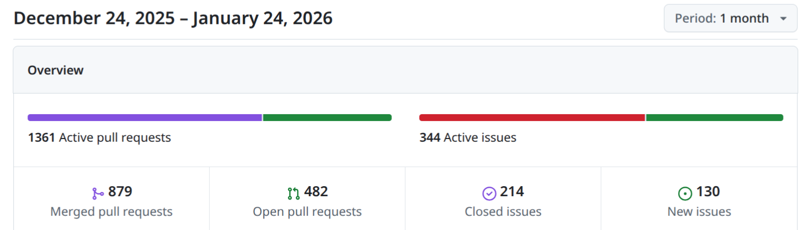
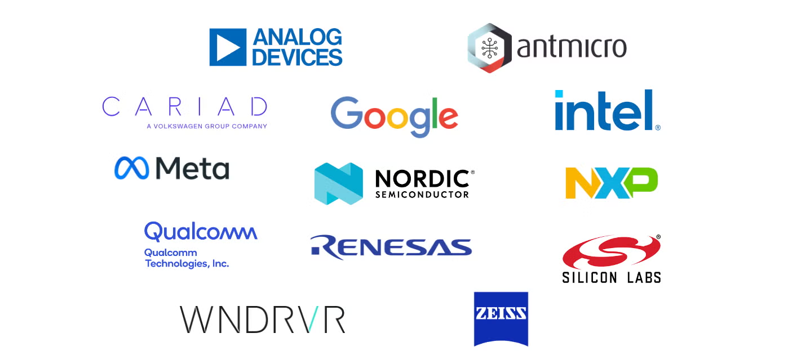
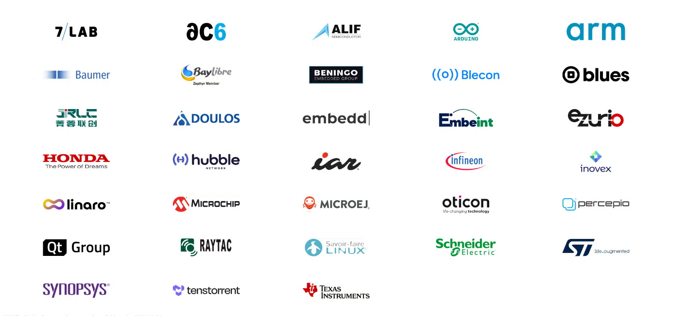
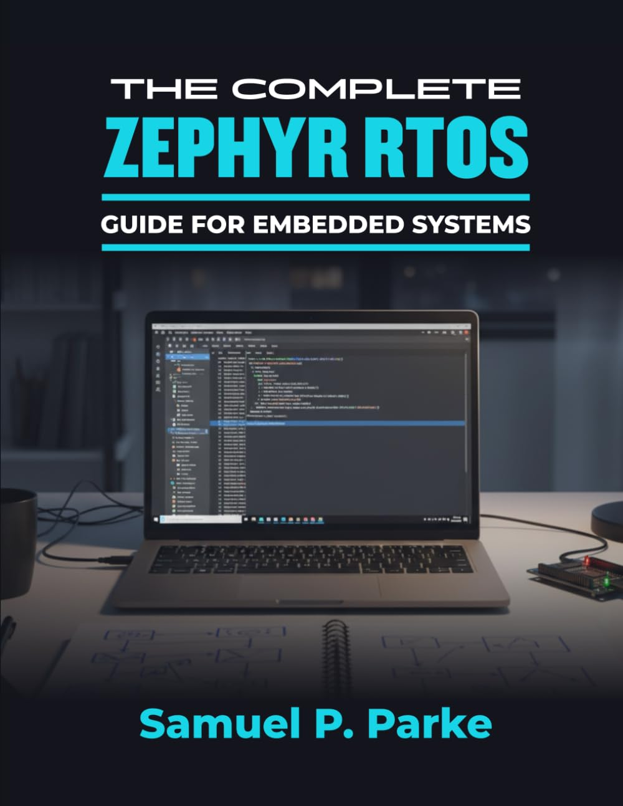
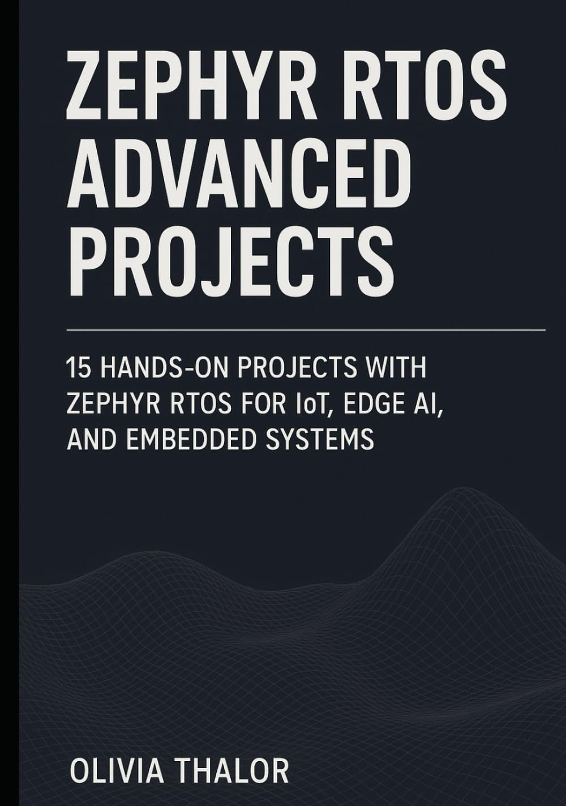

# Zephyr 爱好者月刊（第 13 期 202601）

这里记录 Zephyr 最新的消息和值得分享的内容，每月最后一周发布。

本杂志开源（GitHub: [lgl88911/Zephyr_Fans_Monthly](https://github.com/lgl88911/Zephyr_Fans_Monthly)），欢迎提交 issue，投稿或推荐 Zephyr 内容。

## 项目数据

不包括合并，347 位作者向主分支推送了 1,724 次提交，向所有分支推送了 1,778 次提交。
在主分支上，共有 4,177 个文件发生了变化，新增了 136,659 行，删除了 28,786 行。

近期动向：
- [ring buffer API 重构](https://github.com/zephyrproject-rtos/zephyr/issues/96860)
- [唤醒控制器（WUC）驱动与设备驱动集成](https://github.com/zephyrproject-rtos/zephyr/issues/100853)
- [NAND Flash 驱动支持与 NFTL 磁盘驱动程序的集成](https://github.com/zephyrproject-rtos/zephyr/issues/99908)
- [引入 LIN 驱动程序 API](https://github.com/zephyrproject-rtos/zephyr/pull/95975)
- [文档改进：替换字符提高文档合规性](https://github.com/zephyrproject-rtos/zephyr/pull/98214)
- [为 C 引入资源自动清理](https://github.com/zephyrproject-rtos/zephyr/pull/101264)
- [USB 主机支持进展与计划](https://github.com/zephyrproject-rtos/zephyr/issues/95661)

## 新闻&活动

1、[庆祝 Zephyr 十周年：回顾与展望](https://www.zephyrproject.org/celebrating-a-decade-of-zephyr-and-the-journey-ahead/)

文章由 **Silicon Labs** 的 **Abitzen Xavier** 撰写，他是 2026 年 Zephyr 项目管理委员会主席。

- **Zephyr 的起源与发展：**
  - 十年前 Zephyr 由 Intel、Windriver、NXP 和 Synopsys 等联合创立，旨在为物联网设备提供一种新型的实时操作系统（RTOS）。
  - Zephyr 在 2016 年的嵌入式世界大会上首次亮相，当时它是一个具有 8 KB 到 512 KB 的紧凑型 RTOS，具有可移植架构和开放治理的初步承诺。

- **十年关键成就：**
  - Zephyr 从一个小型 RTOS 发展成为嵌入式和连接设备领域最值得信赖、可扩展且丰富的开源平台。
  - 支持的硬件平台达到 **900 多个开发板**，涵盖 **8 种以上架构** 和 **275 多种传感器**。

- **安全性：**
  - Zephyr 一开始就将安全性作为核心，设立安全委员会，制定安全编码实践，并建立漏洞处理流程。
  - 2017 年成为 CVE 授权机构（CNA），2018 年获得 CII 金牌认证，2021 年增加 SBOM 支持，并导入 CVE 自动化。2022 年成立安全工作组，2024 年完成第三方 NCC Group 安全审计。

- **功能安全：**
  - Zephyr 正在朝着 IEC 61508 SIL 3/SC 3 功能安全认证迈进，包括实施 MISRA 的编码指南、集成静态分析工具、增加需求和可追溯性以及 StrictDoc 自动化文档生成。

- **生态系统：**
  - Zephyr 的生态系统从最初的少数创始成员发展成为一个多元化的生态系统，涵盖了半导体领导者、汽车创新者、消费技术公司、培训和咨询合作伙伴、无线连接领导者和工具合作伙伴。
  - 
  - 

- **开发体验：**
  - Zephyr 在过去十年中大力投资于开发体验和工具，使其比早期版本更容易上手，包括仿真和模拟环境、跨平台工具链和调试器、IDE 集成和图形化工具等。

- **未来展望：**
  - Zephyr 的未来十年将专注于扩展连接性、在边缘实现智能、为量子时代做准备以及生态系统增长。

- **社区的力量：**
  - Zephyr 的最大优势在于其社区，未来十年将继续吸引更多的不同力量，包括半导体供应商、设备制造商、标准机构和教育工作者。

2、Zephyr 播客持续发布

本月 Zephyr 发布 2 期播客：
- https://www.zephyrproject.org/lighting-up-2026-zephyr-podcast-017/
- https://www.zephyrproject.org/shell-commands-for-everything-zephyr-podcast-018/

3、[Silicon Labs 在 CES 2026 上推出专为 Zephyr 优化的 Simplicity SDK](https://markets.ft.com/data/announce/detail?dockey=600-202601050900PR_NEWS_USPRX____DA55954-1)

Silicon Labs 在 CES 2026 上展示其在物联网领域的最新进展，重点推出专为 Zephyr 优化的 Simplicity SDK。这一新产品为企业级用户提供一个高质量、经过质量保证的 Zephyr 代码库，并支持蓝牙低功耗和 Wi-Fi 等无线技术。通过将开源的 Zephyr 与企业级支持相结合，Silicon Labs 满足了大规模物联网部署对安全、性能和合规性的长期需求，推动了连接设备的未来发展。

https://www.silabs.com/blog/introducing-silicon-labs-simplicity-sdk-for-zephyr-rtos

Simplicity SDK for Zephyr RTOS，是针对无线平台的下游 Zephyr 分发版本。该 SDK 结合 Zephyr 现代 RTOS 架构和开源生态系统的优势，同时确保 Silicon Labs 所期望的质量、测试和生命周期支持。支持广泛的 Series 2 设备，并提供经过验证的无线堆栈和驱动程序、跨硬件的一致行为以及关键支持，帮助开发团队在不偏离 Zephyr 工作流的情况下，实现开发、测试和商业化的清晰路径。

4、[Zephyr 参与 2026 FOSDEM](https://zephyrproject.org/zephyr-project-at-fosdem-2026-eu-open-source-week/)

Zephyr 在 2026 年 FOSDEM（自由和开源软件开发者欧洲会议）及 EU Open Source Week（欧盟开源周）中的活动安排。FOSDEM 是全球开源领域的重要活动之一，Zephyr 将与 Dronecode 基金会共享展位，展示运行 Zephyr 的产品、进行现场演示，并与开发者和维护者交流。此外，Zephyr 社区还将在布鲁塞尔举办线下聚会，提供深入技术讨论的机会，同时在 FOSDEM 期间举办非正式的 BoF 会议，讨论项目未来十年的发展方向、产品开发者的反馈以及社区健康状况。

## 文摘&观点

1、[BayLibre 2025 开源之旅回顾](https://baylibre.com/2025-retrospective/)

BayLibre 是一家法国的专注于嵌入式软件工程与开源技术的公司，成立于 2013 年，主要为半导体厂商、OEM（原始设备制造商）和 IoT / 嵌入式设备开发者提供嵌入式系统软件开发服务。2025 年为 Zephyr 做了大量的贡献：

- 参与 Zephyr 4.1.0 版本的开发，优化 ZMS 存储子系统并扩展对 TI CC23x0 SoC 家族的支持。
- Zephyr 4.2.0 版本中贡献新硬件平台支持、内核优化、存储子系统改进、电源管理和加密/安全增强。
- 贡献 Zephyr 4.3.0 版本，包括 SoC 级电源管理和改进的 PSA Crypto API 迁移。

2026 年 BayLibre 将继续在 Linux 内核、Zephyr RTOS、Yocto 项目、GNU 工具链、Mbed-TLS、U-Boot、AOSP 等社区中保持贡献和维护者的角色。

2、Zephyr 招聘

特斯拉招聘工程师负责特斯拉家庭、多户型住宅以及人形机器人充电产品的全栈开发。有提到对 Zephyr 技能的需求：
- https://www.tesla.com/careers/search/job/sr-embedded-software-engineer-residential-vehicle-robot-charging-245773

高通招聘工程师，负责 QuRT OS 和 Zephyr RTOS 的开发与部署：
- https://www.indeed.com/viewjob?jk=edb342ba50a1f7a1

## 技术

1、[Zephyr 上整合 Wi-Fi HaLow](https://blog.golioth.io/wifi-halow-with-morse-micro-zephyr-and-golioth/)

Morse Micro 提供了 Zephyr West 清单仓库，支持快速整合 WiFi HaLow。通过将 Morse Micro 的 Zephyr 模块添加到 Golioth 项目中，可以轻松实现 WiFi HaLow 支持。
Morse Micro 是推动 WiFi HaLow 全球采用的领先企业，其 MM8108 芯片于 2025 年 9 月开始量产，开启了新一代长距离、低功耗物联网设备的时代。

2、[CHERI-Zephyr++](https://www.thecapablehub.org/blog/cheri-zephyr-getting-started/)

CHERI-Zephyr 是一个由伯明翰大学开发的项目，旨在为 Zephyr 实时操作系统（RTOS）提供 CHERI（Capability Hardware Enhanced RISC Instructions）支持。该项目获得了 UKRI（英国研究与创新）的 £2100 万投资，用于开发 CHERI 能力硬件和相关软件生态系统。
CHERI 技术：CHERI 是一种增强型 RISC 指令集，通过硬件能力（capabilities）提供内存安全保护，防止诸如缓冲区溢出等安全漏洞。

- 工作组：https://cheri-alliance.org/who-we-are/working-groups/cheri-zephyr/
- GitHub: https://github.com/CHERI-Alliance/CHERI-zephyr

## 课程&教程

1、[West 项目管理](https://circuitcellar.com/research-design-hub/basics-of-design/improve-portability-and-reusability-in-embedded-systems-with-west/)

详细介绍了 West 通过简化项目管理、构建和部署流程，提高嵌入式系统的可移植性和可重用性。West 作为 Zephyr RTOS 生态系统的一部分，提供高效的方式来管理多仓库项目，确保代码的模块化和版本控制。通过实际案例展示如何在项目中应用 West，从而实现代码的快速迁移和重用。

文章通过一个低功耗传感器节点的案例展示了如何使用 West 管理项目。该传感器节点最初基于 STM32 平台开发，计划在未来迁移到其他处理器。通过在清单文件中定义硬件抽象层和其他组件，可以轻松地切换硬件平台，而无需修改应用逻辑。

2、[使用 Git Bisect 在 Zephyr 中定位问题版本](https://blog.golioth.io/find-breaking-changes-in-zephyr-using-git-bisect/)

`git bisect` 是 Git 内置命令，用于定位引入破坏性变更的具体提交（commit）。它通过二分查找算法，让用户标记"好"（无问题）和"坏"（有问题）的提交，从而快速缩小范围，最终找到导致问题的提交。

作者通过实际案例，详细说明了 Git Bisect 的工作原理、在 Zephyr 中的特殊操作步骤以及如何通过手动和自动化的方式完成 Bisect 流程。

3、Zephyr 又添两本新书

[THE COMPLETE ZEPHYR RTOS GUIDE FOR EMBEDDED SYSTEMS](https://www.amazon.de/COMPLETE-ZEPHYR-GUIDE-EMBEDDED-SYSTEMS/dp/B0FXMVJ3RS?source=ps-sl-shoppingads-lpcontext&ref_=fplfs&psc=1&smid=A3JWKAKR8XB7XF&language=en_GB)

[ZEPHYR RTOS ADVANCED PROJECTS](https://www.amazon.it/ZEPHYR-RTOS-ADVANCED-PROJECTS-Hands/dp/B0FTLS2WNP)

通过 15 个端到端项目，系统性地说明如何运用 Zephyr RTOS 构建面向生产的物联网与边缘 AI 设备。重点解决实际开发中的问题：如何集成蓝牙、Wi-Fi、蜂窝网络乃至 Matter 等复杂连接协议；如何在资源受限的微控制器上部署与优化 AI 模型（如手势识别、语音唤醒）；以及如何实现设备的安全启动、空中升级和远程管理。

## 观察

1、国内对 Zephyr 的投入热度逐渐浮出水面

Zephyr 在 2017～2018 年的时候 Intel 在国内有专门的团队进行开发和运营，但水花不大。2018 年后中文公众号基本就不再更新。虽然在 2025 年前国内就有不少公司在使用 Zephyr，但网络和社区中见 Zephyr 一直不温不火。但在过去 3 个月开始国内的一些平台上 Zephyr 的信息开始增多，例如 CSDN、公众号、掘金等都有大量的博客输出。瑞萨在国内社区也投入活动送 Zephyr 开发板。种种迹象推测，Zephyr 在国内从公司团队幕后使用开始逐渐变为同 RT-Thread、FreeRTOS 一样被普通工程师关注的 RTOS。

## Zephyr 每月小知识

1、支持 Zephyr 的 SoC 商和组织如下

- ADI → 亚德诺半导体（Analog Devices）
- Ambiq → Ambiq Micro
- Intel → 英特尔
- Nordic → Nordic 半导体
- OpenISA → OpenISA / 开放指令集组织
- Renesas → 瑞萨电子
- Silabs → 芯科科技（Silicon Labs）
- TDK → TDK 株式会社
- WCH → 南京沁恒微电子
- Atmel → 爱特梅尔（已并入 Microchip）
- GigaDevice → 兆易创新
- Nuvoton → 新唐科技
- QuickLogic → QuickLogic
- RPI_Pico → 树莓派 Pico（Raspberry Pi 基金会）
- ST → 意法半导体
- Telink → 泰凌微电子
- WürthElektronik → 伍尔特电子
- Altera → 阿尔特拉（已被 Intel 收购）
- BouffaloLab → 博流智能
- Espressif → 乐鑫信息科技
- Infineon → 英飞凌
- Microchip → 微芯科技
- NXP → 恩智浦半导体
- Realtek → 瑞昱半导体
- SiFli → 思澈微电子
- STM32 → STM32 系列（意法半导体 ST 的 MCU 产品线）
- TI → 德州仪器