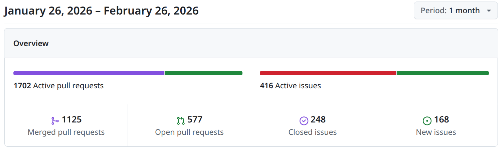
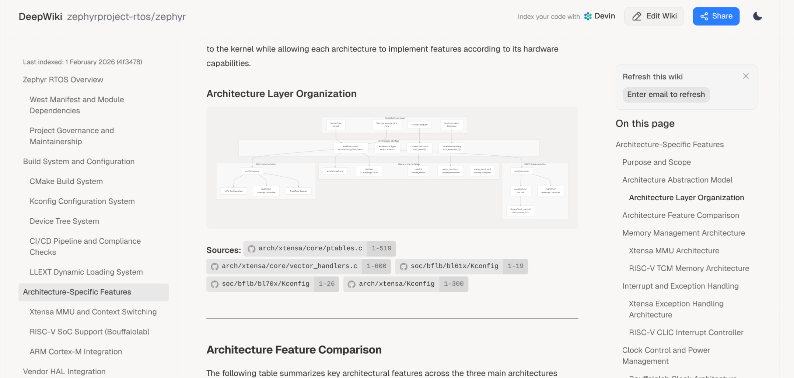

# Zephyr 爱好者月刊（第 14 期 202602）

这里记录 Zephyr 最新的消息和值得分享的内容，每月最后一周发布。

本杂志开源（GitHub: [lgl88911/Zephyr_Fans_Monthly](https://github.com/lgl88911/Zephyr_Fans_Monthly)），欢迎提交 issue、投稿或推荐 Zephyr 相关内容。

## 项目数据



不包括合并，411 位作者向主分支推送了 2213 次提交，向所有分支推送了 2297 次提交。
在主分支上，共有 5888 个文件发生了变化，新增了 166867 行，删除了 78351 行。


近期动向：
- [引入基于 Clock 驱动的 Clock Management 子系统](https://github.com/zephyrproject-rtos/zephyr/pull/72102)
- [WUC 驱动程序与设备驱动集成](https://github.com/zephyrproject-rtos/zephyr/issues/100853)
- [新增唤醒原因检测API](https://github.com/zephyrproject-rtos/zephyr/pull/103863)
- [添加 NXP XBAR 驱动程序](https://github.com/zephyrproject-rtos/zephyr/pull/102264)
- [步进电机驱动类的重构与命名优化](https://github.com/zephyrproject-rtos/zephyr/issues/101330)
- [引入SLCD控制器驱动及7段LCD显示驱动](https://github.com/zephyrproject-rtos/zephyr/pull/102796)
- [UART 驱动 API 变更提议：允许 irq_update 为 NULL](https://github.com/zephyrproject-rtos/zephyr/issues/102881)
- [Device API 调用中增加额外 assert 的提议](https://github.com/zephyrproject-rtos/zephyr/issues/103176)
- [软件定义外设的统一 API 提案](https://github.com/zephyrproject-rtos/zephyr/issues/104334)


## 新闻&活动

1、[Zephyr 宣布迎来新成员](https://www.zephyrproject.org/zephyr-project-welcomes-new-members-february-2026/)

2026 年 2 月 5 日，Zephyr 宣布迎来新成员，包括银牌会员：成都菁蓉联创科技、Embedd、Savoir-faire Linux、SevenLab 和施耐德电气，以及合作伙伴会员 BeagleBoard.org 和 openEuler。

在 2026 世界嵌入式大会中，Zephyr 也同步发布了这一消息：https://embeddedcomputing.com/technology/open-source/linux-freertos-related/the-zephyr-project-grows-membership-highlights-security-and-resilience-at-embedded-world-2026

这些新成员包含 2025 年加入的会员。

2、Zephyr 播客持续发布

本月 Zephyr 发布 3 期播客：
- https://www.zephyrproject.org/you-merged-my-sisters-pr-zephyr-podcast-021/
- https://www.zephyrproject.org/brussels-calling-zephyr-podcast-020/
- https://www.zephyrproject.org/heap-heap-hooray-zephyr-podcast-019/

3、[Zephyr线下见面会](https://www.zephyrproject.org/what-to-expect-at-the-zephyr-project-meetup-feb-12-2026-winterthur-switzerland/)

- 时间与地点：2026年2月12日，瑞士温特图尔的ZHAW工程学院
- 主办方：由Noser Engineering和ZHAW嵌入式系统研究所共同主办。


## 文摘&观点

1、越来越多的 Zephyr 开发支持公司

去年的月刊介绍过风河等公司提供对 Zephyr 开发的定制支持服务，本次又发现新的公司支持该业务，这表明 Zephyr 的大规模商用需求已经初具规模

https://swedishembedded.com/zephyr

Swedish Embedded AB 提供全面的 Zephyr RTOS 咨询服务，专注于解决 BSP、驱动程序、CI/CD 和测试中的常见问题。成功案例包括在 30 天内交付 8 个以上生产级驱动程序和 2 个板级启动程序，以及将 CI 的可靠性从 60% 提高到 100%。

## 技术

1、[Zephyr 增加对Armv9 Cortex-A处理器的支持](https://www.zephyrproject.org/baylibre-partners-with-arm-to-bring-zephyr-os-support-to-armv9-cortex-a-processors/)

BayLibre 与 Arm 合作，为 Zephyr RTOS 增加对 Armv9 Cortex-A 处理器的支持，特别是 Cortex-A320。此次合作增强了边缘 AI 能力，通过优化 SVE/SVE2 上下文管理和 FVP 支持，提升了系统设计的灵活性和稳定性。所有实现的功能已合并到 Zephyr 主分支，为开源社区提供了新的开发资源。双方将继续合作，进一步扩展 Armv9 架构的实时能力。

2、[Zephyr RTOS 在 NXP 的 HiFi4 DSP 上的应用](https://www.zephyrproject.org/zephyr-on-hifi4-dsp-development-simplified/)

通过 Zephyr 的支持，HiFi4 DSP 可以高效地处理音频、语音和神经网络任务，同时与 ARM 核心无缝协作。Zephyr 提供统一的开发环境，简化了开发流程，使开发人员能够充分利用 DSP 的计算能力，实现高性能、低功耗的嵌入式系统设计。

Zephyr 在 DSP 上的优势：
- 统一开发流程：提供跨 ARM 和 DSP 核心的通用 API、工具和构建系统。
- 性能优化：卸载计算密集型任务，提升系统性能。
- 开放性和可扩展性：利用开源的 Zephyr 和 SOF 生态系统，减少长期技术债务
- 可扩展的系统设计：支持 Linux、ARM 上的 Zephyr 和 DSP 上的 Zephyr 之间的无缝协作

3、[Zephyr虚拟文件系统（ZVFS）的改进](https://antmicro.com/blog/2026/02/improved-zephyr-virtual-filesystem)

本文介绍了 Zephyr 虚拟文件系统（ZVFS）的改进，重点在于提升跨操作系统兼容性和功能扩展。
- 增强 POSIX 兼容性：
	- ZVFS 完全支持 POSIX 文件访问 API，使得原本为其他操作系统开发的应用程序更容易移植到 Zephyr
	- 移除外部文件访问标准单独实现数据结构的需求
	- 可根据需要启用或禁用 ZVFS 整合进 POSIX
	- 所有单文件操作现在都由 ZVFS 处理，POSIX 通过 ZVFS 执行这些操作
- C 函数支持：
	- ZVFS 新增了 ISO C 标准的 fdopen 和 fileno() 方法，允许使用 C 函数对通过 POSIX 打开的文件进行操作

## 课程&教程

1、[在 Arduino UNO R4 WiFi 开发板上运行 Zephyr](https://www.embeddedk8.com/posts/2026/running-zephyr-on-arduino-uno-r4/)

文章详细说明如何在 PC 上设置 Zephyr 开发环境，如何构建和烧录示例程序，并提供了在 Ubuntu 上可能遇到的问题的解决方案。还介绍了如何使用 Zephyr 的模拟功能进行程序测试。

2、[Zephyr 中使用 IAR C-STAT 进行静态代码分析](https://blog.golioth.io/find-breaking-changes-in-zephyr-using-git-bisect/)

本文介绍了如何在 Zephyr 中使用 IAR C-STAT 进行静态代码分析，以构建更安全的代码。通过将静态代码分析工具集成到 Zephyr 的构建系统中，开发团队可以在早期发现代码缺陷和合规性问题，降低修复成本。IAR C-STAT 提供了灵活的配置选项，支持多种编码标准和安全检查。

## 技术&工具

1、[Rust 2026嵌入式开发全景](https://dasroot.net/posts/2026/02/rust-embedded-development-microcontrollers-safety/)

本文系统阐述了Rust 2026版在嵌入式微控制器开发中的核心优势与生态成熟度。主旨在于说明Rust凭借所有权模型实现的内存安全保证，结合零成本抽象机制，已成为安全关键领域替代C/C++的可行选择。

文中在Embedded Rust 的工具与生态系统概况的官方工具与集成中有专门提及RTOS 与调度框架支持，其中Zephyr（v3.4.0）官方已增强 Rust 支持。通过 zephyr-rtic 可以在 Zephyr 板级平台上运行 RTIC 应用，支持将 Rust 作为 Zephyr 原生语言之一进行开发。

2、[DeepWiki Zephyr](https://deepwiki.com/zephyrproject-rtos/zephyr)
DeepWiki 是由Cognition Labs 公司推出的一款免费的AI 驱动GitHub 源码阅读与分析神器。 旨在帮助开发者更高效地阅读、理解和分析GitHub 上的源码，从而加速开发进程，提升代码质量（无需注册即可使用）。其中已经包含Zephyr的repo,初步看了下还是分析得比较到位。




## Zephyr 每月小知识

1、没有示例代码怎么办

Zephyr的samples下有大量的示例代码，这些代码可以帮助开发者快速了解Zephyr的功能模块如何使用，但samples只集中在主要的功能模块，对于一些特殊功能模块，没有对应的samples。这种情况下可以去测试代码tests目录下去找，Zephyr的测试代码是非常全的，在tests下可以找到所有Zephyr公共API的测试代码，透过测试代码，可以了解Zephyr的API使用方法。
```
application_development  bluetooth  bsim    ctest        kconfig  misc     posix   test_config_ci.yaml  unit
arch                     boards     cmake   drivers      kernel   modules  robot   test_config.yaml     ztest
benchmarks               boot       crypto  integration  lib      net      subsys  tests.dox
```
编译测试代码的方法和正常的构建一样，构建代码的目录就是测试代码的目录，例如`west build -p -b qemu_x86 zephyr/tests/net/iface`