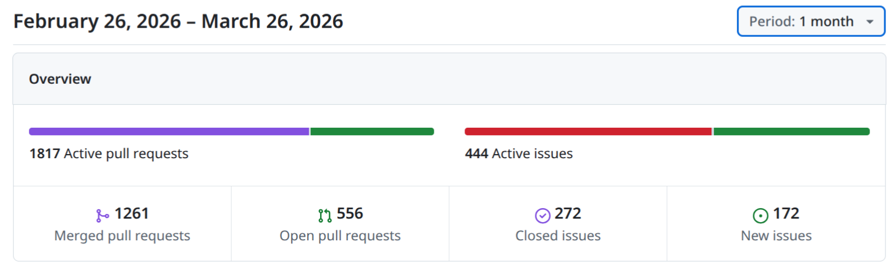
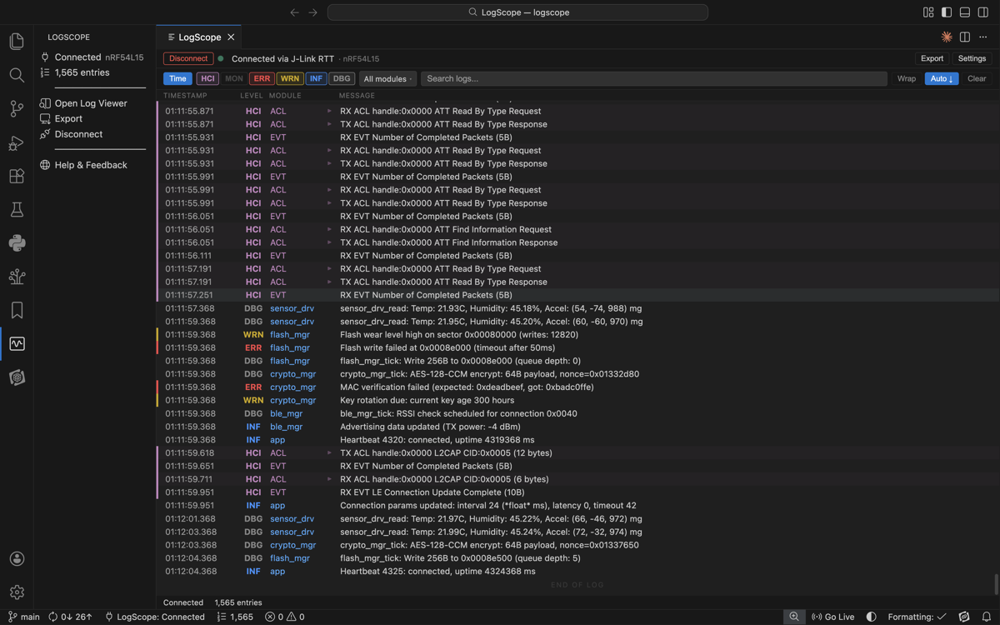
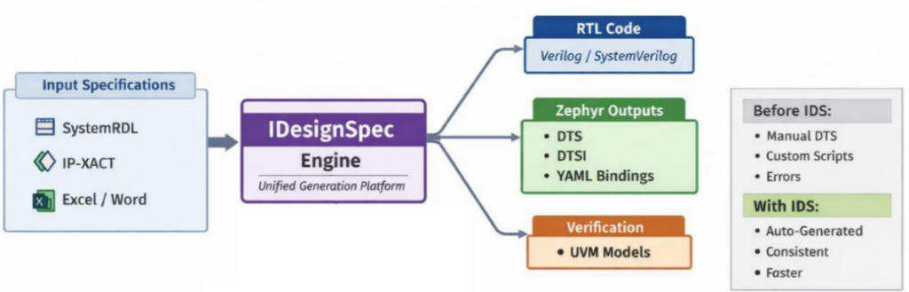

# Zephyr 爱好者月刊（第 15 期 202603）

这里记录 Zephyr 最新的消息和值得分享的内容，每月最后一周发布。

本杂志开源（GitHub: [lgl88911/Zephyr_Fans_Monthly](https://github.com/lgl88911/Zephyr_Fans_Monthly)），欢迎提交 issue、投稿或推荐 Zephyr 相关内容。

## 项目数据



不包括合并，446 位作者向主分支推送了 2881 次提交，向所有分支推送了 2947 次提交。
在主分支上，共有 6917 个文件发生了变化，新增了 271997 行，删除了 60104 行。


近期动向：
- [vendor 特定 API 放置策略](https://github.com/zephyrproject-rtos/zephyr/pull/99750)
- [软件定义外设的统一 API 提案](https://github.com/zephyrproject-rtos/zephyr/issues/104334)
- [RTIO支持ADC子系统](https://github.com/zephyrproject-rtos/zephyr/pull/104672)
- [统一 I2C 超时配置机制](https://github.com/zephyrproject-rtos/zephyr/issues/104847)
- [合并eth和mdio控制驱动](https://github.com/zephyrproject-rtos/zephyr/pull/104268)
- [LTS版本的3.7.2发布](https://github.com/zephyrproject-rtos/zephyr/releases/tag/v3.7.2-rc2)
- [Zephyr SDK迎来1.0版本](https://github.com/zephyrproject-rtos/sdk-ng/releases/tag/v1.0.0)
- [引入GPIO原始寄存器直接访问机制](https://github.com/zephyrproject-rtos/zephyr/pull/105263)
- [Device API 调用中增加额外 assert 的提议](https://github.com/zephyrproject-rtos/zephyr/issues/103176)


## 新闻&活动

1、[Zephyr 十周年发展里程碑与全球采用趋势](https://www.zephyrproject.org/zephyr-turns-10-as-global-adoption-surges-and-long-term-embedded-use-expands/)

Zephyr已从一个小型开源实验项目，演进为全球嵌入式系统的生产级基础设施。Linux Foundation Research的Zephyr 10周年调查显示：Zephyr 用 70%（北美）和62%（欧洲）的商业采用率、52%的长期部署周期、以及仅1%的弃用意愿，证明其技术成熟度和市场渗透力。研究同时展示出Zephyr的差异化优势：49%的受访者将"硬件可移植性"视为最大收益。

Zephyr不再只强调"新功能"，而是强调"可信赖的长期伙伴关系"。文章的作者Kate Stewart提到Zephyr的下一个十年竞争焦点是"坚守开放、协作、可移植性和信任"，而非简单的技术堆砌。Zephyr正从通用RTOS向高可靠性领域渗透，立志于变为安全关键系统。

10周年调查报告：https://www.linuxfoundation.org/research/zephyr-turns-10?hsLang=en

2、Zephyr 播客持续发布

本月 Zephyr 发布 2 期播客：
- https://www.zephyrproject.org/10-years-and-still-learning-zephyr-podcast-025/
- https://www.zephyrproject.org/only-0-51-zephyr-zephyr-podcast-024/

3、[Zephyr线下见面会](https://www.zephyrproject.org/what-to-expect-at-zephyr-project-meetup-march-26-2026-rennes-france/)

- 时间与地点：2026年3月26日 法国雷恩
- 主办方：Savoir-faire Linux（银牌会员）与 Silicon Labs（白金会员）


4、[Zephyr SDK 1.0 正式发布](https://github.com/zephyrproject-rtos/sdk-ng/releases/tag/v1.0.0)

从2017年 SDK第一笔提交https://github.com/zephyrproject-rtos/sdk-ng/commit/cf3665cb0a30c8ed7977669c9c40a83824ef7435 开始，经历近9年时间, Zephyr SDK终于迎来1.0版本。

Zephyr SDK 1.0 标志着 Zephyr 开发工具链的重大里程碑。本次发布核心在于双工具链架构的确立：传统 GNU 工具链（GCC 14.3）与现代 LLVM 工具链（Clang 19.1.7）并行支持. 另外值得注意的是，newlib and newlib-nano C lib从工具链中移除，Picolibc 成为唯一默认 C 库。

版本升至 1.0 体现了生态成熟度：新增 OpenRISC 1000 架构支持，同时移除已淘汰的 NIOS II 和 macOS x86-64 支持。跨平台能力显著增强，首次为 macOS 和 Windows 提供完整主机工具链（OpenOCD、QEMU 等），Windows 版本更采用现代 UCRT 运行时以支持 Unicode。

5、[Arduino Nano Matter 获得原生 Zephyr 支持](https://blog.arduino.cc/2026/03/10/your-arduino-nano-matter-board-is-now-a-professional-zephyr-development-platform/)

Arduino Nano Matter 开发板获得 Zephyr 官方原生支持，实现从"创客友好"到"专业级嵌入式平台"的跨越。单一硬件实现双轨开发路径：初学者可用 Arduino Core 快速搭建 Matter-over-Thread 智能家居原型；进阶开发者则通过 west build -b arduino_nano_matter 调用完整 Zephyr 工具链，构建具备实时多线程、高级电源管理和硬件安全特性的生产级固件。

文章最后锚定于欧盟网络韧性法案合规的紧迫商业需求，表明 Zephyr 原生支持不仅是技术升级，更是面向 2026 年监管截止期的战略部署。


## 文摘&观点

1、[IoT RTOS 市场研究报告笔记](https://www.verifiedmarketreports.com/product/real-time-operating-systems-rtos-for-the-internet-of-things-iot-market-size-and-forecast/)

该报告在IOT RTOS 市场竞争格局中提到Zephyr专注在航空航天和医疗等细分市场，通过认证，开源社区和垂直整合来构建其竞争优势。

2、Zephyr相关招聘

https://www.careers.ford.com/job/palo-alto/embedded-camera-lead/48560/93158988528

福特的招聘嵌入式 Camera Lead，要求负责Zephyr上bring up camera 流媒体功能。

https://openai.com/careers/embedded-swe-consumer-devices-san-francisco/

OpenAI 招聘消费级硬件产品线的深嵌入式软件工程师，会Zephyr是加分项。

## 技术

1、[AkiraOS](https://github.com/ArturR0k3r/AkiraOS)

AkiraOS 是一个模块化、注重安全的嵌入式平台，适用于资源受限的设备。基于 Zephyr 实时操作系统构建，支持 WebAssembly (WASM) 运行时和 OCRE 容器技术。

2、[Unikie与onsemi携手展示超低功耗边缘AI解决方案](https://www.unikie.com/stories/embedding-intelligence-in-low-power-devices/)

Unikie以心率监测系统为演示案例，展示基于onsemi RSL15蓝牙低功耗MCU和CEM102模拟前端方案，配合Zephyr实现了"LED光反射采集—设备端信号处理—无线传输"的全链路超低功耗运行。为医疗设备、工业监测和可穿戴产品提供了可量产的技术路径。

3、[基于大语言模型与检索增强生成的RTOS固件标准库函数自动识别方法](https://ieeexplore.ieee.org/document/11421957)

这是一篇IEEE论文，针对物联网安全中RTOS固件逆向工程的核心瓶颈——剥离符号信息后标准库函数难以识别的问题，作者设计了自适应迭代筛选算法（AISA），通过综合调用频率、调用深度和地址邻近性三项指标的加权评分，智能优先筛选高价值候选函数，显著降低token消耗。在Zephyr RTOS上的实验表明，该方法达到90.59%的识别准确率。

论文为了验证跨ARM、MIPS、RISC-V等九种硬件架构的广泛通用性，选择了支持多架构的Zephyr作为实验对象。

4、[OSADL Zephyr实时性能QA监控](https://www.osadl.org/Zephyr-Monitoring.zyclictest.0.html)

OSADL通过标准化硬件平台、固定测试周期、公开数据访问，为Zephyr在工业自动化领域的应用建立了可量化的性能基准。

5、[AMD MicroBlaze V全面迁移到Zephyr RTOS](https://www.microchipusa.com/manufacturer-articles/amd/zephyr-rtos-support-for-amd-microblaze-v-complete-fpga--risc-v-guide?srsltid=AfmBOoobPviOoIw6v8ULZd9ypGBlNtd9R-587yq-NK0hlu1ONzNHsn9h)

Zephyr凭借其Linux基金会背书、Devicetree架构、完整网络协议栈和标准化驱动模型，解决了FreeRTOS在可扩展性、生态系统和长期维护方面的局限，成为AMD FPGA嵌入式开发的未来方向。

文章详细对比Zephyr与FreeRTOS在架构复杂度、配置方式、硬件抽象和联网能力等维度的差异，明确选型场景；梳理AMD全系列处理器（从MicroBlaze V到Cortex-A78/R52）的Zephyr支持路线图，其中MicroBlaze V已于2025.1达到PROD（生产级）；深入解析MicroBlaze V的RISC-V ISA扩展能力、AXI驱动开发现状，以及基于West/Kconfig/Devicetree的Zephyr开发 workflow。

## 课程&教程

1、[iomico 推出**免费**的Zephyr RTOS在线实战课程](https://www.iomico.com/media/iomico-zephyr-course-2026)

iomico 将于2026年3月推出**免费**的Zephyr RTOS在线实战课程，面向嵌入式初学者。课程采用线上直播的放松由两位资深工程师主讲，基于iomico六年以上的Zephyr实战经验，涵盖上游代码协作、west多仓库管理、Kconfig/设备树配置、自定义板级支持、标准驱动开发（含Shell集成）、模块封装及ztest单元测试七大核心技能，

2、[Zephyr RTOS 入门](https://siliconwit.com/education/rtos-programming/zephyr-rtos-introduction/)

以实现一个信号交通灯为例说明如何使用Zephyr，并和FreeRTOS进行对比。通过 devicetree 、Kconfig 、west 构建工具三个 Zephyr 核心机制的深度解析，展示了现代嵌入式开发如何从"寄存器编程"演进为"声明式硬件描述"。

## 工具

1、[Zephyr log工具：logscope](https://github.com/NovelBits/logscope?ref=novelbits.io)

LogScope是由嵌入式蓝牙教育公司NovelBits开发的VS Code扩展，该工具通过pylink库直接对接J-Link RTT，实现零丢包的实时日志流传输，在不暂停CPU的前提下完成10万条日志的环形缓冲。有三个优势体现：
- Zephyr原生解析，自动提取日志的时间戳、模块、严重级别
- 蓝牙LE解码，内置14+种HCI包解析器，将十六进制数据转化为可读的连接事件、ATT操作等
- 智能故障响应，自动检测ARM异常与Zephyr致命错误并高亮暂停

项目采用TypeScript+Python混合架构，以MIT协议开源，当前使用J-Link，**未来计划扩展UART支持**。



2、[Zephyr 设备树自动化生成：IDesignSpec](https://www.agnisys.com/blog/zephyr-dtsi-and-dts-output-with-idesignspec/)

Agnisys公司IDesignSpec工具对Zephyr RTOS设备树生成的自动化支持。Zephyr采用DTSI（硬件抽象定义）与DTS（板级实例配置）两级结构描述硬件，但手工维护或专用脚本处理存在易错、难扩展、多源失同步等问题。IDesignSpec允许用户使用SystemRDL、IP-XACT、Excel等熟悉格式定义硬件，将其直接生成DTSI、DTS及Zephyr YAML绑定文件。做到同一规格驱动RTL、UVM模型、软件头文件、技术文档及设备树的同步生成，消除传统流程中多文件版本不一致的隐患。



3、[Zephyr AI Agent Skill](https://github.com/beriberikix/zephyr-agent-skills/tree/main)

Goliothc的Jonathan Beri针对Zephyr 建立了AI Agent Skill体系。几乎覆盖了Zephyr开发的各个方面。

Phase 1: 基础阶段（Foundations）
| 技能名称 | 核心内容 | 
|:---|:---| 
| zephyr-foundations | 嵌入式C模式与安全编码 | 
| build-system | West、Sysbuild、Kconfig、CMake | 
| devicetree | 语法、绑定、硬件描述 | 
| native-sim | 仿真与主机端测试 | 
| board-bringup | 自定义板级定义（HWMv2） |

Phase 2: 核心功能（Core Features）
| 技能名称 | 核心内容 | 
|:---|:---| 
| kernel-services | 线程、工作队列、Zbus、log | 
| hardware-io | GPIO、I2C、SPI、DMA、传感器 | 
| power-performance | 电源管理状态、优化构建、RAM调优 |

Phase 3: 连接性（Connectivity）
| 技能名称 | 核心内容 | 
|:---|:---| 
| connectivity-ble | 蓝牙低功耗（GAP/GATT）| 
| connectivity-ip | IPv6、CoAP、MQTT、LwM2M | 
| connectivity-usb-can | USB设备类与CAN总线 |

Phase 4: 生产与专业化（Production & Specialized）
| 技能名称 | 核心内容 | 
|:---|:---| 
| security-updates | MCUboot、镜像签名、DFU | 
| iot-protocols | OpenThread、Matter、Golioth | 
| multicore | SMP、OpenAMP、IPC | 
| industrial | Modbus RTU/TCP、CANopen | 
| specialized | 音频、LVGL GUI、可靠性 |

## Zephyr 每月小知识

1、如何产生SBOM

SBOM 可以快速定位软件产品中的组件，从而更容易识别、处理和修复漏洞。Zephyr在每次release的时候都会附带SBOM。我们自己使用Zephyr开发产品软件时为了达到同样的目的，也可以通过下面方法方便的产生物料清单

- 初始化填充构建目录
```
west spdx --init -d <BUILD_DIR>
```

- 添加`CONFIG_BUILD_OUTPUT_META=y` 到prj.conf    
- 构建项目
```
west build -d <BUILD_DIR> [...]
```

- 生成SBOM
```
west spdx -d <BUILD_DIR>
```

例如：
```
west spdx --init -d build/
west build -b esp32s3_touch_lcd_2/esp32s3/procpu LVGLXMLwZephyr/cpp_app/'
west spdx --build-dir=./build/
```

最后你可以在`build/spdx/`下看到sbom文件
```
├── app.spdx
├── build.spdx
├── modules-deps.spdx
└── zephyr.spdx
```