# Zephyr 爱好者月刊（第 16 期 202604）

这里记录 Zephyr 最新的消息和值得分享的内容，每月最后一周发布。

本杂志开源（GitHub: [lgl88911/Zephyr_Fans_Monthly](https://github.com/lgl88911/Zephyr_Fans_Monthly)），欢迎提交 issue、投稿或推荐 Zephyr 相关内容。

## 项目数据

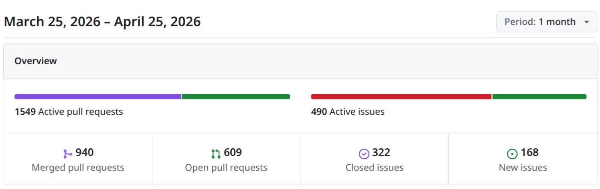

不包括合并，371 位作者向主分支推送了 1643 次提交，向所有分支推送了 1749 次提交。
在主分支上，共有 4450 个文件发生了变化，新增了 134730 行，删除了 37723 行。

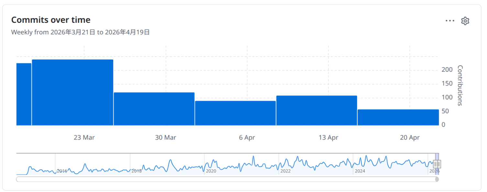

近期动向：
- [eSPI 子系统改进](https://github.com/zephyrproject-rtos/zephyr/issues/105695)
- [支持OTA增量升级](https://github.com/zephyrproject-rtos/zephyr/pull/106525)
- [快速 GPIO API 扩展](https://github.com/zephyrproject-rtos/zephyr/issues/106831)
- [支持 usb host cdc-ecm](https://github.com/zephyrproject-rtos/zephyr/pull/100289)
- [ethernet设备支持多iface](https://github.com/zephyrproject-rtos/zephyr/issues/106544)
- [合并eth和mdio控制驱动](https://github.com/zephyrproject-rtos/zephyr/pull/104268)
- [Device API 调用中增加额外 assert 的提议](https://github.com/zephyrproject-rtos/zephyr/issues/103176)
- [引入GPIO原始寄存器直接访问机制](https://github.com/zephyrproject-rtos/zephyr/pull/105263)
- [运动学(Kinematic)子系统](https://github.com/zephyrproject-rtos/zephyr/issues/107078)

## 新闻&活动

1、[Zephyr RTOS 4.4 正式发布](https://www.zephyrproject.org/zephyr-rtos-4-4-now-available-wireguard-wi-fi-direct-openrisc-and-more/)

本文系统介绍了Zephyr RTOS 4.4版本的重大更新，通过放缓发布节奏至半年度，强调"质量优先于速度"的治理理念，项目得以在工具链现代化、网络安全能力、硬件生态扩展及开发者体验四个维度实现深度突破，巩固其作为领先开源嵌入式RTOS的地位。技术层面，C17迁移与Zephyr SDK 1.0标志着工具链成熟；OpenRISC支持延续架构开放性传统；Wi-Fi Direct与WireGuard的组合填补了嵌入式设备直连安全通信的空白；UVC摄像头驱动与传感器扩展则瞄准边缘视觉场景。CPU压力感知调频与Cortex-M上下文切换优化——二者分别从功耗效率和执行性能切入，回应资源受限系统的核心诉求。在开发者体验侧，Build Dashboard整合分散工具、堆加固提升可靠性、RAII式清理助手减少人为错误。

2、[Zephyr Project 德国嵌入式世界2026回顾：十周年里程碑与生态共荣](https://www.zephyrproject.org/recap-embedded-world-exhibition-conference-germany-2026/)

Zephyr Project 对2026年德国嵌入式世界展览与会议的官方回顾，以十周年庆典为叙事主线，展现开源实时操作系统生态的成熟与全球化扩展。文章概括为三层：
- 规模验证价值: 展会36,000人次、13%的增长率及全球分站布局，印证嵌入式开源社区已从边缘走向产业中心；
- 生态即竞争力:13家成员企业联合演示、技术议题覆盖全栈工程挑战，说明 Zephyr 已构建起从芯片厂商到培训服务的完整价值链，而非单一技术项目；
- 社区治理的可持续性: 通过 scavenger hunt、Happy Hour 等低门槛参与设计，以及 Discord、工作组等常态化协作机制，项目将"十周年纪念"转化为持续吸纳贡献者的入口。

3、[Zephyr项目亮相2026年北美开源峰会：十年征程与未来展望](https://www.zephyrproject.org/zephyr-project-at-the-open-source-summit-north-america-2026/)

本文介绍Zephyr在2026年北美开源峰会上的安排，核心主旨在于展示Zephyr作为开源实时操作系统历经十年发展后的技术成熟度与生态扩张力，同时明确其面向下一个十年的战略聚焦点。

Zephyr已从解决"供应商锁定"问题的替代方案，演进为支持长生命周期产品、覆盖从开发到量产全链条、兼具安全认证能力与硬件灵活性的现代化嵌入式基础设施，其开源协作模式正重新定义实时操作系统行业的技术标准和商业生态.

4、[Zephyr in Science and Education 2026 征文启事](https://www.zephyrproject.org/call-for-paper-zephyr-in-science-and-education-2026/)

第二届"Zephyr科学与教育国际会议"（ZiSE 2026）征文启事，将Zephyr RTOS定位为连接嵌入式系统学术教育与工业实践的关键基础设施。文章强调在嵌入式技术快速迭代的背景下，高校亟需引入供应商中立、社区驱动且文档完善的专业级平台，以培养学生具备真正的开发能力。

Zephyr RTOS的教育价值
- 产业-学术桥梁: 弥合学术教育与工业实践之间的鸿沟
- 供应商中立性: 摆脱单一厂商锁定，提供未来可持续的技术基础
- 社区与文档: 强大的社区支持与优质文档降低学习门槛
- 真实技能培养: 学生接触专业级系统，而非简化版教学工具
- 代际传承: 连接教学、学生项目与专业用例，培养新一代开发者

## 文摘&观点

1、[ST与Zephyr 4.4.0深度合作：开源协作如何降低嵌入式开发门槛并惠及全行业](https://blog.st.com/zephyr/)

ST通过积极拥抱Zephyr开源生态，既满足了客户对跨平台、可移植系统的需求，又以"贡献代码+审核社区贡献"的双向协作模式，推动整个嵌入式行业降低技术门槛。

ST拥有完善的专有软件生态（STM32Cube系列），但部分客户因多厂商兼容性、专有系统构建或开源偏好而需要Zephyr。Zephyr提供硬件抽象层，避免供应商锁定，使项目更具可移植性。ST将此举定位为战略选择：通过支持Zephyr这类开源RTOS项目， democratize（民主化）实时操作系统，使边缘计算、物联网等前沿技术更易于获取，从而惠及超出ST产品用户的整个开发者社群。

Zephyr 4.4.0作为实证，新增对STM32C5等四大MCU系列及多款ST外设的支持，同时在驱动性能、ADC流式处理、I3C接口等中间件层面实现突破。ST强调其贡献不仅限于代码输出，更投入工程资源审核社区提交，形成良性循环。

2、[Silicon Labs Zephyr RTOS 战略解析：企业级质量保障与开源灵活性的融合之道](https://www.silabs.com/software-and-tools/zephyr-rtos?tab=overview)

Silicon Labs 围绕 Zephyr RTOS 构建的产品战略与开发者生态。通过"下游维护+上游贡献"的双轨模式，Silicon Labs 将 Zephyr 的开源灵活性与自身企业级的质量保障、技术支持深度结合，为物联网开发者提供一条兼具创新效率与生产可靠性的开发路径。

特别值得注意的是，Silicon Labs 并未试图用 Zephyr 版本替代标准 SDK，而是明确区隔两者适用场景——Zephyr 版胜在跨平台灵活性与生态丰富度，标准版则聚焦 Silicon Labs 硬件的极致性能优化。这种"双 SDK 并行"策略既顺应了开源化行业趋势，又守住了专有技术的性能护城河。

3、[嵌入式双轨演进：从资源裸奔到Linux生态，Zephyr如何架起技术桥梁](https://codium.fr/en/news/embedded-development/)
本文对比嵌入式开发的两大技术范式——资源受限的微控制器/RTOS世界与应用处理器上的嵌入式Linux生态。前者以KB级RAM、无MMU、硬实时、直接寄存器操作为特征，后者则需应对启动优化、PREEMPT_RT实时补丁、功能安全认证及内核ABI稳定性等复杂挑战。

Zephyr通过移植Linux的四大技术资产——Devicetree声明式硬件描述、Kconfig/CMake构建系统、上游BSP直接维护机制、west多仓库管理,消解两大领域的历史隔阂，使Linux工程师能快速切入MCU开发。这种架构借鉴不仅是技术便利，更代表了行业标准化方向：Nordic、ST、Espressif等主流厂商均已将BSP上游化。

4、Zephyr相关招聘

https://justjoin.it/job-offer/astek-polska-software-engineer-crank-lub-zephyr-f-m--warszawa-c

ASTEK波兰招聘嵌入式软件工程师,面向家用电器（AGD）领域的嵌入式GUI开发,Zephyr RTOS被明确列为高度优先的加分技能

https://www.bayt.com/en/pakistan/jobs/senior-engineer-linux-zephyr-sw-integration-74479456/

高通海得拉巴招聘Linux/Zephyr软件集成高级工程师,招聘明确要求候选人具备Zephyr/FreeRTOS等RTOS的实战经验，并需担任Zephyr产品集成团队的首要联系人，直接驱动Zephyr在嵌入式设备上的软件启动、组件集成与问题调反转试

## 技术

1、[如何避免Zephyr BLE 固件中的优先级反转](https://hubble.com/community/guides/zephyr-thread-priorities-and-scheduling-avoiding-priority-inversion-in-ble-firmware/)

本文深入剖析了 Zephyr 下 BLE 固件中由优先级反转导致的静默连接断开。此类问题典型表现为无错误日志的周期性 supervision timeout（错误码 0x08），根源是应用线程与 BLE 协议栈内部线程之间的调度冲突。

文章系统梳理了 Zephyr 的协作式/抢占式调度机制，发现 BLE 线程虽为协作式却因 k_mutex_lock() 阻塞而可能被间接挂起的机制。通过传感器读取→日志抢占→bt_rx 阻塞的完整时序，演示了经典的三线程优先级反转场景。

文章提出三个处理点：
- 强制使用内置优先级继承的 k_mutex 替代无所有权的 k_sem
- 设计 intentional 优先级映射，将关键应用工作转到专用 workqueue，避免与系统 workqueue 及 BLE 回调竞争
- 使用k_msgq/k_pipe 的消息传递模式避免共享数据

2、[Zephyr RTOS on ESP32 实战指南：以可移植性重构嵌入式产品长期架构](https://hubble.com/community/guides/getting-started-with-zephyr-rtos-on-esp32-why-it-might-replace-esp-idf-for-your-next-product/)

本文面向具备ESP-IDF经验的开发者，论证Zephyr RTOS在ESP32上的应用价值与实操路径。ESP-IDF虽能加速单平台首版交付，却锁定"下一代产品仍用Espressif硅片"；一旦面临BOM优化、供应链多元或跨代硬件迭代，固件重写成本将急剧攀升。Zephyr以Linux Foundation背书的 vendor-neutral 架构，通过devicetree硬件描述、统一驱动API与west构建系统，实现同一套C应用代码向600+板卡、100+ SoC的零改动移植。

最终结论：若产品路线图含多平台战略，Zephyr的前置学习成本将转化为跨代技术投资的复利回报；BLE深度应用更是其最强差异化优势。决策关键在于权衡"首版速度"与"长期架构弹性"的工程预算分配。

3、[Moddable + Zephyr：嵌入式 JavaScript 开发架构](https://www.moddable.com/documentation/devices/zephyr)

该文档介绍了 **Moddable SDK 在 Zephyr RTOS 上运行的开发方式与整体架构。利用 Zephyr 提供的硬件驱动、设备树和 RTOS 能力，在其之上运行 Moddable 的 JavaScript 引擎（XS），从而让开发者可以用 JavaScript 编写嵌入式和 IoT 应用

4、[WallaBMC 基于 Zephyr RTOS、面向微控制器的开源轻量级 BMC](https://www.reddit.com/r/RISCV/comments/1sjeza1/tenstorrent_built_a_bmc_firmware_wallabmc_using/)

WallaBMC 是 Tenstorrent 基于 Zephyr RTOS 构建的开源轻量级 BMC 固件，通过充分利用 Zephyr 的现代嵌入式基础设施，可在资源受限的 MCU 上实现符合行业标准的企业级带外管理能力。项目以 Zephyr 的 west 构建系统、Kconfig 配置框架、设备树硬件抽象、以及原生网络/Shell 子系统为基石，将 Redfish RESTful API、HTTPS Web 管理、WebSocket 串口重定向等复杂功能压缩进 STM32/RISC-V 级别的微控制器。

其设计刻意区别于基于 Linux 的传统 BMC（如 OpenBMC），以 Zephyr 的实时性、小体积、模块化 换取更低的硬件成本与功耗；同时通过 MCUboot 安全引导、双镜像 sysbuild 构建、及完整的合规文档体系，证明轻量级方案亦可满足生产环境的可靠性与可维护性要求。该项目为 Zephyr 生态在服务器/嵌入式管理领域的应用拓展提供了重要参考，展现了 RTOS 在现代基础设施管理中的新可能性。

## 课程&教程

1、[Linux 基金会Zephyr免费入门资源](https://training.linuxfoundation.org/resources/zephyr-essentials-the-future-of-embedded-development/)

Linux 基金会培训平台发布的Zephyr 项目免费入门资源介绍

2、[Zephyr Shield 机制](https://medium.com/@aliaksandr.kavalchuk/hardware-abstraction-in-zephyr-zephyr-shields-separating-boards-and-modules-0a0ea8875cb9)

本文系统说明了 Zephyr Shield 机制 的设计原理与实践方法，Shield 通过标准化的四文件结构（shield.yml、.overlay、Kconfig.shield、Kconfig.defconfig）实现扩展板与主控板的构建时分离与动态集成，显著提升嵌入式项目的架构清晰度与硬件模块的可复用性。以 LED Shield 为例，详细解析了元数据声明、设备树覆盖、配置符号定义及默认值注入的完整流程，并重点说明了标准构建与 sysbuild 多镜像场景下的差异化命令用法。

3、[TI关于Zephyr资源的页面](https://www.ti.com.cn/zh-cn/design-development/software-design/Zephyr-RTOS.html)

TI 官方资源页面，提供 Zephyr 官方文档、资源下载、社区支持、课程等。

4、[bilibili上有搬运的zephyr教学视频](https://www.bilibili.com/video/BV1V91jBnECC)

Zephyr国内的关注度持续提高，有网友将Zephyr的教学视频搬运到bilibili，大家可以参考。

## 产品

1、[基于Zephyr RTOS的模块化工业物联网开发平台——Tibbo Project System](https://www.zephyrproject.org/portfolio/tibbo-project-system/)

Tibbo Technology公司推出的Tibbo Project System（TPS），是以Zephyr RTOS为固件核心的模块化工业控制器与物联网设备硬件平台。TPS采用创新的"即插即用"架构，通过三层结构——功能模块Tibbits、核心主板TPP、可选外壳TPB——实现硬件的灵活定制，兼具成本效率、可扩展性与快速原型优势。

Tibbo选择Zephyr作为其模块化固件生成平台的基础，最大化硬件覆盖范围；配合可视化开发工具AppBlocks，形成"模块化硬件+Zephyr驱动固件+可视化编程"的全栈嵌入式开发生态。公司管理总监Dmitry Slepov明确指出，这一组合能大幅降低开发摩擦，加速产品上市。该案例体现了Zephyr RTOS在工业物联网领域的实际应用价值，以及其作为开源实时操作系统对商业化嵌入式平台的支撑能力。

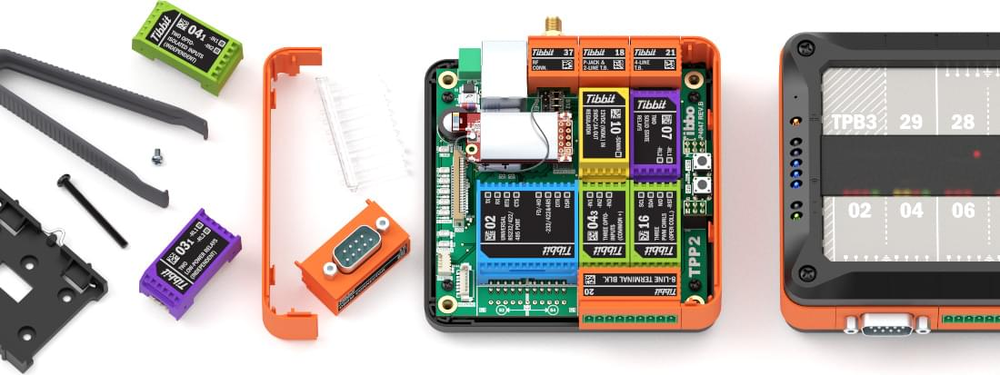

2、[Aethero NxN 太空边缘计算模块](https://www.zephyrproject.org/portfolio/nxn-edge-computing-module/)

Aethero 公司首款太空级边缘计算模块，该产品由 Aethero 与 Antmicro 联合开发，仅用12个月即完成从设计到 LEO 轨道部署的全周期，体现了Zephyr开源技术栈在航天领域的敏捷开发优势。

系统采用异构架构：Nvidia Jetson Orin NX 主控运行 Linux 提供 100 TOPS AI 算力，而协处理器 MCU 运行 Zephyr RTOS，负责任务调度与主计算模块的运行控制。这种"Linux + Zephyr RTOS"的分层设计，既满足高性能计算需求，又通过 RTOS 的实时性与可靠性保障航天任务的关键控制。

软件层面，Antmicro 贡献了 Linux 系统基础与 Zephyr RTOS 固件，并集成其开源 RDFM 框架实现差分更新能力，使太空设备可远程维护。该案例充分证明：Zephyr RTOS 已从物联网延伸至航天等严苛场景，成为高可靠边缘计算的核心基础设施之一，也彰显了开源生态在商业航天快速创新中的战略价值。

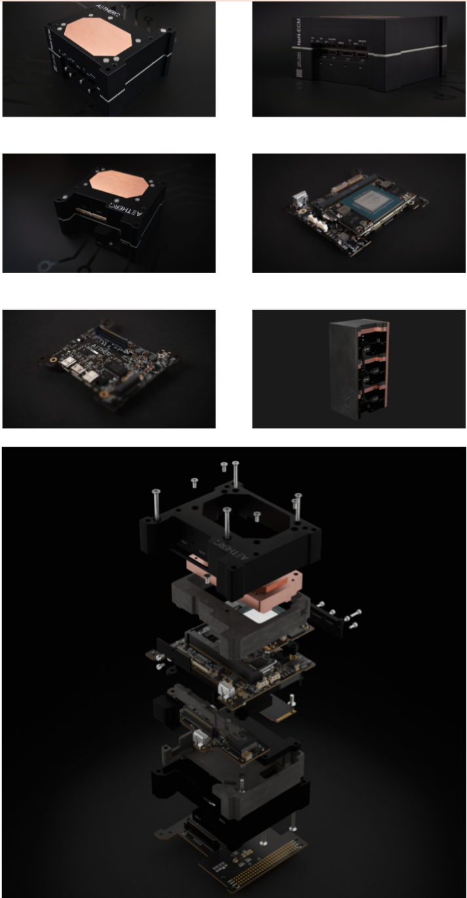

3、[基于 Zephyr RTOS 的 splitR™ 蓝牙音频中枢](https://www.zephyrproject.org/portfolio/splitr/)

splitR™ 由 ATITAN Technology 开发,支持 Bluetooth LE Audio 和 Auracast™ 的蓝牙音频收发中枢，可实现一对多低延迟高音质广播。

Zephyr 的硬件无关架构、生产就绪的蓝牙与电源管理子系统，使开发团队无需自研底层协议栈即可快速实现多设备音频和 Auracast™ 等复杂功能；Zephyr模块化设计与标准化配置机制支撑了产品的快速迭代与功能扩展。Zephyr 强大的开源社区和长期维护保障，有效降低了技术风险，让开发团队得以聚焦产品核心价值而非底层基础设施。

该案例体现了 Zephyr RTOS 在商业物联网音频设备领域的竞争优势：成熟的协议栈支持、灵活的架构设计、以及可持续的开源生态，共同构成企业选择 Zephyr 作为生产级操作系统的重要依据。

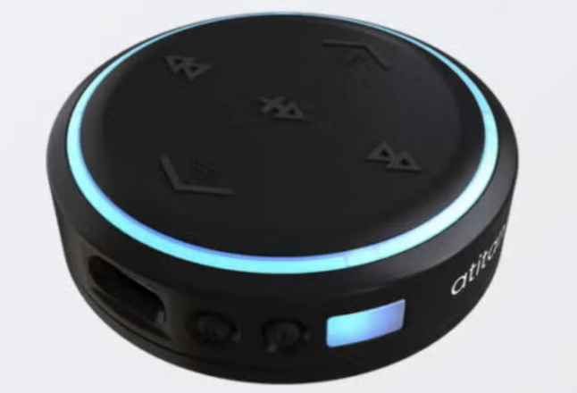

4、[DandelionMD PulseTape ECG：基于Zephyr RTOS的医疗级无线心电监测平台](https://www.zephyrproject.org/portfolio/dandelionmd-pulsetape-ecg/)

本文介绍Dandelion Medical Devices公司PulseTape平台的首款产品PulseTape ECG™，采用Zephyr实时操作系统的医疗级无线心电监测设备。作为传统Holter监护仪的创新替代方案，该设备以小型一次性贴片形态实现连续单导联ECG采集，通过蓝牙低功耗安全传输至多端临床系统，覆盖从居家监测到远程ICU等医疗场景。

Zephyr RTOS的核心价值在该产品中体现于三方面：
- 支撑多传感器架构下的实时心血管信号采集与情境化处理
- 满足医疗设备对超低功耗、高可靠性的严苛要求
- 通过开源生态的安全基座实现符合临床规范的数据传输

该产品表明着Zephyr已突破传统的IOT领域，在 **医疗物联网（IoMT）** 这一高门槛行业获得商业化验证

## Zephyr 每月小知识
Zephyr从4.4开始支持Dashboard, 将分散的报告工具整合到一起，更方便开发者。使用方法：只需要在编译完后执行`west build -t dashboard`，在build/dashboard目录下就可以看到生成的报告index.html报告，点击后可以在浏览器中查看详细数据，演示：https://lgl88911.pages.dev/zephyr/Zephyr-v4.4.0%E5%8F%91%E5%B8%83/dashboard/

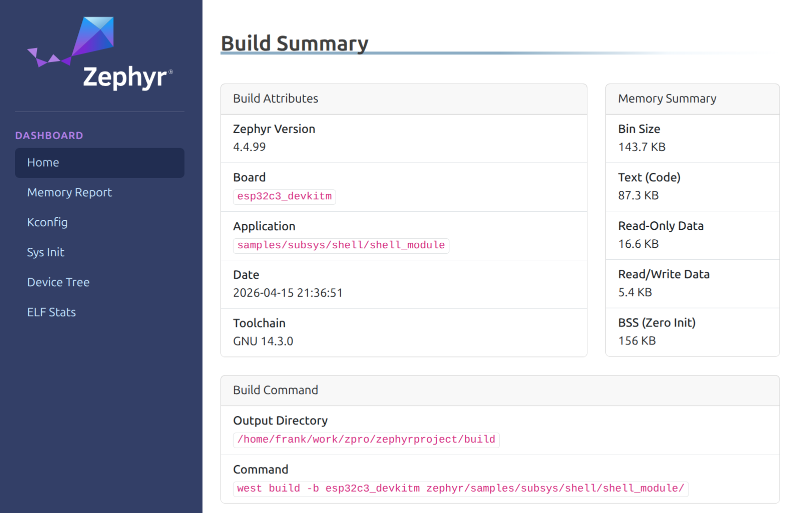

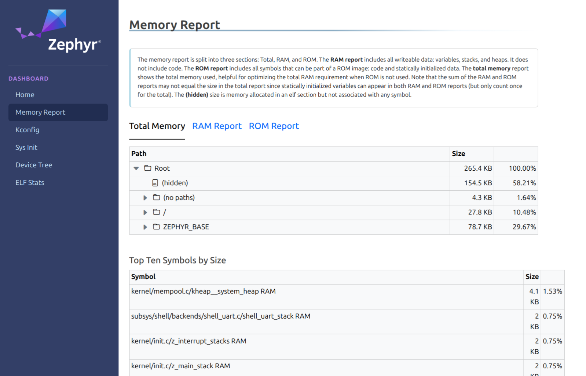

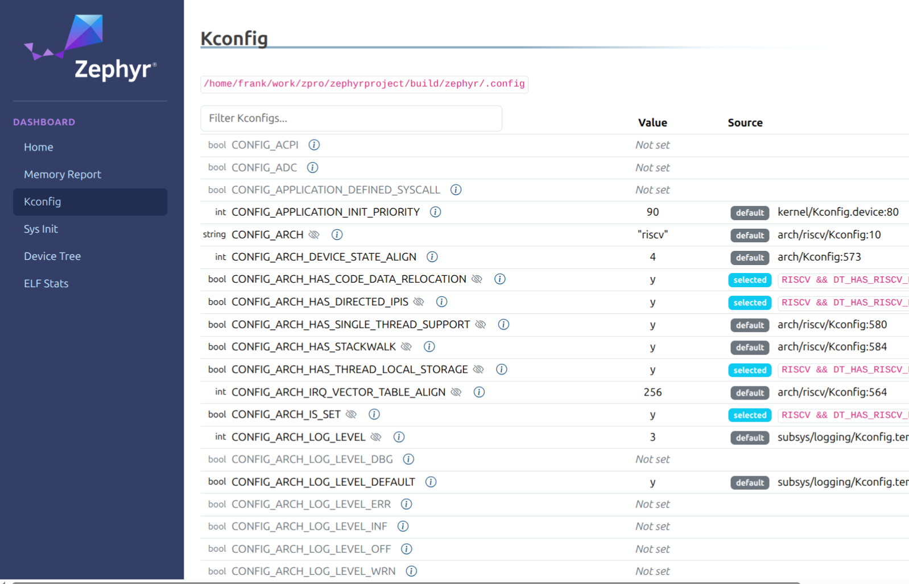

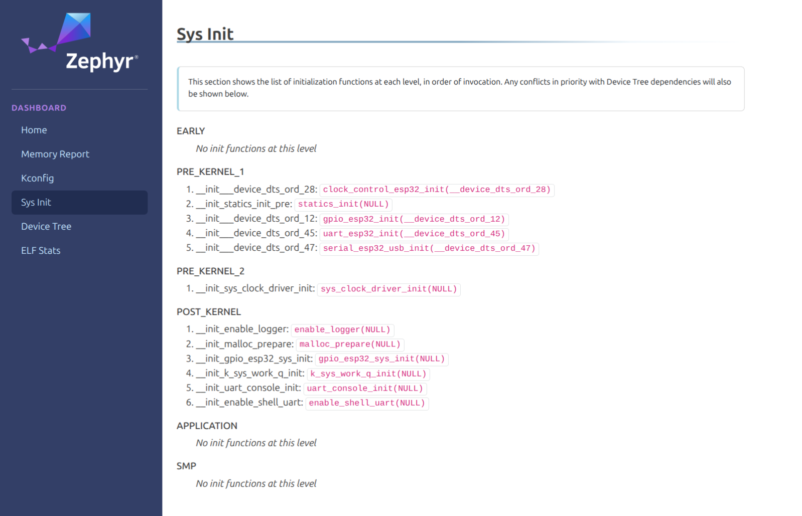

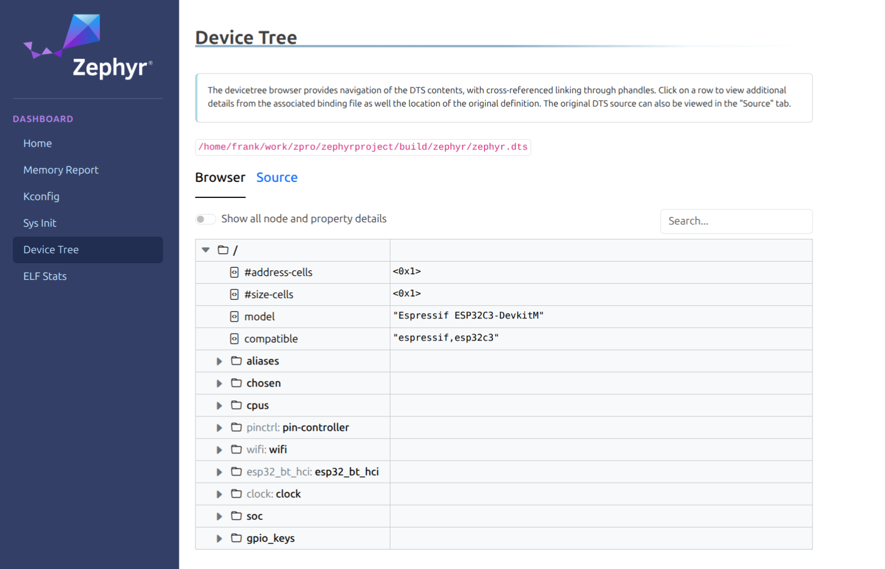

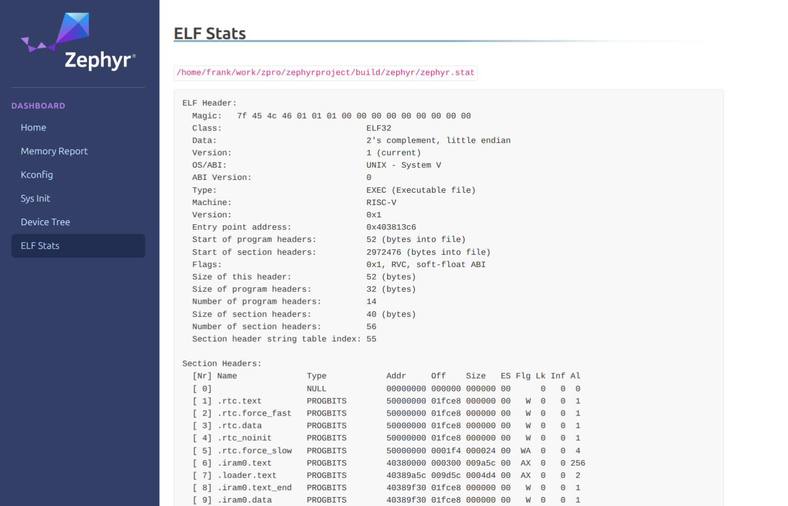