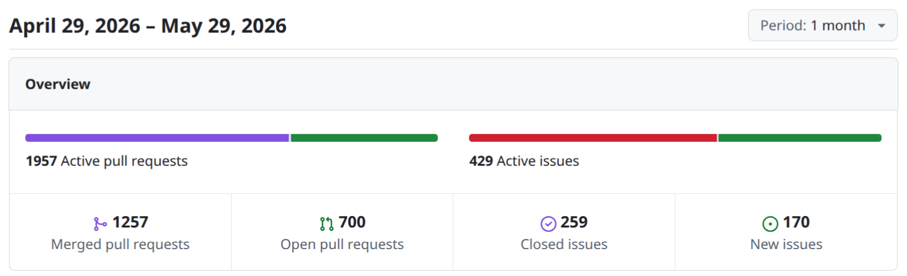

# Zephyr 爱好者月刊（第 17 期 202605）

这里记录 Zephyr 最新的消息和值得分享的内容，每月最后一周发布。

本杂志开源（GitHub：[lgl88911/Zephyr_Fans_Monthly](https://github.com/lgl88911/Zephyr_Fans_Monthly)），欢迎提交 issue、投稿或推荐 Zephyr 相关内容。

## 项目数据



不包括合并，412 位作者向主分支推送了 2349 次提交，向所有分支推送了 2510 次提交。
在主分支上，共有 6973 个文件发生了变化，新增了 183421 行，删除了 37240 行。


近期动向：
- [处理LOG_ERR冲突](https://github.com/zephyrproject-rtos/zephyr/pull/107843)
- [设备树中interrupt-controllers标准化命名](https://github.com/zephyrproject-rtos/zephyr/pull/107565)
- [增加tricore架构支持](https://github.com/zephyrproject-rtos/zephyr/pull/107516)
- [导入Device API继承机制](https://github.com/zephyrproject-rtos/zephyr/pull/106371)
- [导入Clock Monitor 驱动API](https://github.com/zephyrproject-rtos/zephyr/pull/107879)
- [添加XC32工具链](https://github.com/zephyrproject-rtos/zephyr/pull/107298)
- [添加Espressif RMT驱动](https://github.com/zephyrproject-rtos/zephyr/pull/101448)
- [导入buzzer 驱动](https://github.com/zephyrproject-rtos/zephyr/pull/108911)
- [减少=>规范使用HAL](https://github.com/zephyrproject-rtos/zephyr/issues/108088)
- [多实例 CDC ACM](https://github.com/zephyrproject-rtos/zephyr/pull/105141)
- [SRAM地址配置转移到DTS](https://github.com/zephyrproject-rtos/zephyr/pull/107874)


## 新闻&活动

1、[Zephyr 参加 2026 孟买开源峰会](https://www.zephyrproject.org/zephyr-project-at-open-source-summit-mumbai-india-2026/)

Zephyr Project 以专属 track 形式参与 2026 年 6 月孟买开源峰会，主要看点包括：
- TI 工程师对裸机开发者「Zephyr 恐惧」的祛魅
- Linumiz 展示芯片厂商下游维护的实战经验
- Linux Foundation 基于新研究发布的十周年生态洞察
- Silicon Signals 团队提出的嵌入式 AI 视觉系统关键增强需求。

这些议题共同指向 Zephyr 在保持实时操作系统核心特质的同时，如何回应快速迭代的上游节奏与日益复杂的边缘 AI 负载。

2. 线下见面会

https://www.zephyrproject.org/what-to-expect-at-the-zephyr-project-meetup-may-12-2026-copenhagen-denmark/

2026年5月12日，丹麦哥本哈根，主办方“Demant A/S”，赞助方“Demant、STMicroelectronics”，演讲企业：Nordic Semiconductor、Oticon、Linumiz GmbH、NXP Semiconductors

https://www.zephyrproject.org/recap-zephyr-project-meetup-march-26-2026-rennes-france/

2026年3月26日，法国雷恩市，**主办方**：Savoir-faire Linux、Silicon Labs

3、[Arduino Core on Zephyr 项目迎来 0.55.0 里程碑版本](https://www.hackster.io/news/arduino-core-on-zephyr-work-hits-a-new-milestone-prepares-to-exit-beta-in-june-1702a5aaf2b5)

Arduino Core on Zephyr 项目迎来 0.55.0 里程碑版本，预计这是最后一个 Beta 版本，2025 年 6 月将正式发布稳定版本。

此次迁移源于 Arm 2024 年终止 Mbed 平台，Arduino 选择全开源 Zephyr RTOS 作为替代，历时两年开发。新版本核心改进包括：串口打印即开即用并统一多 IDE 体验、新增 RTC 日历与 NTP 同步、UNO Q 支持 CAN 总线与动态中断、任意引脚移位操作、Zephyr 工作队列支持及多项修复。硬件支持扩展至 Nicla Vision 等 9 款板卡。同时 Arduino 将弃用 mbedOS 核心，该项目标志着 Arduino 从依赖厂商闭源生态转向开源基础设施的关键战略转型。

4、[Automotive Grade Linux 发布开源 SoDeV 平台](https://www.linuxfoundation.org/press/automotive-grade-linux-releases-open-source-sodev-reference-platform-for-software-defined-vehicles-and-welcomes-five-new-members)

Automotive Grade Linux 于 2026 年 5 月 14 日发布开源 SoDeV 参考平台初始版本「Ultimate Unagi」，是面向软件定义汽车（SDV）的预集成开源解决方案。该平台整合 AGL 统一代码库、Linux 容器、Xen 虚拟化、Zephyr 实时操作系统等技术，支持在 Renesas 硬件、虚拟机及云端运行，实现软硬件解耦开发，显著缩短 SDV 上市周期。

同期，EMQ、Lineo Solutions、MediaTek、VA Linux Systems Japan 和 Very Good Ventures 五家企业加入 AGL 社区，分别覆盖数据骨干基础设施、嵌入式 Linux、汽车芯片、内核工程及 Flutter 界面等关键领域，体现 SDV 生态对跨行业专业能力的需求。

Ultimate Unagi 版本采用 Yocto Scarthgap LTS 长期支持，升级 Flutter 工具链与车辆信号规范，并提供两年维护周期。AGL 同时开放 2026 年柏林全体成员会议的提案征集，持续推动开源汽车软件的标准化与产业化进程。

## 文摘&观点

1、[企业如何选择和部署 RTOS——基于 Zephyr 十年研究报告](https://www.zephyrproject.org/how-organizations-choose-and-deploy-rtos/)

这篇文章基于 Linux Foundation《Zephyr® Turns 10》研究报告，系统分析了企业 RTOS 选择与部署策略。

研究发现：RTOS 决策呈现三种模式——单一标准化（30%）、小型组合优选（29%）和逐项目评估（20%），其中 Zephyr 用户更倾向结构化长期规划。

核心决策因素从「技术性能」转向「生态系统成熟度」，涵盖工具链、社区活跃度、硬件支持及现代工作流适配性。

| 传统视角 | 现代转变 |
| ---- | ---- |
| 选择独立操作系统 | 选择可持续生态系统 |
| 关注即时技术匹配 | 关注多年部署维护支持能力 |
| 单一产品周期考量 | 软件定义、持续连接的长周期视角 |

部署规模方面，Zephyr 在中大规模传感监测场景中优势显著，而非用户多用于交通机器人领域。

- **Zephyr 优势领域**：
  - 中大规模部署（数十万至数百万设备集群）
  - 需要跨异构硬件平台的可移植性
  - 传感、监测、数据采集应用
  - 资源受限且需硬件灵活性的场景
  
- **非 Zephyr 用户集中领域**：  
  - 交通运输
  - 机器人相关部署
  
- **RTOS 应用拓展边界**（超越传统嵌入式/IoT）：  
  - 消费电子
  - 公共照明系统
  - VR/AR 设备
  - USB 控制器
  - 工业基础设施

资源约束（128-512KB RAM为主）和有限预算使开源生态与成本效率成为关键考量。

当今的趋势：RTOS 选择从「选内核」演变为「选可持续生态」，需支撑产品 5-10 年以上的全生命周期。Zephyr 凭借十年成熟度正成为生产环境可信选择，但仍面临上手、安全认证与长期维护等挑战。

2、[关于 Zephyr 开源的讨论](https://www.reddit.com/r/embedded/comments/1t3cjvu/why_do_open_source_communities_feel_so_different/?rdt=59924)

Reddit 上对参与开源社区的讨论，Zephyr 和 Home Assistant 成为对比讨论的核心：**Zephyr** 作为一个**工业级嵌入式开发平台**，与典型的个人爱好者驱动项目（如 Home Assistant）在文化、运作方式和准入门槛上的显著差异。
- **Zephyr 的「门槛」并非恶意，而是其工业级特性的必然结果。** 作为一个致力于成为工业标准的开源项目，必须优先考虑代码库的健壮性和长期的可扩展性，而非仅仅迎合个体的兴趣或便捷性。相比之下，Home Assistant 更偏向终端用户，因此其文化更倾向于开放和包容，这导致了用户在跨社区贡献时会产生「截然不同」的感受。
- 开源社区体验差异源于**项目基因、目标场景与规模压力**三个方面。Home Assistant 作为原生开源的消费者项目，以爱好者生态为核心，友好协作是其增长策略；Zephyr 由专有项目转型而来，服务于工业嵌入式场景，稳定与可维护性优先于个体贡献体验，严格的 RFC 流程和稀缺审查资源构成高准入门槛。
  
讨论上有个有趣的观点：说这是「集市」式自由协作与「大教堂」式工程纪律的张力——后者在涉及硬件成本与安全认证的嵌入式领域尤为凸显。贡献者需识别项目类型，调整预期：爱好者项目重社区融入，工业项目重流程适配与长期信誉积累。集市和大教堂原本是用来类比开源和闭源两种模式，该文章则引申到开源的自由协作和工程纪律管理。

3、[Zephyr 技能解析](https://jobcannon.io/skills/zephyr-rtos)

这是一篇对 Zephyr 技能的评价文章：层级属于 TIER 2（中级技能），领域为 Tech（技术类），薪资影响力为 High（高）


该技术栈要求扎实的 C 语言基础，学习周期约 5 个月，难度较高，但薪资回报显著——美国资深工程师可达 $170K。关键学习门槛包括 Kconfig 构建系统、Device Tree 硬件描述语法、West 元工具链，以及通过 QEMU/GDB 进行仿真调试的能力。典型职业路径为嵌入式系统工程师与物联网固件工程师，工作涉及跨平台移植、实时任务调度优化及底层驱动开发。对于需在资源受限设备上实现联网功能的开发者，Zephyr 是当前工业界增长最快的 RTOS 选择之一。


4、[Zephyr RTOS 技术解析与战略价值](https://developex.com/blog/zephyr-rtos-overview/)

Zephyr RTOS 是 Linux Foundation 托管的开源实时操作系统，以模块化内核、统一工具链（West/Kconfig/Devicetree）和跨架构支持（ARM/RISC-V/x86）为核心竞争力。其安全原生设计（MPU、安全启动、OTA 更新）与 800+ 开发板生态，使其成为无线 IoT、边缘 AI 及安全关键型嵌入式应用的优选平台。相比 FreeRTOS 和裸机方案，Zephyr 通过硬件抽象层实现厂商无关性，降低供应链锁定风险；CMake 标准化构建则支撑 DevOps 流程，加速产品迭代。然而，Linux 风格的复杂度意味着显著的学习投入——Kconfig 配置、devicetree 语法及驱动模型均需比较专业的积累。因此，Zephyr 最适合长期项目、具备相关背景的团队，以及需要集成无线协议栈或高级安全的场景；对于简单快速的原型开发，传统方案仍更为合适。战略上，Zephyr 既是技术杠杆，也是规避嵌入式市场高风险的长期保险。

关键技术规格
| 维度 | 特性 |
|---|---|
| **内核架构** | 单地址空间单片内核，支持多种调度算法，MPU 内存保护 |
| **硬件支持** | ARM Cortex-M/R/A、RISC-V、x86（x86 主要用于主机仿真开发） |
| **开发板生态** | 800+ 开发板，NXP、Nordic、Intel 等主流厂商深度参与 |
| **能效设计** | 编译时模块化配置（Kconfig），最小化内存占用与处理开销 |

开发最佳实践与常见陷阱规避  
| 常见陷阱 | Zephyr 解决方案 | 战略收益 |
|---|---|---|
| 时间关键代码中的阻塞调用 | RTOS 原语（信号量、消息队列）实现事件驱动非阻塞架构 | 提升可靠性，减少调试时间 |
| 缺乏自动化测试 | 原生测试框架 + CI/CD 集成 | 早期缺陷发现，加速开发 |
| 复杂中断处理 | ISR 极简设计 + 线程延迟处理 | 系统行为更确定、更稳健 |
| 依赖硬件测试 | 主机仿真环境运行代码（devicetree 抽象） | 降本增效，支持并行开发 |
| 错误处理缺失 | 结构化错误处理 + 日志与恢复机制 | 防止灾难性故障 |

性能优化专业技巧
- **功耗管理**：深度睡眠模式、外设/时钟门控、ISR 最小化、数据采样频率优化
- **调试进阶**：JTAG/SWD 硬件调试器 + GDB 集成、边界测试、分治调试法
- **量产扩展**：Kconfig + devicetree 的灵活性支撑 DfM（可制造性设计）与 DfT（可测试性设计）

战略商业价值（决策层视角）
| 技术特性 | 商业转化 |
|---|---|
| 高度模块化可配置 | ↓ 开发成本，↑ 上市速度 |
| 开源免版税 | ↓ 总拥有成本，预算释放至硬件等关键领域 |
| 安全原生架构 | ↑ 产品可靠性，↓ 召回/泄露风险，强化品牌信任 |
| 跨架构支持（ARM/RISC-V） | 长期业务敏捷性，规避供应链/厂商锁定风险 |
| DevOps 就绪工具链 | 持续集成自动化，快速响应市场需求 |

5、[Linux 工程师转型 Zephyr 的可行性讨论](https://www.reddit.com/r/embedded/comments/1titrd0/would_you_hire_a_linux_engineer_for_zephyrrtos)

Reddit 上围绕 Linux 工程师转型 Zephyr/RTOS 职位的可行性讨论的帖子。

社区总体持**谨慎支持**态度：多数认为 Linux 背景是良好基础，因两者共享底层概念，且 Zephyr 在某些方面甚至比 Linux 更「高层」、更易用。核心障碍在于**设备树的编译时处理机制**、小型 OS 生态的驱动/资源局限，以及企业招聘的保守倾向。建议转型者通过业余项目积累实战经验，并瞄准**已有传统 MCU 专家的团队**作为互补角色。

个别反对声音指出 Zephyr 更新稳定性问题及硬件调试经验的不可替代性。讨论折射出嵌入式领域技术栈融合的趋势，从侧面反映大家对「精确匹配」的偏好。

6、[开源平台 Zephyr 推动物联网创新](https://www.eet-china.com/mp/a497578.html)

本文通过 Silicon Labs 高管 Chad Steider 的访谈，系统阐述 Zephyr 在物联网领域的战略价值。

随着物联网设备从简单连接向智能化、高安全、长周期部署演进，专有软件栈的低效性日益明显。Zephyr 作为行业共享平台，通过全球社区协作提供经过验证的核心系统能力，使企业能聚焦应用层创新。其强调，在规模化部署中，统一平台对安全更新、互操作性和生命周期管理至关重要；同时安全与能效必须协同设计而非权衡取舍。

展望未来五年，开源模式将重塑物联网开发范式——加速产品上市、简化人才获取、增强跨生态兼容性，最终成为驱动行业创新的核心力量。

## 技术

1、[Zephyr 代码体积优化技术](https://www.zephyrproject.org/zephyr-insights-code-footprint/)

本文以 Zephyr 经典 `blinky` 示例为对象，展示如何实现从 1.8MB 静态库总和精简到 **20KB 最终二进制**。核心机制包含三层：
- 编译器默认启用 `-Os` 体积优化；
- 构建系统通过 Kconfig 仅编译被配置的组件（如 I2C/SPI 驱动因未使用而排除）；
- 链接器采用 Unix SysV 经典的选择性包含技术，以目标文件为粒度丢弃未引用代码——如 `mutex.c.obj` 因无调用而被自动剔除。

作者强调良好的编译单元划分是链接优化的工程前提，并介绍了 `rom_report`/`ram_report` 分析工具及 v4.4 新增的 HTML 仪表板。
```
  ┌─────────────────────────────────────────┐
  │  1. 编译器层: -Os 默认优化代码体积          │
  ├─────────────────────────────────────────┤
  │  2. 构建系统层: 仅构建被配置/依赖的组件      │
  ├─────────────────────────────────────────┤
  │  3. 链接器层: 丢弃未引用的目标文件           │
  └─────────────────────────────────────────┘
           ↓
      20 KB blinky.bin
  
```

2、[Zephyr 中 Kconfig 与 Devicetree 协同机制解析](https://www.wadixtech.com/blog/zephyr-rtos-kconfig-devicetree-build-flow)

Zephyr 采用 Kconfig 与 Devicetree 双系统分离设计，分别解决「编译什么软件」与「描述什么硬件」的问题。

Kconfig 继承自 Linux 内核，通过层级化的符号系统与 `prj.conf` 控制特性使能；Devicetree 以节点-属性结构描述硬件拓扑，用户通过 `.overlay` 扩展而非修改官方板级文件。两者在 CMake 阶段独立并行处理，输出 `.config` 宏与 `devicetree.h` 头文件，共同供给编译器。

驱动生效必须同时满足：Kconfig 编译驱动源码、Devicetree 提供可用硬件节点。掌握 `menuconfig` 探索依赖、正确命名 overlay 文件、理解错误诊断信息，是高效使用 Zephyr 构建系统的关键。

3、[Zephyr 生产级 IoT 设备构建指南](https://hubble.com/community/guides/how-to-build-production-ready-iot-devices-with-zephyr-project-structure-debugging-and-field-deployment-patterns/)

本文系统阐述基于 Zephyr 构建量产级 IoT 设备的工程方法论，指明结构性组织优于功能堆砌。作者以 nRF52840-DK 为参考平台，强调 Zephyr 本身已具备完整的 BLE、电源管理、驱动生态，团队失败的主因在于未掌握其构建系统（west/Kconfig/Devicetree/CMake）。

文章力推 T2 应用中心式工作空间，通过 west.yml 锁定依赖版本，实现可复现构建与自主更新节奏。目录结构采用子系统级模块化（src/ble/、src/sensors/等），配合分层 Kconfig 策略（基础 prj.conf + 板级 .conf + 构建类型 overlay）与 Devicetree 板级隔离，使多板型扩展与自定义 PCB 迁移时应用代码零改动。

调试层面，文章构建场景化工具矩阵，突出线程感知 GDB（CONFIG_DEBUG_THREAD_INFO）、延迟日志模式、RTT Shell 及 Coredump 现场诊断的价值，并警示 nRF52 平台的 Flash 冲突、west flash --erase 破坏性、过早电源优化三大陷阱。

现场部署章节将良好结构直接转化为 MCUboot OTA 集成、看门狗 + retained RAM 故障恢复等量产能力，最终形成 12 项检查清单。

全文的核心：前两周对构建系统的深度投资，决定项目三个月后的存亡。

4、[Ada on Zephyr：Alire Skill 打通两大生态系统](https://www.adacore.com/blog/ada-on-zephyr-how-the-alire-skill-wires-it-together)

本文详解 AdaCore 发布的 Alire Skill 借用 LLM + agent 的能量将 Ada/SPARK 形式化验证语言与 Zephyr 实时操作系统无缝集成。通过三层架构（Ada 应用层、C shim 适配层、Zephyr RTOS 层）解决两大生态系统的构建工具鸿沟。

Ada 的 gprbuild 与 Zephyr 的 CMake/west 原本互不相识。Alire 负责工具链的自动解析与隔离缓存，CMake 通过读取 GPR 文件实现配置单一来源，最终生成静态库链接至 Zephyr 镜像。

文章重点剖析了 Zephyr 相关的两个链接陷阱（abort() 重复定义与浮点 ABI 匹配）、C 宏封装必要性、以及板级可移植性设计。SPARK 证明独立于交叉编译在主机运行，通过规约-实现分离模式确保业务逻辑的形式化验证。整个流程简化为 make 一键构建，使安全关键固件开发既能利用 Zephyr 丰富的板级支持生态，又保留 Ada/SPARK 的静态保证能力。

5、[将 Qt 移植到 Zephyr](https://zenn.dev/tasuku/articles/04f39f7e31c1d0?locale=en)

Tasuku Suzuki 成功将**标准 Qt 6.11.0** 完整移植到**Zephyr RTOS**，在**NXP Cortex-M7 MCU**（无 MMU，64MB RAM）上零修改运行官方 Qt Quick、Qt Widgets、QPainter 等示例。

核心创新是**qzephyr QPA 插件**，将 Qt 的 OS 抽象层对接 Zephyr 的显示/输入子系统；关键技术突破包括：
- 两阶段构建分离、V4 JS 引擎适配无 MMU 环境（替换 `mmap`）
- 64 位原子操作软实现（PRIMASK 中断屏蔽）
- PXP DMA 硬件旋转
- GT911 触摸异步事件传递

与 Qt for MCUs 不同，此方案保留**QtCore/QtGui/QtWidgets/QtQml/QtQuick** 完整 API，使现有 Qt 资源可直接复用于 MCU，并借助 Zephyr 的跨厂商抽象实现 Cortex-M/RISC-V/ARC 等多架构统一部署，为嵌入式 Linux 与实时 Zephyr 核的异构双核配置开辟新可能。

6、[Zephyr 低功耗电源管理技术详解](https://www.dotcom.co.in/blogs/power-management-zephyr-rtos-low-power-iot-devices)

本文系统阐述了 Zephyr 在低功耗物联网设备中的电源管理技术体系，并提出：软件层面的智能化功耗管理是实现电池供电设备数年续航的关键，其重要性不亚于硬件效率本身。

文章从五个维度解析 Zephyr 的技术优势：
- 系统级电源管理通过 Idle/Light Sleep/Deep Sleep 三级状态实现 CPU 动态降耗
- 设备运行时电源管理针对射频、传感器等高功耗外设进行精细化开关控制
- Tickless Kernel 消除传统 RTOS 的周期性时钟中断，使 CPU 获得连续深睡眠机会
- 多元唤醒源机制确保系统在可靠响应事件的同时避免无效唤醒

## 代码片段

以下是一个与设备树相关的代码片段，展示了 Zephyr 中设备初始化的机制：

```c
  __init__device_dts_ord_12: i2c_esp32_init(__device_dts_ord_12)
```

这个代码片段展示了 ESP32 I2C 驱动的初始化过程，其中 `__init__device_dts_ord_12` 是一个初始化函数，用于根据设备树顺序编号 12 初始化 ESP32 的 I2C 设备。
- BLE专项优化通过连接参数调优将无线通信功耗压缩至最低。

```
┌─────────────────────────────────────┐
│      Zephyr电源管理架构               │
├─────────────────────────────────────┤
│  ① System Power Management         │
│     → CPU/系统级功耗控制              │
├─────────────────────────────────────┤
│  ② Device Runtime Power Management │
│     → 外设动态挂起/恢复                │
├─────────────────────────────────────┤
│  ③ Tickless Kernel                 │
│     → 消除周期性时钟中断               │
├─────────────────────────────────────┤
│  ④ CPU Sleep State Handling        │
│     → 多级睡眠状态管理                 │
├─────────────────────────────────────┤
│  ⑤ Peripheral Suspend/Resume       │
│     → 外设电源门控                    │
└─────────────────────────────────────┘

```

作者强调，Zephyr的"分层分级、按需供电"架构使开发者能够在不牺牲性能与连接性的前提下，将每个组件压入最低功耗状态。面向能量收集、AI边缘计算等前沿趋势，Zephyr的持续演进正推动物联网设备向"永久续航"愿景迈进。选择Zephyr作为电源管理框架，是构建下一代高效、长寿命物联网设备的战略性技术决策。

## 课程&教程

1、[IAR Arm工具链开发调试Zephyr RTOS的完整流程](https://www.iar.com/zh/knowledge/learn/development-and-debugging-zephyr-rtos-by-iar-arm-toolchain)

本文介绍使用IAR Arm工具链开发调试Zephyr RTOS的完整流程。包括：环境准备需IAR EWARM 9.70.1+及Zephyr SDK；工具链切换通过设置`ZEPHYR_TOOLCHAIN_VARIANT=iar`和`IAR_TOOLCHAIN_PATH`两个环境变量实现。调试支持两种模式——外部构建后导入ELF的轻量方式，或完整导入工程的全集成方式，均需勾选Zephyr感知调试插件并启用`CONFIG_DEBUG_THREAD_INFO`。此外，IAR集成的C-STAT静态分析工具已正式支持Zephyr，可显著提升代码质量与安全性。

全文以NXP FRDM-MCXA153为实例，提供了从构建到调试的实操指引，并附官方文档与GitHub示例资源，便于开发者快速上手。

2、[Windows上开发Zephyr指南](https://myembeddedstuff.com/how-to-flash-zephyr-rtos-on-windows-xiao-boards)

官方不推荐用WSL，但文章就是要用WSL，典型的犟种教材。我自己也不例外，刚开始至少用了有2年WSL来开发Zephyr，还写来不少相关的文章。

文章详尽拆解了WSL环境搭建、usbipd USB透传配置、多板并行编译的-d目录隔离策略，以及四款模块差异化的刷写机制：nRF52840的UF2拖拽协议、nRF54L15的板载CMSIS-DAP免调试器方案、ESP32系列所需的west blobs fetch二进制Blob获取与双核独立编译。作者特别针对官方文档对WSL的警告进行了实证反驳，提供了权限修复、auto-attach常驻等生产级技巧，最终构建出一套零脚本、零外部工具的统一刷写工作流。


3、[Zephyr新书：Zephyr RTOS Cookbook](https://hubble.com/community/guides/zephyr-devicetree-explained-how-hardware-description-actually-works/)

《Zephyr RTOS Cookbook》由Dr. Roy Jamil与Dr. Ayoub Bourjilat合著的实践指南，预计2026年6月出版。本书突破传统RTOS教材的局限，以"食谱式"案例引导开发者掌握Zephyr的平台化开发范式。

强调**可移植性与规模化**：通过West构建多仓库工作流、Kconfig实现功能配置、DeviceTree完成硬件抽象，三者协同使应用脱离特定板级绑定。内容涵盖驱动模型、常用子系统（GPIO/I2C/ADC/日志/Shell）、安全用户模式及初始化管理等关键实践。

面向工业与IoT场景，帮助具有嵌入式C基础的开发者从裸机、传统RTOS或Linux平滑迁移至Zephyr生态，最终建立跨硬件、跨团队的可复用代码体系。


## 工具

1、[Zephyr MCP](https://lobehub.com/de/mcp/leog25-mcp-zephyr-west)

该MCP为agent提供工作空间完整分析、Zephyr 版本提取、模块枚举、清单解析、开发板发现和构建系统信息获取等能力。


## Zephyr 每月小知识
当我们想了解Zephyr设备初始化的顺序时可以通过`west build -t initlevels`命令来查看。
```
EARLY
PRE_KERNEL_1
  __init___device_dts_ord_9: clock_control_esp32_init(__device_dts_ord_9)
  __init_statics_init_pre: statics_init(NULL)
  __init___device_dts_ord_7: gpio_esp32_init(__device_dts_ord_7)
  __init___device_dts_ord_13: gpio_esp32_init(__device_dts_ord_13)
  __init___device_dts_ord_65: uart_esp32_init(__device_dts_ord_65)
  __init___device_dts_ord_68: serial_esp32_usb_init(__device_dts_ord_68)
  __init_uart_console_init: uart_console_init(NULL)
PRE_KERNEL_2
  __init_sys_clock_driver_init: sys_clock_driver_init(NULL)
POST_KERNEL
  __init_enable_logger: enable_logger(NULL)
  __init_malloc_prepare: malloc_prepare(NULL)
  __init_k_sys_work_q_init: k_sys_work_q_init(NULL)
  __init___device_dts_ord_12: i2c_esp32_init(__device_dts_ord_12)
  __init___device_dts_ord_27: spi_esp32_init(__device_dts_ord_27)
  __init___device_dts_ord_8: regulator_fixed_init(__device_dts_ord_8)
  __init___device_dts_ord_28: mipi_dbi_spi_init(__device_dts_ord_28)
  __init___device_dts_ord_29: st7789v_init(__device_dts_ord_29)
  __init___device_dts_ord_14: cst816s_init(__device_dts_ord_14)
  __init___device_dts_ord_15: NULL(__device_dts_ord_15)
  __init_enable_shell_uart: enable_shell_uart(NULL)
APPLICATION
  __init_lvgl_init: lvgl_init(NULL)
  
```