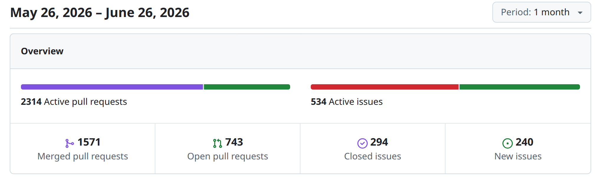
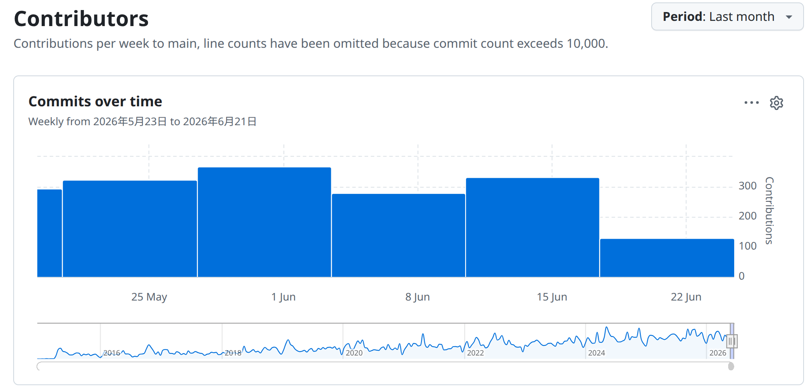

# Zephyr 爱好者月刊（第 18 期 202606）

这里记录 Zephyr 最新的消息和值得分享的内容，每月最后一周发布。

本杂志开源（GitHub：[lgl88911/Zephyr_Fans_Monthly](https://github.com/lgl88911/Zephyr_Fans_Monthly)），欢迎提交 issue、投稿或推荐 Zephyr 相关内容。

## 项目数据



不包括合并，448 位作者向主分支推送了 3002 次提交，向所有分支推送了 3213 次提交。
在主分支上，共有 7421 个文件发生了变化，新增了 260974 行，删除了 51510 行。



近期动向：
- [导入摩斯码子系统](https://github.com/zephyrproject-rtos/zephyr/pull/106477)
- [从 k_work_q 中移除 thread](https://github.com/zephyrproject-rtos/zephyr/pull/110255)
- [改进 DMA API](https://github.com/zephyrproject-rtos/zephyr/issues/108153)
- [pulse_io 子系统 RFC](https://github.com/zephyrproject-rtos/zephyr/issues/109586)
- [添加 PMU API 和 ARMv8-A PMUv3 驱动](https://github.com/zephyrproject-rtos/zephyr/pull/107016)
- [nRF7120 添加 MSPI PSRAM](https://github.com/zephyrproject-rtos/zephyr/pull/110560)
- [通用射频校准数据持久化保存 RFC](https://github.com/zephyrproject-rtos/zephyr/issues/110769)
- [导入 FIDO2/CTAP2 认证子系统](https://github.com/zephyrproject-rtos/zephyr/pull/104327)
- [memc 子系统添加读写 API 和 IS66WV PSRAM 驱动实现](https://github.com/zephyrproject-rtos/zephyr/pull/111074)
- [快速 GPIO API 扩展提案](https://github.com/zephyrproject-rtos/zephyr/pull/110787)

- [处理 LOG_ERR 冲突](https://github.com/zephyrproject-rtos/zephyr/pull/107843)
- [设备树中 interrupt-controllers 标准化命名](https://github.com/zephyrproject-rtos/zephyr/pull/107565)
- [增加 tricore 架构支持](https://github.com/zephyrproject-rtos/zephyr/pull/107516)
- [导入 Device API 继承机制](https://github.com/zephyrproject-rtos/zephyr/pull/106371)
- [导入 Clock Monitor 驱动 API](https://github.com/zephyrproject-rtos/zephyr/pull/107879)
- [添加 XC32 工具链](https://github.com/zephyrproject-rtos/zephyr/pull/107298)
- [添加 Espressif RMT 驱动](https://github.com/zephyrproject-rtos/zephyr/pull/101448)
- [导入 buzzer 驱动](https://github.com/zephyrproject-rtos/zephyr/pull/108911)
- [减少 => 规范使用 HAL](https://github.com/zephyrproject-rtos/zephyr/issues/108088)
- [多实例 CDC ACM](https://github.com/zephyrproject-rtos/zephyr/pull/105141)
- [SRAM地址配置转移到DTS](https://github.com/zephyrproject-rtos/zephyr/pull/107874)


## 新闻&活动

1、[Zephyr 2026 年开发者调查](https://linuxfoundation.research.net/r/G8QXM9L)

这次开发者调查旨在了解项目中哪些方面运行良好，哪些方面需要改进。调查结果将汇总提交给技术指导委员会（TSC），用于帮助项目确定未来的工作重点。所有回复均匿名收集。

问卷将于 2026 年 6 月 30 日截止

2. [Zephyr 4.4.1 发布](https://github.com/zephyrproject-rtos/zephyr/releases/tag/v4.4.1)

v4.4.1 是 Zephyr 4.4.0 的维护性修复版本，非功能更新，包含 78 项问题修复及 5 个 CVE 安全漏洞。

3、线下见面会

- https://www.zephyrproject.org/what-to-expect-at-the-zephyr-project-meetup-june-11-2026-london-uk/
	- 2026 年 6 月 11 日 伦敦 embedd.it 主办
- https://www.zephyrproject.org/what-to-expect-at-the-zephyr-project-meetup-june-16-2026-wroclaw-poland/
	- 2026 年 6 月 16 日 波兰弗罗茨瓦夫 GoodByte 团队主办，Nordic 赞助硬件
- https://www.zephyrproject.org/what-to-expect-at-the-zephyr-project-workshop-meetup-june-17-2026-vienna-austria/
	- 2026 年 6 月 17 日 奥地利维也纳维也纳当地开发者社区主办
- https://www.zephyrproject.org/what-to-expect-at-the-zephyr-project-meetup-june-25-2026-in-austin-texas/
	- 2026 年 6 月 25 日 美国德克萨斯州奥斯汀市 ADI 主办
- https://www.zephyrproject.org/what-to-expect-at-the-zephyr-project-meetup-june-30-2026-in-lyon-france/
  - 2026 年 6 月 30 日 法国里昂 Witekio 主办，ST 赞助硬件


## 文摘&观点

1、[Zephyr 十周年里程碑及未来展望](https://www.zephyrproject.org/zephyrs-10-year-milestone-and-the-road-ahead/)

Linux Foundation Research 高级副总裁 Hilary Carter 的演讲文章。文章主要内容如下：
- Zephyr 已成长为开源实时操作系统领域的核心力量。社区极度活跃：每月 436 名贡献者提交超 2500 次代码，频率达 3.5 次/小时。技术上实现了从 < 8KB Flash 的极简设备到复杂多核系统的全跨度覆盖，支持 1000 余款开发板，以跨厂商可移植性（49% 用户首选因素）打破芯片锁定。
- 市场方面，工业自动化（45%）与消费物联网（44%）为两大支柱，汽车、医疗、能源等新兴领域增速显著。43% 产品生命周期超 5 年。
- 展望未来，社区优先级发生关键转变——从功能扩张转向可持续运营：49% 组织将长期维护列为首要挑战，开发者最期待更丰富的生态（42%）、可靠的 LTS 保障（40%）及完善的培训体系（39%）。Zephyr 同步启动 2026 开发者调查，以实证研究驱动第二个十年的战略制定。

2、[嵌入式 TCP/IP 协议栈对比](https://mongoose.ws/embedded-tcpip-stack-comparison/)

文章对比六款嵌入式 TCP/IP 协议栈，提出“选择 TCP/IP 栈”实质是“选择谁拥有驱动、TLS、HTTP、MQTT、OTA 及安全修复的全生命周期责任”。由于是 mongoose 直接的文章，难免会偏向自身方案：

- lwIP 与 FreeRTOS+TCP 止于 TCP 层，应用层需自行搭建，隐性成本高昂  
- Zephyr、NetX Duo 深度绑定特定 OS  
- CycloneTCP 以商业授权换取最全工业协议覆盖，但会被单一供应商锁定  
- Mongoose 以 ~3.3k 行代码实现 TCP/IP + HTTP + WebSocket + MQTT + TLS 一体化，支持 Bare metal / 任意 RTOS，在 Flash 占用（20–40KB）、集成复杂度、CRA 合规 SBOM 精简度上优势显著  

建议：平台已定则随平台；平台未定则按“完整应用层需求 → 安全维护责任 → 代码可审计性 → 授权成本”优先级决策，避免将“默认 SDK 附送的 TCP/IP”误判为最优解。

3、[Zephyr 上 AI Coding 方法论](https://developer.espressif.com/blog/2026/06/zephyr-coding-with-ai/)

本文是 Espressif 高级软件经理 Ricardo F. Tafas Jr 继 Rust AI 开发实验后的续作，将同一套 AI 协作方法论迁移至 Zephyr 开发，以 ESP DualKey 开发板实现 Espressif 统一配网功能为不变目标，验证流程本身的可复用性。

作者的观点：AI 加速编码的时代，工程纪律比代码生成更重要。作者系统阐述了“Plan → Execute → Commit → Test”主循环、三层合同体系（产品 spec、Zephyr 集成原则、仓库布局），以及关键实践——包括组件化架构隔离产品策略与库 API、journal.md 防止 AI 重复失败尝试、严格禁止 AI 修改上游代码、先验证 sample 再集成产品等。

Zephyr 相关内容强调其四重约束（最大化使用 Zephyr 本体 / OS 服务 / 发行版 / 无缝集成模式），突出 Kconfig / devicetree / west 的工具链特性，特别提到 Zephyr 的 in-tree 生态与 out-of-tree 模块布局对 AI 提示工程的结构化价值。最终成果为可复用的 esp-provisioning-zephyr 模块及其 shell 验证应用，证明方法论跨栈迁移的可行性——速度来自 Agent 的键盘，价值来自人类评估者。

4、[Zephyr 设备量产化经验](https://www.embedur.ai/taking-a-zephyr-device-to-production-managing-the-realities-of-scale/)

embedUR 上发表的一篇关于 Zephyr 设备量产的经验文章，系统阐述了基于 Zephyr 的嵌入式设备从原型走向规模化量产所面临的分阶段工程挑战与架构对策。

文章将规模演进划分为四个数量级阶段：
- 十台级：聚焦硬件抽象与 Devicetree 解耦；
- 百台级：建立安全双槽 OTA 与远程诊断能力；
- 千台级：通过设备运行时电源管理、CBOR 压缩和硬件版本统一优化；
- 万台级：则依赖 Settings 子系统、线程级看门狗和自动化 coredump 实现整体韧性。

文章主旨是：Zephyr 的高度复杂性要求工程团队在早期建立严格的结构纪律，或将底层基础设施交由专业嵌入式合作伙伴，以避免应用开发者在低层平台细节上过度分散精力，从而保障产品从实验室到商业部署的确定性演进。

5、[RTOS、裸机与实时 Linux 的博弈与融合](https://www.birjob.com/blog/embedded-operating-systems-2026)

文章以阿丽亚娜 5 号爆炸、火星探路者重置、丰田意外加速三大灾难为锚点，揭示嵌入式系统失败根源非 OS 本身，而是人为流程缺陷——未验证假设、误关安全特性、代码质量失控。

文章提到不同系统相同领域的混合使用，模糊了系统界限：2024 年 PREEMPT_RT 并入 Linux 主线，打破了“裸机 - RTOS - Linux”的经典分界：Zephyr 以全栈生态成为 IoT 默认选择，Linux 数十微秒级最坏延迟侵蚀传统 RTOS 腹地，裸机在极简场景仍不可替代。

作者提出决策应基于延迟约束、故障后果、任务监控、远程更新四问，而非内核品牌；安全关键领域仍以 QNX / VxWorks 的认证体系为刚需。技术选项趋同之际，团队工程严谨度而非工具选择才是生死分野。

6、[十年磨一剑，Zyphry 做对了什么？](https://eu.36kr.com/zh/p/3857926818501892)

作者指出，Zephyr 以 Linux 基金会为治理底座，规避了传统专有 RTOS 的厂商锁定风险，使 Intel、NXP、Silicon Labs、STMicroelectronics、TI、Renesas、Nordic 等全球主流芯片厂商愿意持续投入代码、工具与培训资源，形成“越多厂商支持 → 生态越成熟 → 越多开发者选用 → 越多厂商加入”的正向循环。六大成功因素中，“硬件可移植性”与“生态成熟度”被用户视为最核心价值，而安全性设计（IEC 61508 认可、PSIRT 机制）则为其向工业、汽车等关键领域扩张铺平道路。

然而，文章亦提到 Zephyr 面临的挑战：现代工具链的学习门槛、安全认证的高昂成本、欧盟 CRA 法规的合规压力，以及 FreeRTOS 等竞品背后的巨头博弈，均考验着这一社区驱动模式的可持续性。


## 技术

1、[Zephyr 再入太空：开源异构架构驱动下一代边缘 AI 航天计算](https://www.zephyrproject.org/antmicro-supports-aethero-next-gen-space-computers-nxn-and-nxa-with-zephyr-controlled-obc-built-around-nvidia-jetson-orin-and-thor-edge-ai-platforms/)

本文提到 Zephyr 已从嵌入式开源项目演进为经航天验证的生产级实时操作系统。Antmicro 与 Aethero 的战略合作以“开源硬件 + 开源软件”垂直整合模式，将 NVIDIA Jetson 边缘 AI 平台通过 Zephyr 控制的配套 MCU 架构送入太空，形成“Linux 主计算 + Zephyr 实时管控”的异构系统。

2024 年 Deimos 任务实现 Zephyr 首飞，2026 年 3 月 Phobos 任务搭载升级版 NxN-ECM（Jetson Orin NX Super，157 TOPS）完成二次验证，并规划下半年部署 NxA-ECM（AGX Thor 双 SoM，4000 TOPS）。这一梯度升级证明 Zephyr 不仅能管理当前载荷，更可支撑未来轨道数据中心、自主机动等超高算力场景。

2、[Zephyr 飞控](https://www.beagleboard.org/projects/ardupilot-on-zephyr-flying-on-the-beaglev-fire)

介绍 ArduPilot 首个 Zephyr 硬件抽象层（HAL）及其在 BeagleV-Fire 板卡上的成功飞行验证。该 HAL 严格遵循 Zephyr 通用设备模型：通过 Devicetree 别名映射外设，禁止通用代码中出现芯片特定逻辑，使移植新板卡仅需四个文件（hwdef.dat、overlay、Kconfig、hwdef.h），从数周工作量缩减至数小时。

BeagleV-Fire 作为首块目标板，利用其 PolarFire SoC 的 RISC-V 核心运行飞控代码、FPGA fabric 生成低抖动 PWM，配合 ROBOTICS 专用 gateware 实现 8 通道舵机输出与传感器接口。构建流程涵盖 Zephyr SDK 配置、交叉编译、`waf` 构建，以及关键的 HSS 启动地址修正。当前已实现 ArduCopter 全功能运行，包括 EKF3 状态估计、MAVLink 遥测和实际四旋翼飞行。

长期愿景为“一次 HAL 编写，任意 Zephyr 支持板卡运行”——涵盖 STM32、nRF、ESP32 等数百种平台，显著降低开源飞控硬件适配门槛。

3、[基于 Zephyr 验证嵌入式远程调试平台 Spotflow](https://www.embeddedrelated.com/showarticle/1810.php)

本文以嵌入式工程师视角，实测评估面向联网嵌入式设备的可观测性平台 Spotflow，验证其能否有效解决规模化部署后的远程调试难题。作者选用 Zephyr 在 NXP FRDM-MCXN947 开发板上完成端到端验证，详尽记录了基于 West 构建系统的工具链配置、工作空间结构及 prj.conf 关键选项。

文章给出两个关键工程教训：
- Python 版本兼容性对 Zephyr 生态至关重要，3.14 的过度超前导致依赖异常，回退至 3.12 方得稳定  
- 网络连通性是设备上线的隐性前提——仅依赖 USB 调试端口不足以支撑云端注册，必须通过以太网或 Wi-Fi 完成 DHCP、DNS、MQTT/TLS 全链路协商。

4、[Zephyr “用多少付多少”：编译时模块化机制全解析](https://www.zephyrproject.org/zephyr-insights-pay-as-you-config/)

本文以 RPI Pico 2 的 GPIO 驱动为例，详细说明 Zephyr “按需配置”的编译优化机制。核心机制是 **Kconfig**（定义软件功能选项）、**Devicetree**（描述硬件拓扑）与 CMake 构建系统的三重协同：Kconfig 通过 `CONFIG_` 前缀宏实现 C 代码条件编译；CMake 以 `add_subdirectory_ifdef` 等指令在目录级裁剪未使用驱动；Devicetree 的 `compatible` 属性经由 `gen_driver_kconfig_dts.py` 自动生成 `DT_HAS_XXX_ENABLED` 选项，形成“硬件存在 → 配置使能 → 代码编译”的协作方式。该机制使 Zephyr 从 132 个 GPIO 驱动中仅目标板匹配的驱动被选择编译，实现真正的“零成本抽象”。这一设计使 Zephyr 区别于传统 RTOS 的粗粒度集成模式，成为资源受限嵌入式系统的理想选择。


## 课程&教程

1、[Zephyr RTOS 开发环境维护与更新指南](https://www.pavelp.cz/posts/eng-zephyr-maintenance/)

一篇针对 Zephyr RTOS 长期中断后环境重建的实操指南，作者发现使用现代 Python 包管理工具 uv 能够显著提升嵌入式开发环境的可维护性与恢复效率。

作者以自身 6 个月间隔、跨系统迁移（Fedora 44 → openSUSE Slowroll）的真实经历为线索，系统阐述了从 Python 虚拟环境重建、Zephyr 内核更新、SDK 工具链刷新到构建验证的完整流程。在 Zephyr 特定内容方面，作者详细记录了 v4.4.0 版本迁移、west update 工作流、多架构 SDK（ARM / ESP32 / RISC-V）的选择性安装，以及 native_sim 仿真目标与硬件目标（rpi_pico）的双轨验证策略。

完整更新流程五步：①删除并重建 .venv → ②Git 检出 Zephyr v4.4.0 → ③`west update` 同步子项目 → ④安装 Python 依赖 → ⑤按需安装 SDK 工具链（ARM / Xtensa / RISC-V）。作者特别强调需清理旧 SDK 目录回收约 10GB 空间，并验证 `~/.cmake/packages/Zephyr-sdk/` 无残留引用。

2、[使用 IAR Arm 工具链在 GD32 开发调试 Zephyr RTOS](https://www.iar.com/zh/knowledge/learn/developing-and-debugging-zephyr-rtos-on-gd32-with-iar-arm-toolchain)

本文详述在 Windows 平台以 IAR Arm 工具链开发 GD32 Zephyr RTOS 应用的完整工作流。核心流程为：搭建 Python 虚拟环境 → 安装 west 元工具 → 拉取 GD32 定制 Zephyr 仓库 → 配置 IAR 工具链环境变量 → west 构建 → IAR EWARM 导入外部 ELF 调试。IAR 9.70+ 将 Zephyr 作为一等公民支持，既提供编译器后端集成，又提供调试插件实现线程/内核对象可视化，同时 C-STAT 静态分析工具链可无缝接入 Zephyr 构建系统。

该方案解决了 GD32 生态在 Zephyr 开发中专业工具链支持不足的问题，为工业级 RTOS 开发提供了符合功能安全要求的工具链选项，适用于汽车、医疗等对代码质量和调试能力有严苛认证需求的场景。

3、[Docker 容器下搭建 Zephyr RTOS 开发环境](https://note.com/kurimoto422/n/n635820d3ab15?hl=en)

本文详述了在 Ubuntu 24.04 上通过 Docker 容器化搭建 Zephyr RTOS 开发环境的完整流程，针对 STM32H755 双核 MCU 的特殊性给出关键解决方案。文中解决多个 Docker 下的实操问题。

## 工具

1、[面向 Zephyr 的可视化固件设计工具](https://appblocks.io/zephyr)

AppBlocks for Zephyr 是 Tibbo 推出的可视化嵌入式开发工具，旨在消除 Zephyr RTOS 的复杂性门槛。用户通过浏览器绘制流程图即可生成面向 Nordic、STM32、ESP32 等数百款板卡的干净 C 代码，无需处理线程、设备树等底层细节。与 AI 代码生成相比，AppBlocks 以预验证模块和显式可视化控制保障可靠性，避免“黑箱”风险。

2、[安森美推出开发 Zephyr VSCode 插件](https://marketplace.visualstudio.com/items?itemName=onsemi.vscode-onsemi-studio)

**onsemi Studio** 是安森美半导体推出的免费 VS Code 扩展（最新版本 v0.5.15），专为嵌入式开发设计，统一支持裸机 CMake/SDK 和 Zephyr RTOS 两类项目。支持**一站式集成**：通过引导式向导自动检测项目类型并安装工具，提供从工作区设置、应用导入/创建、多配置构建到可视化调试的完整工作流。关键特性包括：West / Kconfig 深度集成、CMake Presets 与 SDK 依赖解析（`sdk.json` + `$env{}` 替换）、双调试适配器（GDB / ASIP）支持、活动 ELF 自动检测与状态栏切换、clangd / Microsoft C/C++ 双 IntelliSense 引擎，以及预配置终端和可取消任务。扩展自动安装 Eclipse CDT GDB、Memory/Peripheral Inspector、Serial Monitor 等调试工具。

当前仅支持 Windows，Linux / macOS 待后续更新。配套文档完善，适合需要高效管理多项目、复杂构建配置的嵌入式开发者，但安装量数据不高，说明该工具尚处早期推广阶段。


## Zephyr 每月小知识

众所周知，在 Zephyr 目录下 `west.yml` 中描述了 Zephyr 支持的所有外部 module，并且会被 `west update` 命令默认下载，但在 `zephyr/submanifests` 下还有一个 `optional.yaml` 用于描述可选的外部 module，支持 Rust 和 TFLite 等扩展能力：

```yaml
manifest:
  remotes:
    - name: upstream
      url-base: https://github.com/zephyrproject-rtos
  # zephyr-keep-sorted-start re(^\s+\- name:)
  projects:
    - name: chre
      revision: c4c2f49fdcaa2fed49eb1db027696a5734a010d2
      path: modules/lib/chre
      remote: upstream
      groups:
        - optional
    - name: tflite-micro
      revision: fcc760af130f3a595b5802cdebcc77461e54f382
      path: optional/modules/lib/tflite-micro
      repo-path: tflite-micro
      remote: upstream
      groups:
        - optional
    - name: zephyr-lang-rust
      revision: dd73abc242e995784da62352fe8c70d9a6c7ac2e
      path: modules/lang/rust
      remote: upstream
      groups:
        - optional
# zephyr-keep-sorted-stop
```